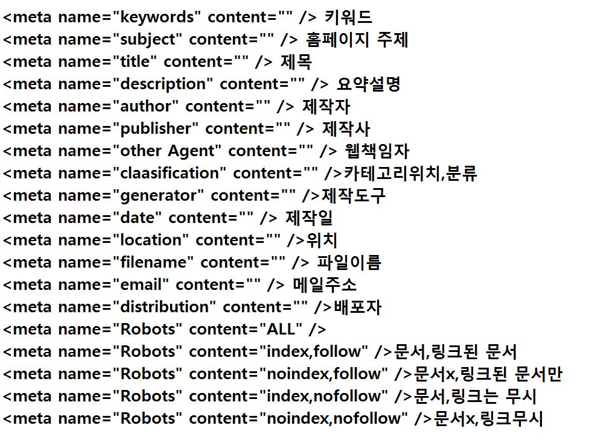
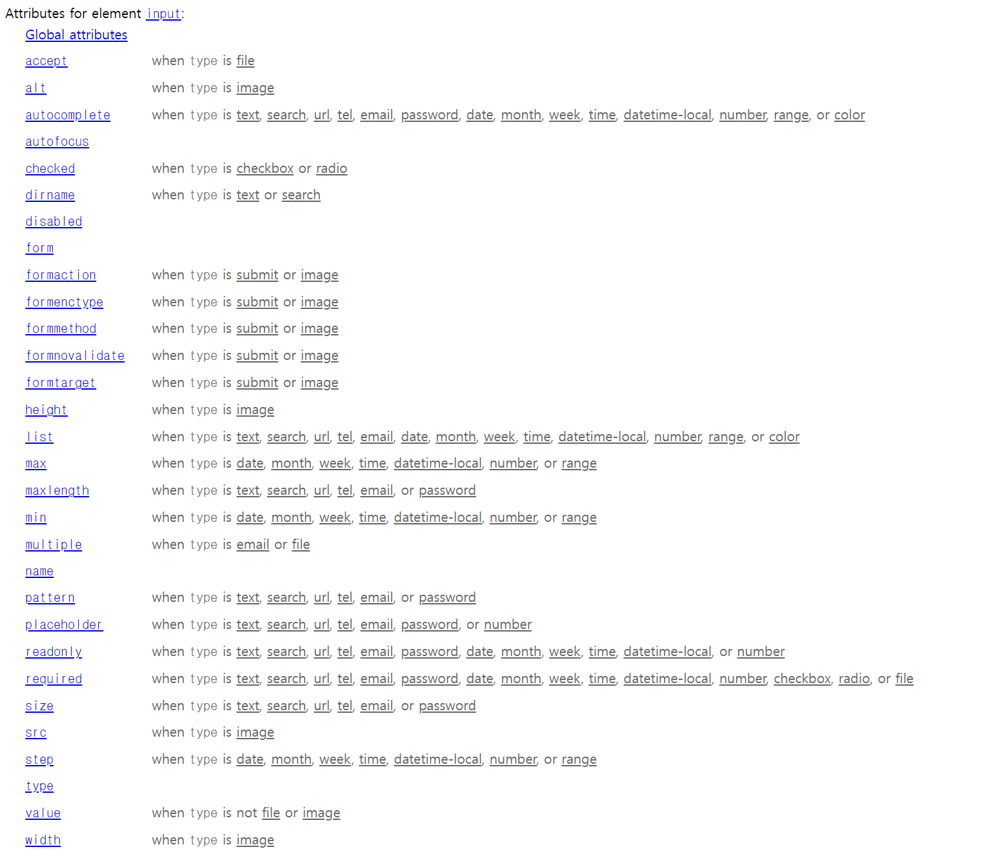

# **Frontend**  

## 💡 `HTML/CSS` 

--- 

- **웹사이트 문서 형식** <br>
    - **html**: 마크업 작업 (.html | .htm → 확장자) <br>
        - 태그(tag)를 사용하여 문서에서 어느부분이 제목이고, 본문이고, 사진, 링크인지를 표시하는 것 <br>
        - 문서의 뼈대, 골격을 만드는 작업 → 텍스트 이미지(문자, 글) <br>
    - **css**
        - html(태그)에서 만들었던 골격에 디자인을 입히는 것 <br>
        - 폰트, 크기, 색상, 위치 등을 지정 → "디자인: 꾸며주는 것"<br>
    
    |<히스토리>| | | |
    |---|---|---|---|
    |html|1991년|10월| |
    |html2|1995년|11월| |
    |html3|1997년|1월| |
    |html4|1997년|12월| |
    |html5|2014년|10월|버전 - 웹표준|

    |<히스토리>| | | |
    |---|---|:---:|---|
    |css1|1996년|12월| → 거의 대부분 사용|
    |css2|1998년|5월| → 거의 대부분 사용|
    |css3|2005년|12월 5일| → css3까지 지원(html5 버전부터)|
    |css4||대부분 브라우저 지원 안함(미래)| → 현재 거의 되지 않는다.|

    1994년 팀 버너스리가 W3C 재단을 창설 <br>
    W3C: 웹표준을 재정하는 단체 <br>

- **웹표준** [코딩 규칙] <br>
    - 국제웹표준화기구(W3C)에서 지정 <br>
    - 세계 각국의 다양한 기존의 html 문서방식을 표준화하여 어떤 브라우저에서도 모두 동일한 사이트를 볼 수 있도록 만드는 것 <br>

- **웹 접근성** [선택이 아닌 필수!] <br>
    - 장애인 차별 금지법 <br>
    - 장애에 구애 없이 모든 사람들이 손쉽게 정보를 공유할 수 있고, 그 어떠한 사이트로 하여금 장애인과 비장애인이 차별되지 않도록 사이트를 모든 사람들이 사용할 수 있도록 만드는 것 → 접근성 안에 웹표준 포함(포괄적) <br>

[웹접근성 이해 동영상]
```
https://nax.naver.com/index
```

[마크업 검사 사이트]
```
http://validator.kldp.org
https://validator.w3.org/#validator-by_input
```

[CSS유효성 검사 사이트]
```
http://css-validator.kldp.org
https://jigsaw.w3.org/css-validator
```

[브라우저]  <br>
＊ 크롬(구글) → html5에 가장 빠르게 대응 <br>
＊ 사파리(애플) <br>
＊ 파이어폭스(모질라) <br>
＊ 인터넷익스플로러(마이크로소프트) → 사용 x <br>
＊ 엣지(마이크로소프트) → (폐지 예정) <br>

[웹브라우저 점유율] <br>
```
http://gs.statcounter.com
```

[브라우저별 지원확인] <br>
```
http://www.w3schools.com

확인할 태그 또는 css입력 후 Browser Support에서 확인
'HTML Browser Support' 검색
```
---

## HTML

- **기본 구조** <br>

```HTML
<!-- <!DOCTYPE html> => html5선언 -->
<!DOCTYPE html>
    <head>
        <title>제목 타이틀</title>
    </head>

    <body>
        내용
    </body>
</html>
```

```hTML
<tagname> ~ </tagname>
<!-- 시작 태그(여는 태그) ~ 종료 태그(닫는 태그) -->
<!-- 종료 태그가 없는 것도 있다. -->
```

---

- **규칙** <br>
    - ★ 마크업,css 모두 **소문자**로 입력(예외도 있다.) <br>
    ```HTML
    <태그 속성명="속성값" ···> * 하나의 태그에 속성이 여러 개 들어갈 수 있다.
    <html lang="언어">
    <태그 lang="언어">

    ※ 띄어쓰기, "", 소문자 유의
    ```

    ```HTML
    <meta charset="UTF-8">
    <meta charset="utf-8">

    <!-- 둘 다 허용 -->
    ```

[웹접근성] <br>
- 기본 언어 표시: 주로 사용하는 언어를 명시해야 한다. (지표번호 15) <br>
    - **lang** <br>
        - ko(한국어), en(영어), ja(일본어), ru(러시아어), zh(중국어), de(독일어), fr(프랑스어) <br>
        ```HTML
        <태그 lang="언어">내용</태그>
        ```

        ```
        https://www.w3schools.com/tags/ref_language_codes.asp
        ```
---

**&lt;meta&gt;** <br>
→ 닫는태그 없음 <br>
```HTML
<meta charset=" ">
```

1. 문자인코딩 <br>
    - 인코딩 <br>
        - ANSI: Windows 문자 집합으로 256가지 문자 코드를 지원 <br>
        - UTF-8: 세계의 거의 모든 문자와 기호를 포함 [★ **Default 설정**] <br>
            - ▶ 필수 요소 사항(지원 안 하는 경우 - 한글 깨짐 현상, 없으면 글씨 깨지는 등) <br>
                - **문자 인코딩에 대한 정보가 속성으로 들어감**

2. 웹페이지의 추가정보 전달 <br>
```HTML
name="keywords"     검색키워드
name="subject"      문서 제목 정보
name="description"  내용 요약
·····
```
meta 외 회사마다 쓰이는 속성을 달리함. <br>
사이트마다 다르다. <br>
cf) "google에서 인식하는 메타 태그" 참조(검색) <br> 
 <br>
이 외에도 많다. <br>

3. 모바일, 반응형 지정 <br>
```HTML
meta name="viewport"
```


---

**&lt;title&gt; ~ &lt;/title&gt;** → ♣ [0_웹접근성] <br>
문서의 제목 <br>
- 마크업: 입력하지 않으면 오류로 인식 <br>

[웹접근성] <br>
- 제목 제공: 페이지, 프레임, 콘텐츠 블록에는 적절한 제목을 제공해야 한다. [지표번호 13] <br>
    - 프레임태그는 html5에서 사용 중지 됨 <br>
    - &lt;h1&gt; ~ &lt;h6&gt; 태그 <br>
    - empty(비워있으면) → 오류 <br>
    ```
    홈페이지 상단에 나와있는 제목
    ex) 회사 이름

    단, [지표번호 13-4] → html5에 없음
    ```

---

**주석(코멘트)** <br>
○ 다른 사람이 소스를 보더라도 내용을 알아보기 쉽게 설명하는 글, 실행되지 않음, 소스에서만 보임 <br>
○ 마크업과 개발의 편의를 위해 작성한 주석은 실제 서비스를 적용할 때 반드시 삭제한다.(일부 회사규칙) <br>

```HTML
<!-- 태그내용 --> 한 줄

여러줄
<!-- 
    태그내용
    태그내용
    태그내용
 -->
```

---

**&lt;hn&gt; ~ &lt;/hn&gt;** <br>
h1 ~ h6까지 <br>
body 안의 제목 <br>

- 마크업: 입력하지 않아도 오류로 인식하지 않음 <br>
- 웹접근성: (제목 제공) 페이지, 프레임, 콘텐츠 블록에는 적절한 제목을 제공해야 한다. [지표번호 13] <br>
```
<h1> 대제목 </h1>
<h2> 중제목 </h2>
<h3> 소제목 </h3>
<h4> 소소제목 </h4>
<h5> 소소소제목 </h5>
<h6> 소소소소제목 </h6>

────────────────────────

◎ 줄 바꿈이 되는 태그
◎ 하나하나의 인덱스
◎ 중복해서 쓸 수 있다.
h1 대제목을 한 번 쓰고, 각각의 내용에 해당하는 h2태그 여러 번 작성 가능
◎ 순차적으로 사용할 것
h1, h2 다음 바로 h6 이런 식으로 사용 x

★ h 태그를 안 쓰면 마크업 오류는 아니지만 '접근성'에서 걸린다.
```

---

**&lt;hr&gt;** <br>
[닫는 태그 없음] <br>
구분선, 경계선 <br>

---

**&lt;p&gt; ~ &lt;/p&gt;** <br>
단락, 텍스트, 이미지 등 내용을 입력할 때 사용 <br>
줄바꿈으로 표시됨 (내용이 길어지면 자동 줄바뀜) <br><br>
★ p 태그와 h 태그는 분리해서 마크업해야 한다. <br>
```
▶ P 태그 영역 안에 h 태그를 넣어서 사용할 수 없다.
▶ h 태그 영역 안 p태그 → 실행되지만 오류
```

---

**&lt;br&gt;** <br>
[닫는 태그 없음] <br>
내용을 강제로 줄바꿈 <br>
보통 단독으로 쓰지 않고, (특정) 태그 안에서 줄바꿈하기를 권장 <br>
→ 태그에 포함하여 사용 (단순히 여백을 위해 사용하지 말 것! - 권장사항 x ☞ 여백을 주는 것 따로 있다.) <br>

---

**&lt;address&gt; ~ &lt;/address&gt;** <br>
기울림 글꼴 <br>
연락처, 이메일, 주소(실제 주소 - 회사 주소 등), (주로 홈페이지 하단에 위치) <br>

<br>

copyright 저작권 표기(한국저작권위원회) → p 태그 안에 마크업(회사마다 다름) <br>

```
p 태그로 했을 때 의미가 달라진다.

ex) address 후 copyright 추가 (address 태그 안 표시)

────────────────────────────────────────────────────────────────
address 안 h 태그 사용하지 말 것! (사용은 가능(화면 표시), but 오류)
```

---

[목록 만드는 태그] → ♣ [02_목록_정의형_특수기호] <br>

1. 순서가 없는 목록 <br>
    ```HTML
    <ul>
        <li>내용</li>
        <li>내용</li>
    </ul>
    ```
    - 기본 disc ● (점 생성) [default]<br>
    ```
    ●
    ●
    ●
    ●
    ```
    - li*4 → li를 4개 생성 (다른 태그를 써도 똑같이 사용 가능) <br>
    ```
    <li></li>
    <li></li>
    <li></li>
    <li></li>
    ```
    
    - html5 → css 또는 이미지 아이콘으로 변경 가능 <br>
    ```
    ○ circle
    ■ square
    ```

```
ul 태그 안 h 태그 사용 x
ul 태그 안 p 태그 사용 x

───────────────────────
ul 안에 li(자식) 태그만 가능!
li 안 h, p, a 태그 가능
```

2. 순서가 있는 목록 <br>
    ```HTML
    <ol>
        <li>내용</li>
        <li>내용</li>
    </ol>
    ```

    - 기본: 숫자 <br>
    ```
    1.
    2.
    3.
    4.
    ```
    - 모양 변경 <br>
        - 태그 속성으로 변경(변경 가능) <br>
        ```
        <ol type=""> 1 숫자(기본값), a 영문소문자, A 영문대문자, i 로마소문자, I 로마대문자
        
        </ol>
        ```
        - css에서 변경 <br>
        ```
        숫자, 로마자, 영문, 이미지 등 
        ```
        - 중간 번호로 시작 <br>
        ```
        <ol type="" start="시작할 숫자">
        
        </ol>
        ```
        ```
        <ol start="3"> → 3부터 시작
        
        </ol>
        ```
        ```
        <ol type="a" start="4"> → 알파벳(type) 4번째(start) 순번(d)부터 시작 
        
        </ol>
        ```
        - 역순으로 표시 <br>
        ```
        <ol type="" reversed>
        
        </ol>

        ul 태그에 사용 금지(순서 없기 때문에)
        ```

---

[정의형, 질문/답 목록 만들기] → ♣ [01_selector, inline_style/01_selector.html(selector1.css)] <br>
```
<dl>
    <dt>용어제목</dt> → 질문(이렇게도 가능)
    <dd>용어설명</dd> → 답(이렇게도 가능)
</dl>

dd 태그는 들여쓰기 된다.
```
```
dl+ → tab키 ▶ 자동 서식 생성
```
```
dl 태그 안 h, p, ul, ol 태그 허용 x
dt 태그 다음 ul, ol 태그 쓰면 dl 태그가 dd 태그를 못 참음
dt 태그 안 h, ol, ul 태그 허용 x / p 허용 o
dd 태그 안 h, p, ol, ul 태그 허용 o
```

---

[특수기호(엔티티) 기호] <br>
```
[홈페이지 참고]
https://www.w3schools.com/html/html_entities.asp
```

| | | |
|---|---|---|
|공백|& nbsp;|space(공백)는 내용에 1번만 적용|
|"|& quot;| |
|<|& lt;|less than|
|>|& gt;|greater than|
|©|& copy;| |
|&|& amp;| |
|/|& frasl;| |


---

**&lt;img&gt;** <br>
[닫는 태그 없음] <br>
이미지(웹 이미지) <br>
```
.jpg/.jpeg
.png: (배경투명) 다양한 색상표현 / 1,600만가지 색상 지원 → png가 좀 더 안정적
.gif: (배경투명, 아이콘) 최대 256가지 색상 표시
▷ 기본 확장자는 3개(더 추가될 수도 있다.)

.svg: 벡터화 이미지(ie8 이하 버전에는 지원 x) - cf) <svg /> 태그 : 코드로 도형을 만들 수 있다.
```

```HTML

```

[속성] <br>

- **src** <br>
```
같은 폴더:          src="이미지 파일명" | src=".이미지 파일명" | src="./이미지 파일명" (./생략 가능)
하위 폴더:          src="폴더명/이미지 파일명"
하위하위 폴더:      src="폴더명/폴더명/이미지 파일명"
한 단계 상위 폴더:  src="../폴더명/이미지 파일명"
```

- **alt** <br>
    - 이미지를 설명해주는 대체 텍스트  <br>
    - 입력하지 않으면 마크업 오류로 인식[지표번호 1-1] <br>
        - 웹접근성 검사항목 1번(적절한 대체 텍스트 제공) <br>
        - (텍스트가 아닌 콘텐츠는 그 의미나 용도를 이해할 수 있도록 대체 텍스트를 제공해야 한다.) <br>
            - alt만 쓰면 마크업 오류 x → but, 접근성 위반 <br>
            ```
            alt="그림" (x → 설명 부족)
            alt="#" (x → 특수문자만)
            alt=" " (x → 공백만)
            alt="" (x → 빈 값)
            ```
- **width** <br>
너비 <br>
`픽셀`사이즈로 인식 [default] <br>
```
width="100" (o) 
width="100px" (x)
```

- **height** <br>
높이 <br>
`픽셀`사이즈로 인식 [default] <br>
```
height="100" (o) 
height="100px" (x)
```

- **title** <br>
툴팁, 풍선도움말 <br>
→ 사용 안 해도 무방(사용 안 해도 오류x, 접근성 위반 x) <br>

[임시 이미지로 표시] <br>
```HTML
<!--  -->


```

```
※ W3C에서 항상 이미지 사이즈를 넣어주기를 권장

안 해준다고 접근성 위반사항은 아니지만,
이미지를 불러올 떄 '깜박임 현상' 발생할 수 있다.
```

---

**&lt;figure&gt; ~ &lt;/figure&gt;** <br>
이미지에 설명글(캡션) <br>
이미지와 텍스트를 묶어서 사용 가능(html5 버전부터 사용 가능) <br>
```HTML
<figure>
    대상
    <figcaption>설명글(캡션)</figcaption>
</figure>
```

```
figure 태그 안 a 태그 허용 x
```

---

**&lt;a&gt; ~ &lt;/a&gt;** [02_이미지_링크] <br>
링크 만들기 (클릭할 때 적용되는 것)<br>
```HTML
<a 속성="속성값">텍스트/이미지 등</a>
```

[속성] <br>
- **href** <br>
    - 링크할 문서나 사이트의 주소 <br>
    ```HTML
    href="event.html"
    href="https://www.naver.com"
    href="#" → 빈 링크(임시 링크)
    ```

- **target** <br>
    - 링크한 내용이 표시될 위치 <br>
        - _self: 현재창 [default] <br>
        - _blank: 새창 <br>


[메일보내기] <br>
```HTML
<a href="mailto:이메일주소">텍스트/이미지등</a>
```

```
a 태그 안 figure, img 태그 허용 ○

→ ♣ [02_이미지 링크, 맵 실습/02_이미지 링크 실습.html]
```

```
<a태그 관련>

구 버전 브라우저에서는 파란 테두리 있다. (작업 시 제거 필요)
```

---

**&lt;map&gt; ~ &lt;/map&gt;** → ♣ 02_이미지 맵.html <br>
하나의 이미지에 클릭 위치에 따라 서로 다른 링크를 설정 <br>
| | |
|---|---|
|사각|rect|
|타원|circle|
|다각|poly|

```HTML

<map name="이미지맵명"> <!-- (img의 usemap명과 같아야 한다.) -->
    <area shape="모양" coords="좌표" href="연결주소" alt="대체텍스트" target="">
</map>
```

```
이름 사용 o
#abc, #map1, #u_map, #u-map(언더바, 대시 가능하다.) 
```

```
이름 사용 x
#123, #1map, #a(한 글자로만 하는 것은 많은 오류를 발생시킬 수 있다.)
```

- 사각형(위치좌표 4개)
```
shape="rect" coords="시작 X좌표, 시작 Y좌표, 끝 X좌표, 끝 Y좌표"


시작①              시작②
    ┌─────────────┐
    │             │
    │             │
    │             │
    │             │
    └─────────────┘
  끝②              끝①

위에서 아래 대각선 방향으로 할 것.
(아래에서 위로 하면 오류난다.)
```
- 원형(위치좌표 3개)
```
shape="circle" coords="중심 X좌표, 중심 Y좌표, 반지름"
```
- 다각형(위치좌표 n개)
```
shape="poly" 
coords="첫 꼭지점 X좌표, 첫 꼭지점 Y좌표, 
둘째 꼭지점 X좌표, 둘째 꼭지점 Y좌표 ··· (가급적 시계방향으로 한 바퀴)"
```

```
※ 좌표 구할 때 '★원본 사이즈'로 구해야 한다.

폴더 - 보기 탭 - 세부 정보 창(alt + shift + p) ▷ 이미지 사이즈(사진 크기) 확인 가능
```

---

**[네임앵커]** → ♣ [03_네임앵커_텍스트] <br>
페이지가 긴 문서에서 특정요소를 클릭하면 그 위치로 이동 <br>

1. 한 페이지 안에서 특정위치로 이동 <br>
    - 위치 설정 <br>
    ```HTML
    <태그 id="id명">

    id명은 중복해서 쓸 수 없다.
    id명: 한글x, 숫자만x, 특수문자x, 한 글자x
    ```
    - 이동 <br>
    ```HTML
    <a href="#id명">텍스트/이미지</a>
    ```
    ▶ 현재 페이지 내에서 href의 id 위치로 이동 <br>

2. 한 페이지에서 다른 페이지의 특정 위치 이동 <br>
    - 위치 설정 <br>
    ```HTML
    <태그 id="id명" >

    id명은 중복해서 쓸 수 없다.
    id명: 한글x, 숫자만x, 특수문자x, 한 글자x
    ```
    - 이동 <br>
    ```HTML
    <a href="파일명#id명">텍스트/이미지</a>
    ```
    ▶ 현재 페이지 href의 id 위치로 이동 <br>

```
※ id를 <p>,  태그 등, 이동하고 싶은 태그 위치에 주면 된다.
```

---

**[텍스트]** <br>

**&lt;b&gt; ~ &lt;/b&gt;** <br>
굵은 텍스트 <br>
'시각적 특정', 그 내용의 의미를 중요하게 보는 것은 아니다.('의미' 없는 태그) <br>

**&lt;strong&gt; ~ &lt;/strong&gt;** <br>
중요도, 강조를 높인 텍스트 - 굵게 표시됨 <br>
일부 음성 브라우저의 경우 강조 관련 요소로 좀 더 크게 읽어 주거나 두 번 반복하여 읽어 주기도 함. <br>

**&lt;i&gt; ~ &lt;/i&gt;** <br>
기울임 꼴 텍스트 <br>
'시각적 특정', 그 내용의 의미를 중요하게 보는 것은 아니다.('의미' 없는 태그) <br>

**&lt;em&gt; ~ &lt;/em&gt;** <br>
중요도, 강조를 높인 텍스트 - 굵게 표시됨 <br>
일부 음성 브라우저의 경우 강조 관련 요소로 좀 더 크게 읽어 주거나 두 번 반복하여 읽어 주기도 함. <br>

**&lt;u&gt; ~ &lt;/u&gt;** <br>
밑 줄 텍스트

**&lt;small&gt; ~ &lt;/small&gt;** <br>
작은 텍스트 <br>

```
cf)

<big></big> 태그
▷ html5부터 중지(지원x)

css로 크기(font-size) 대체
```

**&lt;sup&gt; ~ &lt;/sup&gt;** <br>
위 첨자 텍스트 <br>

**&lt;sub&gt; ~ &lt;/sub&gt;** <br>
아래 첨자 텍스트 <br>

**&lt;s&gt; ~ &lt;/s&gt;** <br>
틀린 텍스트(잘못된 텍스트)를 정의할 때 - 취소선 <br>

**&lt;del&gt; ~ &lt;/del&gt;** <br>
내용이 업데이트된 사항에서 그 텍스트가 삭제될 때(기존 내용 삭제) <br>
속성으로 `datetime` 사용 → `삭제` 언제 이루어졌는지 값을 지정할 수 있다. (특정 기간 x (00년 a월 ~ b월 안 된다.) / 특정 시점 o) ▷ 시각적 표현은 없고, 의미적 표현 <br>

**&lt;ins&gt; ~ &lt;/ins&gt;** <br>
내용이 업데이트된 사항에서 그 텍스트가 추가될 때 <br>
속성으로 `datetime` 사용 → `추가` 언제 이루어졌는지 값을 지정할 수 있다. (특정 기간 x (00년 a월 ~ b월 안 된다.) / 특정 시점 o) ▷ 시각적 표현은 없고, 의미적 표현 <br>

```
datetime="2022-10-05" (o)

datetime="2022-3-05" (x)
datetime="2022-03-5" (x)
datetime="2022/03/05" (x)
```

---

**&lt;mark&gt; ~ &lt;/mark&gt;** <br>
노란색 형광펜 효과 <br>

**&lt;meter&gt; ~ &lt;/meter&gt;** <br>
값이 차지하는 크기 <br>
값(value) → 범위에서 차지하는 값 <br>
```
max="범위의 최대 값" (생략 가능)
min="범위의 최소 값" (생략 가능)
```

**&lt;ruby&gt; ~ &lt;/ruby&gt;** <br>
해당 문자의 발음이나 설명을 작은 크기의 윗첨자로 알려주는 루비 주석(ruby annotation)을 정의할 때 사용 <br>
- **&lt;rt&gt; ~ &lt;/rt&gt;** <br>
문자 발음 <br>

```HTML
<ruby>
    가나다
    <rt>123</rt>
</ruby>

───────────────────────────────────────
cf)

<ruby>
    가나<br>다 <!-- br 태그 사용 가능 -->
    <rt>123</rt>
</ruby>

<ruby>
    가나다 <br> <!-- br 태그 안 먹음 -->
    <br><rt>123</rt> <!-- br 태그 안 먹음 -->
</ruby>
```

- **&lt;ruby&gt; ~ &lt;/ruby&gt;** <br>
    - **&lt;rb&gt; ~ &lt;/rb&gt;**: ruby bottom - 아래 쪽에 들어갈 글자를 지정 <br>
    - **&lt;rp&gt; ~ &lt;/rp&gt;**: ruby parentheses - 브라우저가 루비를 지원하지 않을 때 표시할 '괄호'를 지정 <br>
    - **&lt;rt&gt; ~ &lt;/rt&gt;**: ruby top - 위쪽에 들어갈 글자를 지정 <br>

```CSS
style="ruby-position: under;"
style="ruby-position: over;"
```
    
---

**&lt;div&gt; ~ &lt;/div&gt;** <br>
내용을 덩어리로 묶을 때 <br>
```
cf) 웹 사이트 내 팝업 창(광고) - 바로 가기, 닫기, 설명 등 포함(의미적이지는 않는다. → 서로 연관된 것들이 아닌 경우)
```

**&lt;span&gt; ~ &lt;/span&gt;** <br>
덩어리 안에서 일부만 묶을 때(일부 내용/단어) <br>
```
span: 폭, 좁은 공간
```

```CSS
/* span 태그는 css를 글자 있는 영역에 적용 */

#ex5 p span
#ex5 p /* p 전체에 대한 것 */

```
---

**`하위구조` ul, ol 중첩** → ♣ [04_하위목록] <br>
ul, ol <br>
```HTML
<ul>
    <li>대메뉴</li>
    <li>대메뉴
        <ul>
            <li>서브메뉴</li>
            <li>서브메뉴</li>
            <li>서브메뉴</li>
        </ul>
    </li>
</ul>
```

```
ex) 홈페이지 탭 목록 안 새로운 목록
```

---

## CSS

※ CSS 작업 시 'mark-up 작업 순서'를 고려하여 작성(유추, 가독성) <br>
```
[css 참고]

https://www.w3schools.com/css
```

스타일 시트 <br>
- 확장자 → .css <br>

주석 <br>
```CSS
/* 주석 */
```

**css 적용하는 방법 3가지** <br>

1. **인라인 스타일(inline style)**: 특정요소에 직접 css를 적용 → ♣ [05_1_css설정] <br>
→ 장점보다는 단점 많음 → 분리 안되는 문제 발생(마크업(구조)와 css가 분리가 안됨) <br>
▶ 최소한에 적용할 때 사용 <br>
```HTML
<태그 style="속성명: 속성값;">
```

2. **내부 스타일(internal style)** → ♣ [05_1_css설정] <br> 
- &lt;head&gt;와 &lt;/head&gt; 사이에 정의 <br>

```HTML
<head>
    <style> /* style 태그 → css 영역 생성 */
        선택자(selector) { 속성명: 속성값; } /* selector 종류 많다. */ 
        /* [속성명: 속성값]에 (" ") 큰 따옴표 사용 x */
    </style>    
</head>

선택자(selector): css가 적용되는 대상

해당 파일에만 적용된다.
```

3. **외부 스타일(external style)** → ♣ [05_1_css설정] <br>
- &lt;head&gt;와 &lt;/head&gt; 사이에 정의 <br>

```HTML
<link rel="stylesheet" href="폴더명/파일명.css">

<link rel="stylesheet" href="폴더명/파일명.css" media="">  <!-- media 속성 추가 가능 -->

css파일 적용 여부 관련하여 html 마크업(마크업한 것)으로 확인
```

- media: css 용도 <br>
    - screen(pc, 모바일, 반응형) <br>
    - print(인쇄) <br>
    - all (screen, print 모두 적용) [default]<br>
    ```HTML
    media="all" [Default]
    ```
→ css파일 연동하면 다른파일에도 적용 된다.(에디터마다 주는 값에 따라 생성 여부 다르다.) <br>

```HTML
<style>
    @import "폴더명/css파일명";
    @import url("폴더명/css파일명");
</style>


<link rel="stylesheet" href="폴더명/파일명.css">와 기능 같다.

```

```
link + @import 혼합형으로 쓸 수 있다.
```

---

**선택자(selector)** → ♣ [05_2_css selector/01_selector.html(css/selector1.css)] <br>
```CSS
선택자 { 속성명: 속성값; }
```
- css가 적용되는 대상 <br>
```CSS
p { color: blue; }

p { /* Style Guide 권장 방식 */
    color: blue; 
}
/* p → selector */
```

---

**전체 선택자** <br>
html 모든 태그에 적용됨 <br>
```CSS
* {
    속성명: 속성값;
}
```

```CSS
/* div 전체 */

div * { 
    속성명: 속성값; 
}
```

**태그(요소) 선택자** <br>
특정 태그에만 적용됨 <br>
초기화 작업할 때 많이 쓰임 <br>
```CSS
/* 태그를 동일시할 때(공통으로 할 때) */

태그 {
    속성명: 속성값;
}
```

```
※ 스타일시트가 중복 적용될 경우 우선 순위

1. inline > internal > external

2. 가장 마지막에 적용한 것 우선

▶ 둘 다 따져봐야 한다.
```

---

**클래스 선택자** <br>
```HTML
<태그 class="class명">
```
class명 중복 가능, 공통으로 적용됨
```HTML
<!-- 클래스명 중복 사용 -->
<h1 class="aa"></h1>
<p class="aa"></p>
<dl class="aa"></dl>
```

```CSS
.클래스명 {
    속성명: 속성값;
}
/* .(점) 반드시 써줄 것 */
/* 클래스명: 내용의 단어로 (유추 가능성) */
/* 클래스명: 숫자만 x, 한 글자 x, 한글 x, 특수문자 x */
```

```CSS
/* txt class 전체 */
.txt {
    color: red;
}

/* p태그 txt 전체 */
p.txt {
    color: red;
}
```

**다중 클래스** <br>

```HTML
<태그 class="class명 class명 class명 ···">
<태그 class="list1 list2 list3 ···">
```

```CSS
.list1 { }
.list2 { }
.list3 { }
```

```HTML
<p class="txt txt1 ···"></p>
<h1 class="txt txt2 ···"></h1>

<!-- txt: 공통 | txt1, txt2: 개별(구분) -->
<!-- 공통으로 적용하는 부분과 별개로 사용할 부분을 나눠서 쓸 수 있다. -->
```

**아이디 선택자** <br>
```HTML
<태그 id="id명">
```
id명 중복 사용 x <br>

```CSS
#id명 {
    속성명: 속성값;
}
```

```CSS
#txt {
    color: red;
}


/* p id에만 적용 */
p#txt {
    color: red;
}
```

```
class + id
태그 안에 같이 쓸 수 있다.
```

```
id는 중복이 안 되어 크게 묶어서 쓸 때 사용할 수 있고,
class는 중복이 되기 때문에 큰 id 안, 나눠서 사용할 수 있다.
```

---

**`color` 글자색** <br>
```
https://www.w3schools.com/cssref/css_colors.asp
```

```HTML
<태그 style="color: red;">
```

- **color** <br>
    - color: red; <br>
    - color: #000000; | color: #ffffff; → 사용범위, 대/소문자 가능(회사마다 다르다.) <br>
    - color: rgb(red, green, blue); <br>
    - color: rgba(red, green, blue, alpha); <br>
    - color: hsl(hue, saturation, lightness) <br>
    - color: hsla(hue, saturation, lightness, alpha) <br>
---

**`background-color` 배경색** <br>
- **background-color** <br>
    - background-color: red;
    - background-color: #000000; → #000 | #fff 축약형으로 가능 (6자리 모두 같은 경우) <br>
    - background-color: rgb(red, green, blue); → 색상 단위[0 ~ 255] <br>
    - background-color: rgba(red, green, blue, alpha); → 투명도 설정[0 ~ 1] (0: 완전한 투명 | 1: 완전한 불투명) (0.5 → .5로 표현 가능) <br>
    - background-color: hsl(hue, saturation, lightness); <br>
    - background-color: hsla(heu, saturation, lightness, alpha); <br>
    - background-color: transparent(투명) [default]  <br>
---

**`font-size` 글자 크기** <br>
- **font-size**: medium [default] | xx-small | x-samll | small | large | x-large | xx-large | <br> 
smaller(부모요소보다 작게) | larger(부모요소보다 크게) | length | initial | inherit <br>
    - inital | inherit → 잘 쓰이지 않는다. ▶ 적용이 잘 안 되거나, 작업 유추하는데 어려움 있고, 다른 방법으로 할 수 있는 방법이 존재한다. <br>

```CSS
font-size: 12px;
font-size: 1.5em;
font-size: 150%;
```

- 단위 <br>
    - **px**(고정 단위) <br>
        - 픽셀이란? : PC 모니터 상의 점. 모니터 해상도가 1024 * 768 이라고 한다면, 가로 1024개의 픽셀과 세로로 768개의 픽셀 <br>

    - **em** : 배수 단위(웹 브라우저의 기본 폰트 크기는 16픽셀), 픽셀 단위는 소수점 이하를 표현하지 못하지만, em은 0.85em과 같이 보다 정교하게 폰트 크기를 조절 할 수 있음 <br>
    ```
    em: 부모의 폰트 사이즈 기준

    1em → 1배(현재 부모의 폰트 사이즈 기준 1배 적용 / 부모 요소가 없으면 최상위 루트(root) 폰트 사이즈 기준)
    최상위 루트 → HTML 요소 (rem과 같다. - root em)
    ```

    - **%** : 백분율 단위 <br>
    ```
    %: 부모 요소 기준

    100% → 1배(현재 부모를 기준으로 1배 적용 / 부모 요소가 없으면 최상위 루트(root) 기준)
    최상위 루트 → HTML 요소
    ```

    ```
    pt(포인트), cm, mm 등 단위 다양하게 존재
    (but, 모든 css에 모든 단위가 적용되는 것은 아니다. 일부 %, em 등 적용 안되는 것도 있으니 참고) 

    [단위 참고]
    https://developer.mozilla.org/ko/docs/Learn/CSS/Building_blocks/Values_and_units
    ```

---

**`font-weight` 글자의 굵기** <br>
- **font-weight**: normal(400) [default] | bold(700) | <br>
bolder(부모요소 기준 굵게) | lighter(부모요소 기준 얇게) | number | initial | inherit
    - font-weight: normal; → 보통
    - font-weight: bold; → 굵게
    - font-weight: 400; → normal (100 ~ 900)
    - font-weight: 1; → 보다 가볍게 표시 (1.0 이상의 수 허용 (1000.0 이하))
    - font-weight: 0; → 유효하지 않는 값(오류 - not valid)

---

**`font-style` 글자 기울림** <br>
- **font-style**: noraml [default] | italic(제일 많이 쓰인다.) - italic이라는 폰트 사용 | <br>
oblique - noraml에서 기울기만 한 것 | inital | inherit
    - font-style: noraml; → 기울림 해제 (address, i, em, 태그 해제 가능) <br>
    - font-style: italic; <br>

---

**`letter-spacing` 글자 사이 간격**(자간) <br>
- **letter-spacing**: normal [default] | length | initial | inherit <br>
(px: 절대값 / em: 글꼴에 상대적인 요소 / %: 부모에 상대적인 값) (10cm도 가능) <br>
    - 숫자 & 수치(단위) → 마이너스(-) 허용 (허용 안 하는 경우도 있으니 주의)<br>
    - 수치 만큼 간격 벌어진다.(제일 마지막(오른쪽)도 적용 ▷ 오른쪽으로 떨어진다. ) <br>
    - 어느정도 이상되면 줄 바꿈 (1000px, 1100px ···) <br>
    - 0만 그냥 쓸 수 있다. (1부터 단위 꼭 써주어야 한다.) <br>

---

**`word-spacing` 단어 사이 간격** <br>
- **word-spacing**: normal [default] | length | initial | inherit <br>
    - 단어 1개 적용 x → ex: '가', '고기' ···· <br>
    - 음수(-)도 쓸 수 있지만 권장 x → 어느정도(블록) 줄어들면 블록 지정(드래그) 안되는 버그 생김 <br>
    - 0만 그냥 쓸 수 있다. (1부터 단위 꼭 써주어야 한다.) <br>

---

**`text-decoration` 글자에 선 표시** <br>
- **text-decoration** <br>
    - text-decoration: none → 밑줄 해제 (a, ins 태그 해제 가능) <br>
    - text-decoration: underline → 아래 밑줄 <br>
    - text-decoration: overline → 위에 선 <br>
    - text-decoration: line-through → 취소선 <br>
        - text-decoration-line → 선 위치 <br>
        - text-decoration-style → 선 스타일 ( solid [default] | dotted | dashed | double | wavy ) <br>
        ```
        text-decoration-line + text-decoration-style
        
        text-decoration: underline wavy;
        text-decoration: underline overline wavy red;
        text-decoration: underline overline line-through;

        (단, 여러 개를 작성할 경우, 호환이 안 되어 일부만 적용될 수 있는 점 주의)
        ```
        - text-decoration-thickness → 선 두께(px …) <br>
        - text-decoration-skip-ink → 밑줄 글자(특히 알파벳)에 따른 표시 여부 ( auto [default]: 글자 겹침 없음 | none: 글자 겹침 ) <br>
        - text-underline-position → 밑줄 위치 미세 조정 ( auto [default] | under: 글자에서 살짝 떨어짐 ) <br>
        - text-underline-offset → 밑줄 (글자 - 줄) 간격 조정 (px 등 단위 지정 가능) <br>

---

**`font-family` 글꼴** <br>
글자체 지정 <br>
- **font-family**: family-name | generic-family | initial | inherit <br>
- font-family: 한글, 영문, 대표 패밀리(접근성) <br>

```
대표 패밀리란?

접근성을 고려하여 사용자의 컴퓨터에 
'글꼴이 없는 경우'를 대비해 
대표 패밀리 글꼴을 대체, 마지막에 지정
```

```
serif, sans-serif, cursive, fantasy, monospace
```

```
[Generic Font Family]

serif: 삐침 있는 명조계열의 글꼴(바탕체) → '한글' 많이 쓰임(한글로 할 때)
sans-serif: 삐침 없고 굵기가 일정한 고딕계열의 글꼴(고딕체 ) → '한글' 많이 쓰임(한글로 할 때)
cursive: 손으로 쓴 것 같은 필기계열의 글꼴(필기체) → '영어' 많이 쓰인다.(영어로 할 때)
monospace: 글자 폭과 간격이 일정한 글꼴
fantasy: 화려한 글꼴

☆ 제일 마지막에 선언(필수 - 없으면 안 된다.)
▶ 키워드이기 때문에 따옴표 등 인용부호로 묶지 않는 것이 원칙.
```

```
https://fonts.google.com (구글 폰트 - 무료)

https://www.w3schools.com/cssref/css_websafe_fonts.asp


★ 글씨체 관련하여 '저작권' 문제에 주의!
```

```CSS
/* 큰 따옴표 안 작은 따옴표 → 인라인인 경우 ▶ "font-family: arial, serif, 'Times New Roman'"  */
/* 쉼표(,) 반드시 작성 */

font-family: 글꼴, 대표 패밀리(접근성);

font-family: "돋움"(큰 따옴표 생략 가능), dotum(한글을 지원하지 않는 경우 대비), 대표 패밀리(접근성);
font-family: 돋움, dotum, sans-serif;

font-family: "맑은 고딕"(띄어쓰기 - 큰 따옴표 생략 불가), 대표 패밀리(접근성);

font-family: ⓐ"돋움", ⓑ"굴림", ⓒ"맑은 고딕", ⓓ대표패밀리(접근성);

ⓐ 없으면  ⓑ / ⓑ없으면 ⓒ / 마지막으로 ⓒ 없으면 ⓓ(대표패밀리)가 적용 된다.
```

---

**`line-height` 줄 간격** <br>
- **line-height**: normal [default (1.0 ~ 1.2)] | number | length | initial | inherit <br>
    - line-height: normal;
    - line-height: 1.5em;
    - line-height: 16px;
    - line-height: 200%;

→ 숫자(음수 값 허용 x) ▶ 그냥 숫자만 쓰는 경우 '배수' 적용 <br>
→ height와 px 같게 하면 가운데 지정 (but, 항상 다 되는 것은 아니다. → 적용이 안되는 경우도 존재) <br>

```
cf)

font: 100%/120% serif;
▷ font-size: 100% + line-height: 120%;

font: 1cm/1.5 sans-serif;


★ 반드시 font-family 지정해 주어야 한다. (최소 1개 이상) → 안 쓰면 적용 x


(뒷 장에 더 자세히 나오니 참고)
```

---

**`width` 너비** <br>
- **width**: auto [default] | value | initial | inherit

→ 자동 넓이는 'tag' 마다 다르다. <br>
→ 사이즈 지정하지 않고 쓰면 `auto` 지정 <br>
→ '0' 값은 단위 없이 그냥 쓸 수 있다. <br>

```
padding(안 쪽 여백), border(테두리), margin(바깥 쪽 여백) 제외하여 지정(포함하지 않음)
```

---

**`height` 높이** <br>
- **height**: auto [default] | length | initial | inherit

→ 자동 넓이는 'tag' 마다 다르다. <br>
→ 사이즈 지정하지 않고 쓰면 `auto` 지정 <br>
→ '0' 값은 단위 없이 그냥 쓸 수 있다. <br>

```
padding(안 쪽 여백), border(테두리), margin(바깥 쪽 여백) 제외하여 지정(포함하지 않음)
```
---

**`text-align` 텍스트 가로 정렬** <br>
★ width(너비) 내에서 가로 정렬 <br>
① block 요소에만 가능 <br>
② block 요소 안 inline(text, 이미지 등 포함) 요소 가능 <br>
- **text-align**: left [default] | right | center | justify | initial | inherit
    - text-align: left → 왼쪽 정렬 <br>
    - text-align: center → 가운데 정렬 <br>
    - text-align: right → 오른쪽 정렬 <br>
    - text-align: justify → 양쪽 맞춤 <br>

```
cf)
div 태그 안 div → 적용 O 
▷ 안의 div 적용 후, 없다면 밖(부모)의 요소 적용 (background-color, text-align 등)

☆ span 태그 → width, height 적용 x
▷ p 태그 안 span 태그 안 span 태그 → 적용 X

※ span 태그는 block 요소가 아니기 때문에 text-align 적용 x
```


---

**`margin` 바깥 쪽 여백** <br>
- **margin**: length | auto | initial | inherit <br>
auto: '수평 방향' 마진 값을 자동으로 설정(왼쪽, 오른쪽 자동 설정) <br>
cf) dl-dt-dd의 'dd'는 margin 값(여백)을 가지고 있다. <br>
    - margin: 10px; → 상 하 좌 우 10px <br>
    - margin: 10px 20px; → 상 하 10px / 좌 우 20px <br>
    - margin: 10px 20px 30px; → 상 10px / 좌 우 20px / 하 30px <br>
    - margin: 10xp 20px 30px 40px; → top - right - bottom - left <br>
    - margin-left: 10px; <br>
    - margin-top: 10px; <br>
    - margin-bottom: 10px; <br>
    - margin: 음수 가능 ☆ (단, 남용 금지 → 상, 하, 좌, 우 일정 부분만 되는 경우 있다. / js, css 애니메이션, css 트랜지션 효과 ▷ '이벤트 효과'를 줄 때 같이 사용(단순히 layout을 줄 때 사용하지 말 것.)) 

```
♣ 가로 중앙으로 위치 변경

⑴ width 사이즈 필수! (width 100%는 적용 x)
⑵ margin-left: auto; margin-right: auto;
  → margin: 0 auto; (위 ⑵와 같다) 
    margin: 상하 여백에 auto를 주는 것은 적용 안 되기 때문에 위처럼 명시하여 사용
    (margin: auto; → 상하 여백을 주지 않아 다른 곳에서 지정해 준 값이 적용이 된다면 원하는 스타일로 적용 안 될 수도 있으니 주의)

```

---

**`padding` 안 쪽 여백** <br>
→ auto 없음 <br>
→ 음수 허용 x <br>
- **padding**: length | initial | inherit <br>
cf) ul/ol 태그는 기본적으로 padding 값을 가지고 있다. <br>
    - padding: 10px; → 상 하 좌 우 10px
    - padding: 10px 20px; → 상 하 10px / 좌 우 20px <br>
    - padding: 10px 20px 30px; → 상 10px / 좌 우 20px / 하 30px <br>
    - padding: 10px 20px 30px 40px; → top - right - bottom - left <br>
    - padding-top: 10px; <br>
    - padding-bottom: 10px; <br>
    - padding-left: 10px; <br>
    - padding-right: 10px; <br>

```
padding을 width에 포함 or height에 포함 시키는 등, 하는 방법이 있다.

(뒷 장 내용에 등장)
```

---

**`목록` ul, ol** → ♣ [16_목록] <br>
cf) ul, ol: 특수 기호, 여백 - 기본 설정되어 있다. <br>
- **list-style**: list-style-type | list-style-position | list-style-image | initial | inherit <br>
    - list-style: none; → 블릿기호(disc, circle, square) 또는 숫자 없애기 <br>
        - list-style-type: none; → 모양 또는 숫자 없애기(list-style: none;과 같다.) <br>
    - **list-style-position**: outside [default] - 기호별 위치 다름 | inside - 기호 따라다님 <br>
    - **list-style-image**: url('경로/파일명'); → 이미지 파일로 블릿기호 적용 <br>
        - 조정할 수 없다. (repeat-x, repeat-y 처럼 → 추후 position에 등장)
    - **list-style-type**; → 모양 선택 <br>
        - disc: ● [ul tag default] | circle: ○ | square: ■ <br>
        - decimal: 1, 2, 3, … [ol tag default] | decimal-leading-zero: 01, 02, 03, … <br>
        - upper-alpha: (대문자) 알파벳 A, B, C, … | lower-alpha: (소문자) 알파벳 a, b, c … <br>
        - upper-latin: A, B, C … | lower-latin: a, b, c → 알파벳(영어와 같음) <br>
        - upper-roman: Ⅰ, Ⅱ, Ⅲ … | lower-roman: ⅰ, ⅱ, ⅲ, …  → 로마 숫자 <br>
        - korean-hanja-informal: 一, 二, 三, … <br>
        - korean-hangul-formal: 일, 이, 삼 … <br>
        - hangul: 가, 나, 다 <br>
        - hangul-consonant: ㄱ, ㄴ, ㄷ, … <br>
        - disclosure-open: ▼
        - disclosure-closed: ▶

▷ 없애서 사용 → `reset`하여 기본 값 변경 (초기화) <br>
```CSS
ul, li {
    list-style: none;
}

ol, li {
    list-style: none;
}

/* ul, li | ol, li 같이 써도 된다. */
/* ul만 쓰는 경우도 가능 */
/* li만 쓰는 경우도 가능 */
/* 회사마다 다르다. */
```

```CSS
list-style-image: url(경로/파일명);
list-style-type

/* ★ image가 우선 순위 높다. */
```

```
https://www.w3schools.com/cssref/pr_list-style-type.asp
```

---

**`border` 테두리** → ♣ [05_2_css selector/02_selector.html(css/selector2.css)] <br> 
- **border**: border-width  border-style  border-color | initial | inherit <br>
    - border-color: 선 색 → 텍스트 색 [default] <br>
    - border-width: 선 두께 → medium(3px) [default] <br>
    - border-style: 선 종류 → none [default] <br>
    - border: 선 종류, 두께, 색 → 상, 하, 좌, 우 모두 적용 <br>
    ```CSS
    border: 1px solid #000;
    border: #eaeaea 1px solid;
    border: solid 1px red;
    border: 1px red solid;
    /* 순서 상관 없다. */
    
    /* 선 색, 두께, 종류를 각각 지정해서 쓸 수 있고, 한 번에 쓸 수 있다. */
    ```
    - border-top: 상 <br>
    - border-bottom: 하 <br>
    - border-left: 좌 <br>
    - border-right: 우 <br>
        - ­­- 선 종류 - <br>
        - none: 테두리 없음 <br>
        - hidden: 숨김(거의 사용x) <br>
        - dotted: 점선 ………… <br>
        - dashed: 직선 점선 ＿＿＿＿ <br>
        - solid: 실선 ─── <br>
        - double: 이중 겹선 〓〓〓 (선 두께 3px 이상 / 컴퓨터 등 해상도마다 다르다.) <br>
        - groove: 홈이 파인 듯 입체적 (선 두께 3px 이상) <br>
        - ridge: 테두리가 튀어나온 듯 입체적 (선 두께 3px 이상) <br>
        - inset: 테두리가 창에 박혀있는 듯 표시 (선 두께 3px 이상) <br>
        - outset: 테두리가 창에 튀어나온 듯 표시 (선 두께 3px 이상) <br>

---

**`text-transform` 텍스트 대소문자**  <br> 
- **text-transform**: none | capitalize | uppercase | lowercase | initial | inherit <br>
    - text-transform: none; [default] <br>
    - text-transform: uppercase; →  영어 - 소문자를 대문자로 <br>
    - text-transform: lowercase; 영어 - 대문자를 소문자로 <br>
    - text-transform: capitalize; 영어 - 첫 글자만 대문자로 <br>

---

**`font-variant` 글꼴 변형**  <br> 
- **font-variant**: normal | small-caps | initial | inherit <br>
    - font-variant: normal; [default] <br>
    - font-variant: small-caps; → 영문 글꼴 - 소문자를 조금 작은 크기의 '대문자'로 변환 <br>
    - font-variant: slashed-zero → 숫자 0을 '(0 안의)슬래시 0'으로 만듬 <br>

---

**`vertical-align`**  <br> 
블록요소 안에서 세로 정렬 요소 <br>
```
● 대부분 부모 요소에 상대적으로 정렬
● 적용이 잘 안되는 경우 많다.
● 거의 잘 안 쓰임 - 쓰이는 곳: 테이블, 체크박스 등
● 요소 자체만을 정렬 (table cell은 예외)
● 내용에 영향 없다.
```

- **vertical-align**: baseline | length | sub | super | top | text-top | middle | bottom | text-bottom | initial | inherit <br>
    **inline**이나 **inline-block**요소에 적용 (ex: span, img) <br>
    - vertical-align: top; → 요소의 상단과 해당 하위 항목을 전체 줄의 상단에 맞춤 <br>
    - vertical-align: middle; → 기준선에 부모 요소의 x 높이 절반을 더한 요소의 가운데를 맞춤 <br>
    - vertical-align: bottom; → 요소의 아래쪽과 해당 하위 항목을 전체 줄의 아래쪽에 맞춤 <br>
    - vertical-align: super; → 요소의 기준선을 부모의 위 첨자 기준선에 맞춤 <br>
    - vertical-align: sub; → 요소의 기준선을 부모의 아래 첨자 기준선에 맞춤 <br>
    - vertical-align: baseline; [default] → 알파벳 기준 베이스라인 / 요소의 기준선을 부모의 기준선과 맞춤 <br>
    - vertical-align: text-top; → 요소의 상단을 부모 요소의 글꼴 상단에 맞춤 <br>
    - vertical-align: text-bottom; → 요소의 아래쪽을 부모 요소의 글꼴 아래쪽에 맞춤 <br>
        - 전체적으로 (위치) 약간씩 안 맞는 부분 있다. <br>
            - 길이 값, %, 음수(-) 허용 
            - 숫자로도 쓸 수 있다( 0 값: defalut ) → 정확히 맞춰 쓰기는 애매하다.(이걸로 정렬 x) <br> 

```CSS
div {
    line-height
    vertical-align: middle;
}
/* 수직 중앙 정렬 가능 */
```

```
테이블(table: '표' - 셀)에 적용할 때 아주 잘 된다.
```

---

**`table` 표** → ♣ [06_table_1, 06_table_2] <br>
- 'table' 태그 안에 써야 적용(전체 div에 table 관련 CSS를 주면 적용 x) <br>
    - border-spacing: 수치 → 수치만큼 셀 간격이 떨어짐 ▷ 단위 반드시 쓸 것 ! / 음수(-) 허용 x, 부분 부분 적용 x (th, td에 (부분) 적용 못 한다. / 부분 부분 적용하고 싶으면 다른 태그 사용할 것)<br>
        - border-spacing: length | initial | inherit <br>
        ```CSS
        border-spacing: 15px; /* 상 하 좌 우 15px */
        border-spacing: 5px 10px; /* 좌우 5px | 상하 10px → padding, border, margin과 다르다. */
        ```
    - **border-collapse**: 테두리 → 〓 두 선을 합치는 것 <br>
        - border-collapse: separate | collapse | initial | inherit <br>
            - border-collapse: separate; [default] → 셀끼리 분리 <br>
            - border-collapse: collapse; 셀끼리 공간 없애기 <br>
            ```
            셀끼리의 선 스타일 다를 때
            ………
            ――― 

            선 스타일을 바꿔줄 때 적용 제대로 안 되니(될 수도 있고 안 될 수도 있다 - 불확실성) 둘 다 적용해 주어야 한다.

            ………
            ――― → "collapse" → 실선 or 점선(어쩌다) ▷ 안정성 ↓ 
            ```
    - **caption-side**: 테이블 캡션 위치 → table 또는 caption 태그에 사용 가능 <br>
        - caption-side: top [default] → 표 상단에 제목(caption) 위치 <br>
        - caption-side: bottom → 표 하단에 제목(caption) 위치 <br>
        ```
        표 좌, 우에 caption(제목) 위치 두고 싶으면 다른 것 사용
        ```
    - **empty-cells**: 표 안의 빈 셀 테두리 <br>
        ```
        ☆ border-collapse 적용하면 empty-cells 적용 x 
        ```
        - empty-cells: show | hide | initial | inherit <br>
            - empty-cells: show; [default] → 빈 셀 테두리 보이기 <br>
            - empty-cells: hide; → 빈 셀 테두리 숨김 <br>

```CSS
#ex1 th, #ex1 td {

}

#ex1 th, td {

}

/* 위 선택자 2개 서로 다르다. */
```

---

## HTML

**`표만들기`** <br>
**&lt;table&gt; ~ &lt;/table&gt;** → ♣ [06_table_1, 06_table_2] <br>
일부 셀만 사이즈 조절 못 한다. <br>
```HTML
<table>
    <caption>표제목</caption> <!-- ▶ caption 태그 반드시 작성 → 접근성 [지표번호 18] -->
    <tr>                      <!-- cf) summary(개요, 요약) [table 속성] → 표의 요약, 구조나 탐색 방법을 기술 -->
        <th>제목셀</th>        <!-- caption과 summary를 같은 용도로 사용하지 말 것 -->
    </tr>                   <!-- ※ caption 또는 summary 둘 중 하나만 써도 됐지만, summary는 HTML5부터 지원 중지(사용하지 말 것) -->
    <tr>
        <td>내용셀</td>
    </tr>
</table>

<!-- th, td 태그 반드시 구분 -->
```
**th**: 글자 굵게, 가운데정렬 → text-align: left [default] 값으로 왼쪽 정렬 가능(예외 사항) <br>
**td**: 글자 보통, 왼쪽 정렬 <br>

```
    <tr>
        ┌───────┬───────┬───────┐
        │       │       │       │ 
        │       │       │       │ table row
        ├───────┼───────┼───────┤
   </tr>│       │       │       │
        │       │       │       │ table row
        ├───────┼───────┼───────┤
        │       │       │       │
        │       │       │       │ table row
        └───────┴───────┴───────┘

        tr: 줄 생성
```

```
th 먼저 width, height 적용되면 td로 변경 불가.
td만 height 적용 안 된다.
첫 행 또는 첫 열에 'height' 정렬되어 있으면 나머지 td는 정렬하는 것(css 적용하는 것) 생략 가능 (일일이 다 줄 필요 없다.)
```

```
★ table 속성으로 border 쓰지 말 것(오류)
```

**`★ 표 접근성`** <br>
검사항목 18. (표의 구성) 표는 이해하기 쉽게 구성해야 한다. <br>
**&lt;caption&gt;** 제공해야 함 <br>
&lt;th&gt;에는 `scope`를 제공해야 함>(col 또는 row → 둘 중 하나) <br>
- &lt;th scope="col"&gt;&lt;/th&gt; → '열' 기준으로 제목 <br> 
- &lt;th scope="row"&gt;&lt;/th&gt; → '행' 기준으로 제목 <br> 
    - &lt;td headers=th의 id 연결&gt;&lt;/td&gt; → ☆ headers 속성 사용하여 구분(접근성) <br>
        - 반드시 `id(속성)`를 사용하여 연결 (id는 th 태그에 사용) / th 태그에 class 사용하여 td 태그의 headers로 연결하면 오류 <br>
```
    
        ┌───────┬───────┬───────┐
        │       │       │       │ 
        │       │       │       │ → row 
        ├───────┼───────┼───────┤
        │       │       │       │
        │       │       │       │ → row
        ├───────┼───────┼───────┤
        │       │       │       │
        │       │       │       │ → row
        └───────┴───────┴───────┘
            ↓       ↓       ↓
           col     col     col
```

**`셀합치기(병합)`** - 나누기는 없음 <br>
- 줄 합치기 **rowspan** <br>
    - &lt;th `rowspan`="병합할 줄 수"&gt;&lt;/th&gt; → 세로 형태 <br>
    - &lt;td rowspan="병합할 줄 수"&gt;&lt;/td&gt; <br>
    ```
        ┌───────┬───────┬───────┐
        │       │       │       │ 
        │       │       │       │ → row 
        │       │───────┼───────┤
        │       │       │       │
        │       │       │       │ → row
        │       │───────┼───────┤
        │       │       │       │
        │       │       │       │ → row
        └───────┴───────┴───────┘
         <td rowspan="3"></td>
    ```
- 칸 합치기 **colspan** <br>
    - &lt;th `colspan`="병합할 칸 수"&gt;&lt;/th&gt; → 가로 형태 <br>
    - &lt;td colspan="병합할 칸 수"&gt;&lt;/td&gt; <br>
    ```
        ┌───────────────────────┐
        │                       │ 
        │                       │ <td colspan="3"></td>
        ├───────┬───────┬───────┤
        │       │       │       │
        │       │       │       │ 
        ├───────┼───────┼───────┤
        │       │       │       │
        │       │       │       │ 
        └───────┴───────┴───────┘
            ↓       ↓       ↓
           col     col     col
    ```
    
    ```
    rowspan, colspan은 '속성' → 태그 x (cf: span 태그)
    ```

**`행그룹화`** - 필수 아닌 '선택사항' <br>
- **&lt;thead&gt;**내용**&lt;/thead&gt;** → 표의 제목행 <br>
- **&lt;tbody&gt;**내용**&lt;/tbody&gt;** → 표의 내용 ♠ <br>
- **&lt;tfoot&gt;**내용**&lt;/tfoot&gt;** → 표의 하단(요약) <br>
    - ☆ 행그룹화를 안 하면 브라우저소스에서 &lt;tbody&gt;내용&lt;/tbody&gt; 자동으로 추가 <br>
        - ▷ 크롬 'F12' 키 참조(Element/요소) <br>
        ```
        cf) 크롬은 "맑은 고딕" 기본체(브라우저마다 다르다.)
        ```
    ```HTML
    <thead>내용</thead>
    <tbody>내용</tbody>
    <tfoot>내용</tfoot>

    <!-- 수동으로 분류(그룹화) 할 수 있다. -->
    ```

    ```
    
        ┌───────┬───────┬───────┐
        │       │       │       │ 
        │   o   │   o   │   o   │ → thead 
        ├───────┼───────┼───────┤
        │       │       │       │
        │   ☆  │   ☆   │   ☆  │ → tbody
        ├───────┼───────┼───────┤
        │       │       │       │
        │   x   │   x   │   x   │ → tfoot
        └───────┴───────┴───────┘
    ```

**`열그룹화`** - 필수 아닌 '선택사항' <br>
※ caption 태그 바로 다음에 넣어주면 깔끔하다. <br>
- **&lt;colgroup&gt;**내용**&lt;/colgroup&gt;** → 세로 열 전체를 그룹화 <br>
    - 속성 : **span** → 속성인 것에 주의! (cf: span 태그 / 태그 span과는 다른 개념) <br>
        - &lt;col span="열 개수"&gt;
    ```HTML
    <table>
        <caption>제목</caption>
        <colgroup>
            <col span="2">
            <col span="1">
        </colgroup>
        <tr>
            <th>제목1</th>
            <th>제목2</th>
            <th>제목3</th>
        </tr>
        <tr>
            <td>내용1</td>
            <td>내용2</td>
            <td>내용3</td>
        </tr>
        <tr>
            <td>내용4</td>
            <td>내용5</td>
            <td>내용6</td>
        </tr>
    </table>
    
    ```
    ```
    '열그룹화' 효과 적용 시 border-collapse: collapse; 로 되어 있어야 적용되는 것도 있다.
    정렬: th, td 같이 있으면 적용 안 된다. (text-align 등)
    ```
```
            1       2       3
        ┌───────┬───────┬───────┐
        │       │       │       │ 
        │       │       │       │ 
        ├───────┼───────┼───────┤
        │       │       │       │
        │       │       │       │ 
        ├───────┼───────┼───────┤
        │       │       │       │
        │       │       │       │ 
        └───────┴───────┴───────┘
            ┗━━━━━━━┛       ┃
            colgroup     colgroup

    1, 2 : col span="2"     3 : col span="1"
```
---
**`인용문넣기`** → ♣ [07_인용문_축약어] <br>
- **&lt;blockquote&gt;&lt;/blockquote&gt;** <br>
    - 남의 글이나 말에서 따온 문장 <br>
    - 다른 블로그나 사이트의 글을 인용할 경우 <br>
    - 들여쓰기로 표시됨 <br>
    - 인용 내용이 줄바뀜을 표시 <br>
    ```HTML
    <blockquote cite="출저">인용내용</blockquote>
    ```
```
cf) 

① 인용부호를 표시하고 의미적 코드를 만족시키는 한 가지 방법은
  'blockquote' 태그를 figure 요소 안에 넣는 방법

② 그런 다음 창의적인 요소를 표현하는 cite(cite 안 a태그 사용 가능) 태그와
  다른 저자 또는 인용 정보를 figcaption에 넣기
```

- **&lt;q&gt;&lt;/q&gt;** <br>
인라인(inline) 따옴표 <br>
    - 남의 글이나 말에서 따온 문장 <br>
    - 다른 블로그나 사이트의 글을 인용할 경우 <br>
    - 따옴표로 표시됨 (&lt;q&gt; 다음부터 끝나는 문장 &lt;/q&gt; (닫는 태그)까지) <br>
    - 인용내용이 줄바뀜 없이 표시
    ```HTML
    <q cite="출저">인용내용</q>
    ```

```
cf)

<cite></cite> → (기울임 꼴)
<cite><a></a></cite>
▷ 창조적인 작품을 '참조'하는데 사용. → 저작물의 출저 + 저작자
※ blockquote, q 태그 내 사용 금지! 

blockquote, q 태그는 인용문의 출저를 나타냄.
```

---
**`축약어`** → ♣ [07_인용문_축약어] <br>
… 점선으로 표시 <br>
**&lt;abbr&gt;&lt;/abbr&gt;** <br>
여러 개의 단어들로 이루어진 문장 <br>

```HTML
<abbr title="축약어 단어문장">축약어</abbr>
```

---

**&lt;bdo&gt;&lt;/bdo&gt;** <br>
텍스트의 방향 <br>
```HTML
<p><bdo dir="ltr">텍스트 방향성</bdo></p>
```
- 속성 **dir** <br>
    - ltr: left to right - 왼쪽에서 오른쪽으로 출력 [default] <br>
    - rtl: right to left - 오른쪽에서 왼쪽으로 출력 <br>

---

**`외부문서(파일, url) 삽입하기`** → ♣ [08_iframe] <br>
외부 파일을 삽입 <br>
외부 사이트(url) 삽입 <br>
→ 못 가져가게 막아 놓은 사이트도 있다. (ex: 네이버, 구글 …) <br>

- **&lt;iframe&gt;&lt;/iframe&gt;** <br>
    ```HTML
    <iframe src="경로/파일명" name="이름" width="너비" height="높이" title="내용 요약(설명)"></iframe>
    <!-- ★ title 속성: 웹 접근성 → 없다고 오류는 아니다. -->
    <!-- name: 필수 x / 필요할 떄 사용 -->
    <!-- width: 300px & height: 150px ▷ [default] → 테두리 자동 생성 -->
    ```
    - width/height: 픽셀(px) 또는 퍼센트 값(%)으로 표시 가능함. <br>
    <br>
    1. 현재 파일에 다른 파일 <br>
    2. 지도 삽입 - https://google.co.kr/maps → '공유 - 지도 퍼가기' <br>
    3. youtube 동영상 - https://youtube.com → '소스코드 복사' <br>
    ```
    cf)

    속성 frameborder(테두리) : 경계선 표시 여부 (0: 경계선 x / 1: 경계선 o)
    → HTML5에서 중지 

    ▶ border: 0; | border: none; 해서 많이 사용.
    ☆ iframe 태그에 'inline'으로 border 속성을 주면 오류 발생
    → style 태그 써줘야 함.
    ```

---

**`비디오파일 삽입하기`** → ♣ [10_동영상] <br>
**&lt;video&gt;&lt;/video&gt;** <br>
video 태그는 HTML5에 추가된 요소 <br>
source도 HTML5에 추가된 요소 <br>
```HTML
<video>
    <source src="파일명" type=""> <!-- source 태그: 브라우저가 video 태그를 지원하지 않을 때 화면에 표시 -->
</video>

<!-- source의 src 속성을 video 태그에 쓸 수 있다. -->
<!-- source 태그에 src, type 속성 중 src 속성 빠지면 오류 -->
<!-- src 속성을 video 태그의 속성으로 쓰고 source에 type만 쓰면 오류 -->
<!-- src, type 형식 맞춰서 써야 오류 안 난다. -->
```

- 지원 브라우저: https://www.w3schools.com (검색 : video, 결과 : HTML video tag) <br>
- 속성 <br>
    - **&lt;source&gt;** 태그 <br>
    - **type** - Media Type <br>
        - MP4 [File Format]  : video/mp4 [Media Type] → 제일 많이 지원 된다. <br>
        - WebM [File Format] : video/webm [Media Type] <br>
        - Ogg [File Format]  : video/ogg [Media Type] <br>
            - ▷ 웹 마다 or 업데이트에 따라 지원 여부 다르다. <br>
    - **&lt;video&gt;** 태그 <br>
    - **width**, **height** → 웬만하면 원본 사이즈로 설정(깨질 것 우려) <br>
    - **preload** → 파일을 재생하기 전에 파일을 모두 다운로드 할 것인지, 일부정보만 다운로드 할 것인지 설정 <br>
        - preload="none" → 재생버튼을 눌러야만 다운로드 <br>
        - preload="metadata" → 전체를 다운로드하지 않고 메타정보만 다운로드 (metadata: 제작사, 강도, 줄거리 등) <br> 
        - preload="auto" → 사용자가 즉시 이용할 수 있도록 모두 다운로드 (보통 이걸로 많이 쓰인다.) <br> 
    - **controls** → 재생 도구 <br>
    - **autoplay** → 자동 재생 (play 버튼 안 눌러도 자동 재생 ▷ 음소거 되어 있어야 가능) <br>
    - **loop** → 반복 재생 <br>
    - **muted** → 음소거 <br>
    - **poster** → 브라우저나 인터넷 연결 문제 등 비디오를 재생할 수 없을 경우 비디오 화면 자리에 대신 표시할 이미지 <br>


**`youtube.com 동영상 삽입`** <br>
youtube.com 접속 - 크롬브라우저, 우 클릭 → '소스코드 복사' <br>

**`yotube 동영상 다운로드`** <br>
youtube.com 접속 - 크롬브라우저, 우 클릭 → '동영상 url 복사' <br>

**`크롬, ie 디자인 통일 시키는 무료 플러그인`** <br>
- https://videojs.com <br>

```
유튜브 영상 다운로드
[4K video downloader]

'4K video downloader' 다운로드 → 실행
유튜브 동영상 URL 복사 → [CTRL + V] (바로) 붙여 넣기 → 영상 다운로드(이름은 영어로)
```

```
cf)

<audio></audio> 태그
음악이나 오디오 스트림과 같은 사운드 정의

● audio 태그는 video와 속성 같다. (다만, width, height, poster 속성은 없음)
● audio 내 위치하는 '텍스트'는 사용자가 audio 요소를 지원하지 않을 경우 화면에 표시(video도 동일)
● mp3 / wav / ogg (mp3 많이 쓰임 - 지원 많이 된다.)


source 태그는 <audio> 태그 안에서도 쓸 수 있다.
```

---

**`data`** 속성 <br>
HTML 요소에 추가 정보를 저장 <br>
속성명 작성 시 반드시 '소문자'로 작성(대문자 작성 시 오류) <br>
- data- ▷ `태그`에 속성으로 쓸 수 있다. <br>
    - data-* : 대시(-) 다음 어떤 이름이든 사용 가능 → 확장 가능성 고려 <br>
        - data-setup="{}" <br>
        - data-columns="3" <br>
        - data-index-number="1234" <br>
        - data-parent="cars" <br>
            - Javascript, CSS에 접근할 떄 사용할 수 있다. <br>
            ```
            ● Javascript: 'html data-setup' 검색 참조
            https://developer.mozilla.org/ko/docs/Learn/HTML/Howto/Use_data_attributes
            ```

            ```CSS
            /* ● CSS */

            tag[data-columns='3'] {
                width: 400px;
            }
            id명[data-columns='3'] {
                width: 400px;
            }
            class명[data-columns='3'] {
                width: 400px;
            }
            ```
---

**&lt;form&gt;&lt;/form&gt;** <br>
로그인, 회원가입 등 → data 전송되는 것 <br>
브라우저별 지원확인 해야함 <br>
```HTML
<form action="" method="" target="">
    내용
</form>

<!-- target: _self [default] | _blank -->
```

- 속성 <br>
- **action** : 전송 버튼을 클릭할 때 태그 안의 내용들을 처리해줄 서버 상의 프로그램을 지정 <br>
    - 서버 확장자: php, asp, jsp … <br>
        - 전송 버튼 <br>
            - input type="submit" <br>
            - input type="image" → 전송 버튼을 이미지로 <br>
            - button type="submit" <br>
                - ▷ 전부 form 태그 안에 써야 한다. <br>
- **method** : 사용자가 입력한 내용들을 서버 쪽에 어떻게 넘겨줄지 지정 <br>
    - get : 주소에 데이터를 입력해서 보내는 방식 → 데이터가 일부 노출되는 것도 존재 <br>
    - post : 주소가 변경되지 않고 비밀스럽게 데이터를 전달하는 방식 → 주소만 보인다. <br>
    ```HTML
    method="get"
    method="post"
    ```

**`폼 내용을 그룹으로 묶기`** <br>
필수 x, 선택사항 <br>
```HTML
<fieldset>
    <legend>그룹 제목</legend>
</fieldset>

<!-- fieldset 쓰면 테두리 자동으로 생긴다.(CSS로 수정 가능) -->
```

**&lt;input type=""&gt;** <br>
닫는 태그 없음 <br>
- **`type`** 값 <br>
- **text** : 일반텍스트, 화면에 내용이 노출됨 <br> 
- **password** : 비밀번호/주민등록번호 등 화면에 내용이 비노출 <br>
→ text, password - CSS로 숨길 수 있다. <br>
    ```
    한 글자씩 들어가는 것 → JS로 설정
    아이디 중복 여부 → JS로 설정
    ```
- **radio** : ○ 1개만 선택 가능 → 선택 모양 CSS/JS로 수정 가능 <br>
    - **checked** : 기본 선택 → 여러 개 작성 시 제일 마지막 것 선택되어 있다. <br>
```HTML
<input type="radio" name="" value="값">

<!-- name 속성에 의해 분류 가능 -->
<!-- name 속성을 다르게 지정하면 radio도 여러 개 선택할 수 있게 된다. -->
```
- **checkbox** : □ 다중 선택 가능 → 선택 모양 CSS/JS로 수정 가능  <br>
    - **checked** : 기본 선택 → 여러 개 작성 시 제일 마지막 것 선택되어 있다. <br>
    ```HTML
    <input type="checkbox" name="" value="값">
    ```
- **file** : 파일 선택 → 파일을 선택할 수 있다. <br>
- **submit** : action url로 전송 <br>
    - 전송 방식을 form 태그의 방식과 다르게 별도로 지정하고 싶을 때 다음의 속성으로 설정 가능 <br>
        - formaction : "전송 url" (action 속성과 같음) <br>
        - formmethod : 전송 방식 설정 (method 속성과 같음) <br>
        - formtarget : "_self" | "_blank" (target 속성과 같음) <br>
- **reset** : 내용 초기화 <br>
- **button** : 실행기능 없음, 모양만 버튼, 자바스크립트/제이쿼리 명령 <br>
- **image** : action url로 전송됨 | src="경로/파일명"  alt="대체텍스트(필수)" <br>

    ```
    type의 값이 file, submit, reset, button, image인 input 태그에 name 속성 줄 수 있다.

    type의 값이 submit, reset, button인 input 태그에 value 속성 줄 수 있다.
    ※ type의 값이 image, file인 input 태그에 value 속성 사용 불가
    ```
    - 속성 <br>
    - **value** : type의 값이 radio, checkbox, submit, reset, button인 input 태그에 '이름(값)' 지정 <br>

**`폼 태그 접근성`** <br>
검사항목 19. [레이블 제공] 입력 서식에는 대응하는 레이블을 제공해야 한다. (label: 묶어 주기 위함) <br>
- **&lt;`input` `type`="image | hidden | submit | button | reset"&gt;** 을 제외한 모든 **&lt;input&gt;**, **&lt;textarea&gt;**, **&lt;select&gt;** 요소에 **&lt;label&gt;** 요소를 제공해야 한다. <br>
```
<input> 태그의 id 속성 값과 <label> 태그의 for 속성 값이 다르거나,
페이지 안에 같은 id가 있는 경우 오류

▶ 접근성 미준수


```

```HTML
<!-- 암묵적 방법(권장하지 않음) -->

<label><input type="text">아이디</label>
```

```HTML
<!-- 명시적 방법(권장) -->

<label for="id명">아이디</label>
<input type="text" id="id명">
```

**`form 내용을 action주소로 전송`** <br>
- 속성 <br>
    - **target**="_self" → 현재창 [default] <br>
    - **target**="_blank" → 새창 <br>

**`버튼`** <br>
**&lt;button&gt;&lt;/button&gt;** <br>
닫는 태그 있음 <br>
- &lt;button tpye="submit"&gt;이름&lt;/button&gt; → action url로 전송 <br>
- &lt;button tpye="reset"&gt;이름&lt;/button&gt; → 내용 초기화 <br>
- &lt;button tpye="button"&gt;이름&lt;/button&gt; → 실행 기능 없음 / 자바스크립트, 제이쿼리 명령 <br>
    (button 태그에 type의 속성 값으로 image는 없다.) <br>
```
<button type="button">이름</button>

<button> 태그 사이 '이름'은 input에서는 value 값으로 지정
```

**`여러 줄 입력하기`** <br>
**&lt;textarea&gt;&lt;/textarea&gt;** <br>
```HTML
<textarea cols="칸수(가로너비)" rows="줄수(세로길이)">내용</textarea>

<!-- 속성 cols, rows는 대략적으로 값을 넣어주고 CSS에서 크기 설정 가능 -->
<!-- textarea 태그 안에 내용 쓸 때, '태그'ㄴ는 그냥 문자(열)로 인식(텍스트로 인식) -->
```

```CSS
/* 크롬 브라우저에서 크기 변경 안 되게 CSS 설정 */

tag, id, class {
    reszie: none;
}
```

- 폼 태그 내용 - '읽기 전용' 속성 <br>
    - **readonly** → 수정 불가 <br>
    ▷ input 태그 안에 사용 가능 <br>
    ```HTML
    <textarea readonly>내용</textarea> <!-- 수정 불가 -->
    ```

**`목록 상자`** <br>
**&lt;select&gt;&lt;/select&gt;** <br>
```HTML
<select>
    <option value="">항목</option> <!-- <option> 태그에 속성으로 'name' 사용 불가 -->
    <option value="">항목</option>
</select>
```
- 속성 <br>
    - **selected** : 항목 기본 선택 <br>
    - **multiple** : 다중 선택 → 이 속성 사용하면 디자인 바뀜 <br>
    - **size** : 노출할 항목 개수 → size="개수" ▷ 4개 기본 <br>
    ```
    ■ multiple 단독으로 사용 가능
    ■ size 단독으로 사용 불가
    ■ multiple, size 같이 사용 가능
    ```
    ```HTML
    <select multiple size="6"></select>
    ```

**`항목을 그룹으로 묶기`** <br>
**&lt;optgroup&gt;&lt;/optgroup&gt;** <br>
```HTML
<optgroup label="그룹이름"> <!-- label: 속성 → 태그와 다르다. / ☆ label 안 써주면 오류 -->
    <option value="">항목</option>
    <option value="">항목</option>
</optgroup>

<!-- optgroup 태그 안 optgroup 태그 사용 불가 -->
<!-- cf) datalist 태그의 option에도 label 속성 사용 가능 --> <!-- datalist 다음에 등장 -->
```
<br>

§ …여기까지가 기존 **`form`** 태그 <br>
〓〓〓〓〓〓〓〓〓〓〓〓〓〓〓〓〓〓〓〓〓〓〓〓〓〓〓〓〓〓〓〓〓〓〓〓〓〓〓〓〓〓〓〓〓

**`기타 속성`** <br>
- **placeholder**="내용" → '입력 란'에 내용 표시(radio, checkbox 제외) <br>
    - 입력하면 내용 없어짐 → 잘 안되는 경우, JS로 더 완벽히 해줄 수 있다. <br>
- **maxlength**="개수" → '입력 글자' - 최대 글자 수 제한 <br>
- **minlength**="개수" → '입력 글자' - 최소 글자 수 제한 <br>
    - maxlength, minlength : 한글 잘 안 먹음 → 잘 안되는 경우, JS로 더 완벽히 해줄 수 있다. <br> 
- **autofocus** → 자동으로 '커서' 위치 <br>
    - (커서 - 깜박 깜박) → 하나만 적용 <br>
    - ☆ autofocus 2번 쓰면 오류 <br>
    - 입력 란, 선택 란 모두 사용 가능(초점 맞춰 준다.) <br>
        - radio, checked 되어 있는 것 포함, input 태그에 사용 o <br>
        - select, textarea 사용 o (only select - option, optgroup 사용 불가) <br>
- **required** → '필수 입력' 설정  <br>
    - 미입력(공란) 시 전송 x → JS로 기본 문구 & 디자인 수정 가능 <br>
- **size** → 텍스트 길이 <br>
    - 숫자가 높을수록 길게 찍힘(잘 안 맞는 경우 있다.) → JS로 수정 가능 <br>
- **autocomplete**="on/off" → '글자' 자동 완성 기능 - 설정/해제 [on: default] <br>

**`HTML5에 추가된 속성`** <br>
**&lt;input type="속성 값"&gt;** <br>
- **email** : 이메일 <br>
- **tel** : 전화번호 <br>
- **number** : 숫자 - 증가/감소 <br>
    ```HTML
    <input type="number" value="초기값(초기 설정 값)" min="최소" max="최대" step="단계">

    <!-- min, max로 범위 지정 -->
    <!-- step: step="10" → 10개씩 묶음 (판매/구매) -->
    <!-- 수치(숫자) JS로 구성 가능 -->
    ```
- **range** : 영역 범위, 슬라이드 막대 <br>
cf) 브라우저 업데이트 되면서 색상 바뀐다. <br>

    ```HTML
    <input type="range" value="초기값(초기 설정 값)" min="최소" max="최대" step="단계">

    <!-- min, max로 범위 지정 -->
    <!-- step: step="10" → 10개씩 표시 -->
    <!-- 수치(숫자) JS로 구성 가능 -->
    ```
- **color** : 색 → 클릭하여 선택 가능 / RGB 입력 <br>
- **date** : 날짜(년-월-일) <br>
- **time** : 시간 <br>
- **datetime-local** : 날짜와 시간 <br>
- **month** : 월 <br>
- **week** : 달력의 한 주(1년) <br>
- **search** : 검색 (입력하고 오른쪽 'x' 등장) <br>
- **url** : 하이퍼링크 주소 <br>

**`기타`** <br>
- **`datalist`** : 텍스트 입력에 대한 리스트 목록 제공 <br>
    - **&lt;datalist&gt;&lt;/datalist&gt;** <br>
    ```HTML
    <input type="text" list="list명">
    <datalist id="list명">
        <option value="(위) 메인 이름" label="(아래) 서브 이름"></option>
    </datalist>
    ```

```HTML
<!-- option 태그 관련 -->
<option>메인 이름</option> <!-- 속성을 안 쓰는 경우 - 메인 이름만 제공 -->
<option label="(아래) 서브 이름">메인 이름</option> <!-- option 태그 사이의 메인 이름 - value 값 대신 메인 이름 제공 -->
<option value="" label="(아래) 서브 이름">메인 이름</option> <!-- 다음과 같이 value가 빈 값이면 메인 이름, 서브 이름 모두 표시 x -->
<option value="(위) 메인 이름">(아래) 서브 이름</option> <!-- option 태그 사이의 서브 이름 - label 값 대신 서브 이름 제공 -->
<option value="(위) 메인 이름" label="">(아래) 서브 이름</option> <!-- 메인 이름만 표시 -->
```

- **`details`** : (목록) 내용 - 펼쳐보기/접기 <br>
    - **&lt;details&gt;&lt;/details&gt;** <br>
    제목을 클릭할 때마다 내용 show/hide <br>
    ```HTML
    <details>
        <summary>제목</summary>
            내용 <!-- p 태그 사용 가능 -->
    </details>
    ```

- **`progress`** : 진행률(진행 상황), 정도 표시 / 프로그레스 바 <br>
    - **&lt;progress&gt;&lt;/progress&gt;** <br>
    ```HTML
    <progress value="" max=""></progress> <!-- min 속성 x - 설정 불가 -->

    <!-- cf) <meter> 태그와 유사 -->
    <!-- 브라우저 업데이트마다 색상/조정 등 달라짐(브라우저마다 좀 다르다.(많이 차이는 x)) -->
    ```

**`input` 속성** 참조 <br>
- **accept** : 확장자 힌트/필터 <br>
    - audio/* <br>
    - video/* <br>
    - image/* <br>
- **dirname** : 텍스트 방향성 <br>
- **form** : 1개 이상의 form 'id' 지정 → 폼 외부에 &lt;input&gt; 태그를 생성할 필요가 있는 경우, 이 속성을 이용하면 해당 요소가 폼에 속한 필드인 것처럼 처리 <br> 
- **pattern** : 정규 표현식 <br>
    ```HTML
    <form action="search.php">
        <label for="code">우편번호 :</label>
        <input id="code" type="text" name="postal_code" pattern="[0-9]{5}" title="5자리 숫자만 입력" size="5">
        <input type="submit" value="주소 찾기">
    </form>

    <!-- 정규 표현식 제약과 일치하지 않을 경우, 폼이 전송되지 않고 경고 메시지 표시 -->
    <!-- 단, 정규 표현식 작성 시 공백 체크까지 하지 않을 경우 미입력 체크가 되지 않아 'required' 속성과 함께 사용할 것  -->
    ```

    ```
    pattern, step 등 입력 필드의 값을 한정하는 속성의 경우,
    자바스크립트, 제이쿼리를 이용해 폼 필드를 전처리 후 전송하는 경우
    한정 속성이 정상적으로 동작하지 않을 수 있다.
    ```



---

## CSS

**`[속성 선택자]`** <br>
- **`태그[속성명]`** : 속성이 있는 태그 <br>
    ```
    target, value, src, href …
    ```
- **`태그[속성명="속성값"]`** : 속성 값이 정확히 있는 태그(일치하는 태그) <br>
    ```
    title="naver" …
    ```
- **`태그[속성명~="속성값"]`** : 속성 값에 공백이 있는 경우에는 그 중 하나이거나, 공백이 없으면 정확한 값이 있는 태그 <br>
    ```
    title="potal daum" / "daum potal" …
    ```
- **`태그[속성명|="속성값"]`** : 속성 값에 하이픈(-)이 있는 경우에는 속성 값으로 시작하거나, 하이픈이 없으면 정확한 값이 있는 태그 <br>
    ```
    "지정 속성 값-선택"
    
    ex)
    [background]
    background-color
    background-image
    …
    ```
- **`태그[속성명$="속성값"]`** : 속성 값으로 끝나거나, 정확한 값이 있는 태그  <br>
    ```
    끝나는 '단어'가 최소 1개 이상 일치해야 한다.
    ```
- **`태그[속성명^="속성값"]`** : 속성 값으로 시작하거나, 정확한 값이 있는 태그 <br>
    ```
    시작하는 '단어'가 최소 1개 이상 일치해야 한다.
    ```
- **`태그[속성명*="속성값"]`** : 속성 값을 포함하거나, 정확한 값이 있는 태그 <br>

**`[자식 선택자]`** <br>
특정 태그 아래에 있는 자식 태그를 선택할 때 <br>

**`부모 요소`** **>** **`자식 요소`{속성명: 속성 값;}** <br>
- ul > li 
    - ul(부모) 안 li(자식) 만(부모 요소의 바로 다음 자식 요소만 선택)
- dl > dd
    - dl(부모) 안 dd(자식) 만(부모 요소의 바로 다음 자식 요소만 선택)
    ```CSS
    /* cf) */ 
    ul li {

    }

    /* ul(부모)의 li(자식) 모두 */
    /* (부모 요소의 다음 자식 요소 전체를 선택) */
    ```

**`[인접형제 선택자]`** <br>
가장 가까운 형제요소에 CSS 적용 <br>

- **`요소`** **+** **`요소`** **{속성명: 속성 값;}** <br>
마크업에 따라 ① 첫번째는 CSS가 제외 / ② 요소 바로 뒤 하나만 적용 <br>

**`[형제 선택자]`** <br>
- **`요소`** **~** **`요소`** **{속성명: 속성 값;}** <br>
요소 바로 뒤 전체에 적용 <br>

```
[인접형제 선택자]와 [형제 선택자] 모두 결국, 선택된 '첫번째 요소'는 CSS 적용 x
```

**`[사용자 동작에 반응하는 가상 클래스]`** <br>
1. 방문하지 않은 링크에 CSS 적용 <br>
    - :**link** { 속성명: 속성 값; } <br>
        ```CSS
        a:link {
            color: red;
        } 
        a {
            color: red;
        } /* 초기화 */
        ```

2. 방문한 링크에 CSS 적용 <br>
    - :**visited** { 속성명: 속성 값; } <br>
        ```CSS
        a:visited {
            color: blue;
        }
        ```

        ```
        1, 2: 문서 안의 '링크'와 관련된 선택자
        → 잘 안 쓰인다.
        ```

3. 마우스 커서를 올려놓을 때 CSS 적용 <br>
    - :**`hover`** { 속성명: 속성 값; } <br>
    
4. 마우스로 누르고 있을 때 CSS 적용 <br>
    - :**`active`** { 속성명: 속성 값; } <br>
        ```CSS
        a:active {
            color: red;
        }
        ```

5. 포커스가 있을 때(탭, 커서) CSS 적용 → 텍스트 필드 안에 커서가 놓여진 것과 같은 상태 <br>
    - :**`focus`** { 속성명: 속성 값; } <br>

- **`outline: none`** → input 태그의 테두리 없애기 <br>
```
input 태그에 생성된 입력 창(입력 필드) 선택 시 테두리(검정) 생성
(테두리(검정)는 브라우저 업데이트마다 색상 달라질 수 있다.)

▷ outline: none; 으로 테두리 없앨 수 있다.
```

**`[선택자에서 조건을 제외하고 CSS 적용]`** <br>
- 선택자:**`not(조건)`** { 속성명: 속성 값; } <br>
(선택자 - tag, id, class) <br>
    - 조건에 해당하는 것 제외하고 선택자 요소 선택 <br>
        ```
        ex) type이 password인 것, text 인 것 등… 제외
        ```
    - 일부 선택자 제외 ▷ not만 쓰고, 별도로 주고 싶은 조건만 쓸 수 없다.(형식 맞춰 쓰기) <br>

**`[일반 구조 선택자]`** <br>
특정한 위치에 있는 태그를 선택하여 CSS 적용 <br>
1. 첫 번째 <br>
    - 선택자:**`first-child`** { 속성명: 속성 값; } <br>
2. 마지막 번째 <br>
    - 선택자:**`last-child`** { 속성명: 속성 값; } <br>
3. n번째 <br>
    - 선택자:**`nth-child(n)`** { 속성명: 속성 값; } <br>
4. 짝수 번째 <br> 
    - 선택자:**`nth-child(even)`** { 속성명: 속성 값; } <br>
5. 홀수 번째 <br>
    - 선택자:**`nth-child(odd)`** { 속성명: 속성 값; } <br>
6. 배수 번째 → 수치n + ⓝ ▷ ⓝ번째 포함 후 수치(배수) + ⓝ <br>
    - 선택자:**`nth-child(수치n)`** { 속성명: 속성 값; } <br>
        ```CSS
        선택자:nth-child(4n) /* 4의 배수 */

        선택자:nth-child(3n+1) /* 1번째 요소 포함하며, 1번째 요소로부터 3배수 (1, 4, 7, 10 …) */
        선택자:nth-child(4n+2) /* 2번째 요소 포함하며, 2번째 요소로부터 4배수 (2, 6, 10 …) */
        ```

```
1 ~ 6번 관련하여 '같은 태그'의 영역에서 사용하기 좋다.
⊙ 정확도
⊙ 예측 가능성


cf) 

<h5></h5>
<h6></h6> 
…

여러 태그 있으면 예측하기 어렵다.
```

7. 형제관계 중에서 수열 번째 등장하는 특정 태그를 선택하여 CSS 적용 <br>
- 선택자:**`nth-of-type(n)`** → n번째 (첫 번째가 1번 (0번 x)) <br>
    - 여러 타입의 태그가 있을 떄, 선택적으로 사용하기 좋다. <br>

8. 기타 <br>
- 선택자:**only-child** → 부모 요소로부터 유일한 자식 요소일 때 CSS 적용 <br>
- 선택자:**only-of-type** → 부모 요소로부터 유일한 타입일 때 CSS 적용 <br>
- 선택자:**nth-last-child(n)** → 마지막 번째로부터 n번째 자식 요소에 CSS 적용 <br>
- 선택자:**nth-last-type(n)** → 마지막 번째로부터 n번째 타입에 CSS 적용 <br>
- 선택자:**first-of-type** → 첫 번째 타입에 CSS 적용 <br>
- 선택자:**last-of-type** → 마지막 번째 타입에 CSS 적용 <br>
- 선택자:**empty** → 텍스트 및 공백을 포함하여 자식 요소가 없는 태그 선택 ( 텍스트 x, 공백x, 자식 요소x ) <br>

**`[문자 선택자]`** <br>
특정 조건의 문자를 선택하여 CSS 적용 <br>
- **시작 문자 선택자** <br>
    - 첫 줄 <br>  
        - 선택자::**`first-line`** { 속성명: 속성 값; } <br>
        - 선택자:**`first-line`** { 속성명: 속성 값; } (ie 하위 버전 → 콜론(:) 1개 작성) <br>
            ```CSS
            선택자::first-line, 선택자:first-line {
                속성명: 속성 값;
            } /* 하위 버전 호환을 위해 같이 쓰기도 한다. */
            ```
    - 첫 글자 <br>
        - 선택자::**`first-letter`** { 속성명: 속성 값; } <br>
        - 선택자:**`first-letter`** { 속성명: 속성 값; } (ie 하위 버전 → 콜론(:) 1개 작성) <br>
            ```CSS
            선택자::first-letter, 선택자:first-letter {
                속성명: 속성 값;
            } /* 하위 버전 호환을 위해 같이 쓰기도 한다. */
            ```
- **전·후 문자 선택자** ▶ **가상으로 내용 추가할 때(많이 쓰임)** <br>
    - 선택자 앞에 내용 추가 <br>
        - ::before { content: "내용"; } → content 내용에 CSS코드 넣어줄 수 있다. (ex: '\2022';) <br>
        - :before { content: "내용"; } (ie 하위 버전 → 콜론(:) 1개 작성) <br>
            ```CSS
            선택자::before, 선택자:before {
                속성명: 속성 값;
            } /* 하위 버전 호환을 위해 같이 쓰기도 한다. */
            ```
    - 선택자 뒤에 내용 추가 <br>
        - ::after { content: "내용"; } <br>
        - :after { content: "내용"; } (ie 하위 버전 → 콜론(:) 1개 작성) <br>
            ```CSS
            선택자::after, 선택자:after {
                속성명: 속성 값;
            } /* 하위 버전 호환을 위해 같이 쓰기도 한다. */
            ```

**`[내용을 '마우스로 드래그' 할 때 적용]`** <br>
- 선택자::selection { 속성명: 속성 값; } <br>

**`[상태 선택자]`** <br>
**폼 태그(입력 양식의 상태를 선택할 때)** <br>

- :**`checked`** → 체크 상태 input(checkbox, radio) ▷ √ 체크하면 적용 <br>
    ```CSS
    selector[type="checkbox"]:checked + label {
	color: #ff0066;
	font-weight: bold;
    } /* 체크박스 체크하면 label 색상 변경 */
    ```
- :**`focus`** → 탭, 커서 input <br>
- :**`enabled`** → 입력 가능한 input [default] <br>
- :**`disabled`** → 입력 불가능한 input <br>
    - ▷ **disabled**는 input 태그의 '속성'으로 쓸 수 있다.(입력 필드 사용 불가) <br>

- **기타** <br>
    - tag, id, class::**`placeholder`** → 입력 필드 내 placeholder 속성으로 지정한 텍스트에 CSS 적용 <br>
        ```CSS
        #login input::placeholder {
            color:green;
            font-style: italic;
        }
        #login input:-ms-input-placeholder {
            color:green;
            font-style: italic;
        }
        #login input:-webkit-input-placeholder {
            color:green;
            font-style: italic;
        }

        /* -webkit-, -ms- 관련하여 나중에 등장 */
        ```

**`[기타]`** <br>
- 선택자:**root** → 문서의 최상위 요소(html) 선택 <br>
- 선택자:**lang(ko)** → HTML 속성의 값이 'ko'로 지정된 요소 선택 <br>
- 선택자:**target** → 선택자의 URL 요청되면 선택 (따라서 '선택자'는 id가 지정되어 있어야 한다.) <br>

**`[CSS가 적용되는 우선 순위 변경]`** <br>
- 선택자 { 속성명: 속성 값 **`!important`**; } → 강제 적용(변경) <br>
    - **명시적으로 설정한 것 보다도 우선적으로 적용된다.** <br>
        - 많이 쓰면 좋은 코드라고 보기 힘들다. (남용 금지) <br>
            - 해석의 어려움 <br>
            - 복잡성 <br>
```
[CSS 적용되는 우선 순위]

1) !important > id > class > tag

2) 명시적으로 CSS를 설정한 것 우선 적용
```

```CSS
/* ex */

.ex { /* ⓐ */
    color: red;
}

p > ul > li.ex { /* ⓑ */
    color: blue;
}

/* ⓑ가 ⓐ보다 우선 적용 된다. */
```

```
[CSS Selector 참고]

https://www.nextree.co.kr/p8468/
```

---

**`border-radius` 둥근 모서리** → ♣ [13_border-radius] <br>
- **border-radius**: 1-4 length 또는 % / 1-4 length 또는 % | initial | inherit <br>
    - border-radius: 0; [default] <br>
    - border-radius: 10px; → 상 하 좌 우 10px <br>
    - border-radius: 10px 20px; → 왼 상단 & 오른 하단 10px,  왼 하단 & 오른 상단 20px <br>
    - border-radius: 10px 20px 30px; → 왼 상단 10px, 오른 상단 & 왼 하단 20px, 오른 하단 30px <br> 
    - border-radius: 10px 20px 30px 40px; → 왼 상단 10px, 오른 상단 20px, 오른 하단 30px, 왼 하단 40px <br>
    <br>
    - border-top-left-radius <br>
    - border-top-right-radius <br>
    - border-bottom-left-radius <br>
    - border-bottom-right-radius <br>
    <br>
    - border-radius: 0 10px 0 0; <br>
    - border-radius: 0 0 10px 0; <br>
    - border-radius: 0 0 0 10px; <br>
    <br>
    - border-radius: x축/y축;
    - border-radius: 10px/20px; <br>
    ```
      ⑴ ⓧ         ⓧ ⑵ 
      ⓨ┌─────────────┐ⓨ
        │             │
        │             │
        │             │
        │             │
      ⓨ└─────────────┘ⓨ
      ⑷ ⓧ         ⓧ ⑶
    
    ⓧ 왼 상단 & 오른 상단 & 오른 하단 & 왼 하단: 10px
    ⓨ 왼 상단 & 오른 상단 & 오른 하단 & 왼 하단: 20px
    ```
    - border-radius: 10px 20px 30px/10px 20px 30px 40px <br>
    ```
        ⓧ           ⓧ  
      ⓨ┌─────────────┐ⓨ
        │             │
        │             │
        │             │
        │             │
      ⓨ└─────────────┘ⓨ
        ⓧ           ⓧ
    
    ⓧ 왼 상단: 10px, 오른 상단 & 왼 하단: 20px, 오른 하단: 30px
    ⓨ 왼 상단: 10px, 오른 상단: 20px, 오른 하단: 30px, 왼 하단: 40px;
    ```

    ```
    정 '원ㅇ'을 넣고 싶으면 사이즈 가로, 세로 같아야 한다.
    ```
---

**`opacity` 불투명도** → ♣ [14_opacity_shadow] <br>
- **opacity**: number | initial | inherit <br>
    ```
    해당 id, class, 태그 전체에 대한 투명도
    ```
    - opacity: 0 ~ 1 (0.0 ~ 1.0) <br>
        ```
        0 : 완전한 투명 (0.0)
        1 : 완전한 불투명 (1.0)

        0.5 : 반 투명 → .5 작성 가능
        ```

---

**`box-shadow` 요소에 그림자 넣기** → ♣ [14_opacity_shadow] <br>
- box-shadow: none | h-offset v-offset blur spread color | inset | initial | inherit <br>
    - box-shadow: x축(수평) y축(수직) 흐림정도 번짐정도 색상 <br>
        - 마이너스(-) 반대축 → x, y 둘 다 마이너스(-) 있다. <br>
        - 바깥쪽 그림자 [default] | 안쪽 그림자 (inset) <br>

```CSS
box-shadow: 1px 1px 2px 3px #cc3333;

box-shadow: 1px 1px 2px 3px #cc3333, 2px p2x 3px 5px #eaeaea;

/* 콤마(,) 써서 그림자 겹침 효과 가능 */
```

```
※ border 쓰면 사이즈 커지니까, box-shadow에 '확산'만 줘서 사용할 수 있다.
```

---

**`text-shadow` 텍스트에 그림자 넣기** → ♣ [14_opacity_shadow] <br>
box-shadow와 쓰는 것 유사 (범위는 적다.) <br>
- text-shadow: h-shadow v-shadow blur-radius (spread 없다.) color | none | initial | inherit <br>
    - text-shadow: 가로 거리(x축) 세로 거리(y축) 번짐 정도 색상 <br>
        - 마이너스(-) 반대축 <br>

```CSS
text-shadow: 2px 2px #cc3333, 4px 4px #cc3333;

/* 콤마(,) 써서 그림자 겹침 효과 가능 */
```

---

**`outline` 요소의 윤곽선** → ♣ [14_opacity_shadow] <br>
▷ **border**와 동일한 속성 값(border와 사용방법 같다.) <br>
- outline: 선두께 선종류 색상 (순서 상관 x) <br>
    - 보편적으로 'border'를 쓴다. <br>
- outline: none; → 폼 태그 기본 테두리 없애기 <br>
```
→ border는 사이즈에 영향 있다. (사이즈: width, height) 

→ outline는 사이즈에 영향 (거의) 없다.


※ border 밖 outline 적용
```

---

**`word-wrap` 긴 텍스트** → ♣ [14_opacity_shadow] <br>
테두리 안에 있을 때 <br>
width 사이즈 적용(사이즈 내) <br>
한글 지원 x → 한글은 사이즈 만큼 자동 적용 <br>
- word-wrap: normal | break-word | initial | inherit <br>
    - word-wrap: normal [default] → 줄 바뀜 x <br>
    - word-wrap: break-word → 줄 바뀜 o <br>

---

**`background` 배경에 이미지 넣기** → ♣ [15_배경] <br>
- **`background-image`**: url(경로/파일명); 
    - → 이미지 넣으면 background-color 적용 x (아래 축약형으로 같이 써줘야 한다.) <br>
- **`background-repeat`**: 배경 이미지의 반복 여부 <br>
    - repeat → 반복 (x축, y축) [default] ▷ 반복으로 찍히는 것 <br>
    - repeat-x → x축 반복 <br>
    - repeat-y → y축 반복 <br>
    - no-repeat → 반복 <br>
- **`background-position`**: 배경 이미지 위치(x축 위치, y축 위치) <br>
    - x축 : left, right, center px, % → 왼쪽(left 기준) 기준 적용 (기준: 0 [default]) <br>
    - y축 : top, bottom, center px, % → 위(top 기준) 기준 적용 (기준: 0 [default]) <br>
        - x축, y축 : 마이너스(-) 음수 값 허용 <br>
        - center를 같이 쓸 경우 하나만 쓸 수 있다. <br>
- **`background-attachment`**: 배경 이미지 위치 고정 여부 <br>
    - scroll [default] → not fixed <br>
    - fixed → 고정 <br>
        - ▷ 광고 같이 따라오는 것(이미지가 고정되어 스크롤 하여도 같이 보인다.) <br>

```CSS
/* background 축약형 ① */

background: 배경색 url(경로/파일명) repeat position attachment;
/* 순서와 상관 없이 나열하여 사용 가능하다. */

background: url(../images/good.png) repeat center fixed rgba(0, 0, 0, .5);
```

**`background-size` 배경 이미지 크기** <br>
- background-size: 값; <br>
    - 직접 지정 → width, height (px, %) <br>
    - auto [default] → 원래 배경 이미지 크기만큼 표시됨(기본값) 
        - ▷ 부모 요소 사이즈 설정한 만큼(또는 auto 만큼) 표시 >> 이후 잘림 <br>
    - contain → 배경 이미지의 가로 세로 비율로 맞춰 요소에 표시할 수 있는 최대 크기로 표시 <br>
    - cover → 배경 이미지를 늘려 요소 전체에 표시 <br>
        - ▷ 사이즈만큼 늘리고 나머지 잘림 <br>
            - 이미지 사이즈에 따라 다르다. <br>
            - 많이 쓰인다. (사이즈가 다 다르기 때문에) <br>

**`background-clip` 배경(색상 또는 이미지)의 요소 내에서 확장되어야 하는 거리** (어디까지 적용할 것인지) <br>
- background-clip: border-box | padding-box | content-box | initial | inherit <br>
    - background-clip: border-box [default] → width + height + padding + border 영역까지 적용 <br>
    - background-clip: padding-box → width + height + padding 영역까지 적용 <br>
    - background-clip: content-box → width + height 영역까지 적용 <br>

**`background-origin` 배경 이미지의 원점 위치(배경 위치 지정 영역)를 지정** <br>
- background-origin: padding-box | border-box | content-box | initial | inherit <br>
    - background-origin: border-box <br>
    - background-origin: padding-box [default] <br>
    - background-origin: content-box <br>
        - 적용 범위는 background-clip과 같다. <br>

```CSS
/* background 축약형 ② */
background: url(../images/good.png) repeat fixed rgba(0, 0, 0, .5) left center/100px 200px border-box;
background: url(../images/good.png) no-repeat 20% 50%/cover;

/* background-size는 항상 background-position 뒤에 위치하여야 하고, 슬래시(/) 기호로 구분하여야 한다. */
/* background-origin & background-clip과 관련하여 값을 1개만 지정하면 둘 다 같은 설정 */
/* 2개의 값을 지정하면 처음 값은 background-origin, 두 번째 값은 background-clip을 설정 */
/* background-color 값은 마지막 레이어만 가질 수 있다. (여러 개 쓴다고 여러 개 적용 x) */

/* 축약형 ①이 보통 많이 쓰이고, 축약형 ②는 간혹 안 먹는 경우 있으니 잘 알아봐서 판단해서 쓸 것 */
```

---

**`text-indent` 첫 줄 들여쓰기** → ♣ [17_테이블] <br>
마이너스(-) 음수 허용 [default: 0] <br>
사이즈 변화 없고, 사이즈 영향 없다. <br>
- text-indent : length | initial | inherit <br> 
    ```CSS
    text-indent: 50px;
    ```
    - ★ span 태그에 쓸 수 없다. <br>
    - 여러 줄 있으면(br...) 1줄(첫 줄)만 적용 <br>

---

**폰트 한꺼번에 표현하기(약식/축약형)** <br>
2개 이상 적용할 때 <br>
- font-weight: 글자 굵기 <br>
- font-style: 글자 기울기 <br>
- font-variant: 변형 글꼴 <br>
- font-size: 글자 크기 <br>
- line-height: 줄 간격 <br>
- font-family: 글꼴 <br>

```CSS
font: ① (font-weight font-style font-variant)  ② (font-size/line-height) ③ font-family;

/* ① : 모두 생략 가능 */
/* ① : 3개 다 사용 가능 */
/* ① : 2개 사용 가능 */
/* ① : 1개만 사용 가능 */

/* ② + ③으로만 사용 가능 */
/* ★ font-size와 font-family는 필수로 써야 한다. */
/* font-family 빠지면 ② 적용 x */

font: 600 24px/1.5 serif; /* line-height에 그냥 숫자만 쓰면 배수 적용(1.5배) */
font: bold italic 15px/30px sans-serif;
…
```

---

cf) <br>

```
h#(제목 태그) 관련 - body 태그에만 지정해서 CSS 쓰면 h# 적용 x

body, h# {

} → 이렇게 써야 적용 된다.
```

```
내용(text)이 크기(전체)보다 크면, height(사이즈)가 안 먹는다.
```

---

**`마우스커서모양`** <br>
- **cursor: pointer;** → 손모양(링크를 나타내는 포인터) <br>
- **cursor: default;** → 화살표 <br>
- **cursor: auto;** [default] → Ⅰ (텍스트를 가리킬 때와 동일) <br>
- cursor: crosshair; (십자선) <br>
- cursor: move; (== all-scroll) <br>
- cursor: alias; (별칭 또는 바로가기 생성)  <br>
- cursor: copy; <br>
- cursor: text; → Ⅰ <br>
- cursor: wait; (무한 로딩 하듯) <br>
- cursor: help; (화살표-물음표) <br>
- cursor: not-drop; (== not-allowed) <br>
- cursor: progress; (화살표-로딩) (wait와 대조적) <br>
- cursor: n-resize <br>
- cursor: ne-resize <br>
- cursor: e-resize <br>
- cursor: se-resize <br>
- cursor: … 더 많다. <br>

```
[cursor 참고]

https://www.w3schools.com/cssref/pr_class_cursor.asp
https://developer.mozilla.org/en-US/docs/Web/CSS/cursor
```

파일로 적용할 때 - 확장자: cursor.cur (.jpg도 가능) <br>
```CSS
ex:hover {
    cursor: url(../images/cursor1.cur), auto; /* 커서 파일 호환 안 되거나 가져오지 못할 때 다음 값(auto) 적용 */
    cursor: url(../images/cursor\(1\).cur), auto; /* url에 괄호 쓸 때 \(역슬래시 사용) */

    cursor: url("pdficon.jpg");
    cursor: url(mycursor.cur);
}

/* 크기: w32 × h32 → 적당 | w64 × h64 | w128 × h128 까지 지원 */
```

---

**`overflow`** → ♣ [18_overflow] <br>
내용이 크기(width, height)를 넘어갈 때 <br>
- overflow : visible | hidden | scroll | auto | initial | inherit <br>
자식 요소에 float가 설정되어 있을 때 부모 요소에 사용(overflow: hidden 내용만큼 자동으로 height 설정 됨) <br>
    - overflow : visible; [default] → 크기 무시하고 모든 내용 보임 <br>
    - overflow : hidden; → 내용이 넘치면 숨김 <br>
        - height 또는 overflow: hidden으로 텍스트 잡을 수 있다. → but, 내용 숨어서 안 나올 수 있는 것 주의 <br>
    - overflow : scroll; → 내용에 상관없이 무조건 scroll(가로, 세로 스크롤 바 생성) <br>
        - 스크롤 바 계속 생성(내용 짧으면 비활성화) <br>
    - overflow : auto; → 내용에 따라서 자동 스크롤 <br>
    <br>
    - overflow-x: scroll → x축 스크롤 <br>
        - (white-space: nowrap → width가 있으면 자동으로 줄바꿈 x, 한 줄만 적용 됨) <br> 
    - overflow-y: scroll → y축 스크롤 (height 꼭 지정해야 함) <br>
```CSS
white-space: nowrap;
overflow-y: scroll;

/* 이렇게 해도 'x' 스크롤 생긴다. */
```

---

**`text-overflow` 텍스트 오버플로** → ♣ [18_overflow] <br>
- text-overflow: clip | ellipsis | string | initial | inherit <br>
    - text-overflow: clip [default] <br>
    - text-overflow: ellipsis <br>
        - 내용이 width보다 많으면 …으로 표시됨 <br>
            - width + white-space: nowrap + overflow:hidden ▷ 단 한줄만 적용 됨 <br>
            (뒤 잘리는 문장 여러 줄이면 전부 …으로 표시) <br>
    
```
inline 텍스트, 상자 하단 - 텍스트 오버 플로우 적용 x
```

---

**`white-space` 요소 내부에 공백 처리** → ♣ [18_overflow] <br>
- white-space: normal | nowrap | pre | pre-line | pre-wrap | initial | inherit <br>
    - white-space: normal [default] <br>
    - white-space pre <br>
        - 입력 그대로 출력 (공간 내 맞춤 x) <br>
    - white-space nowrap <br>
        - 한 줄 출력 ★ (공간 내 맞춤 x) <br>
    <br>
    - white-space: pre-line <br>
        - 입력 그대로 출력되지만, 앞 줄 맞춰 준다.(공간 맞춤 o)  <br>
    - white-space: pre-wrap <br>
        - 입력 그대로 ~ 공간 맞춤 o (줄 맞춤 x) <br>

---

**`resize` 요소의 크기를 조정** → ♣ [18_overflow] <br>
- resize: none | both | horizontal | vertical | initial | inherit <br>
    - resize: both → width, height 모두 변경 <br>
    - resize: horizontal → width만 변경 <br>
    - resize: vertical → height만 변경 <br>
    - resize: none [default] → width, height 변경 안 되게 설정 <br>

```
overflow: visible만 resize 적용 x

★ overflow: hidden, scroll, auto만 resize 적용 된다.
```

---
**`scrollbar` 스크롤 바** → ♣ [18_overflow] <br>
- ::scrollbar { width: px, em … } → 스크롤-y 너비 <br>
- ::scrollbar { height:: px, em … } → 스크롤-x 높이 <br> 
- ::scrollbar-track { background-color } → 스크롤 바 전체 색상 <br>
- ::scrollbar-thumb { background-color } → 스크롤 이동 바 색상 <br>
- ::scrollbar-thumb → :hover/:active/:focus 사용 가능 <br>
    - ::scrollbar-thumb:hover <br>
    - ::scrollbar-thumb:active <br>
    - ::scrollbar-thumb:focus <br>

※ 단, 구버전 사용하는 방법 같이 쓸 것 <br>
- -webkit- (크롬/사파리/오페라) <br>
- -o- (오페라) <br> 
- -moz- (파이어폭스) <br>
- -ms- (ie) <br>

```CSS
.ex::-webkit-scrollbar { width: 4px };
.ex::-webkit-scrollbar-track { background-color: orange };
.ex::-webkit-scrollbar-thumb { background-color: red };
.ex::-webkit-scrollbar-thumb:active { background-color: black };

/* CSS 어떤 속성이든 구버전 값 설절하여 쓸 수 있다. */
/* -webkit-transform: … */
/* -ms-overflow-style: none; */
/* … */
```

---

**`direction` 방향 설정** <br>
텍스트의 방향 설정 <br>
스크롤 바 방향 설정 (스크롤 바 좌·우 위치) <br>
    - direction: ltr; [default] → 텍스트 : 왼쪽에서 오른쪽 / 스크롤 바 : 오른쪽 위치 <br>
    - direction: rtl; → 텍스트 : 오른쪽에서 왼쪽 / 스크롤 바 : 왼쪽 위치 <br>

```
direction 속성으로 스크롤 바 위치를 바꿀 때 '상위 부모 요소'에 주어야 한다.
```

```CSS
/* [스크롤 바 위치를 바꾸는 또 다른 방법] */


/* 부모 요소 */
transform: rotate(180deg);

/* 자식 요소 */
transform: rotate(-180deg); /* 부모요소로 전체를 돌린 것을 자식 요소만 원상태로 ~ */

/* 어색함이 남을 수 있다. → 마우스 휠을 하였을 때 스크롤 바 움직임 반대 */

```

---

**`float` 요소의 박스를 이동** → ♣ [19_float1 / 19_float2 / 19_float3] <br>
정렬과는 좀 다른 개념 / 중첩해서 쓸 때 사용 <br>
왼쪽 또는 오른쪽 배치 <br>
**inline, block 요소에 모두 적용 가능** <br>
**text-align** 사용 불가 (적용 x) / **vertical-align** 사용 불가 (적용 x) <br>
```
cf: 기사문 - 사진 배치에 따른 글 배치 → 이전에 이런 형태로 많이 쓰임
요즘은 어떤 요소든 배치를 하기 위해 쓰인다. ex: header의 네비게이션 바 - 목록을 나열
                                             그림/사진 요소들을 나열 및 정렬(위치)
```
- float: none | left | right | initial | inherit <br>
    - float: none; [default] → 이동 x <br>
    - float: left; → 왼쪽 배치 <br>
    - float: right; → 오른쪽 배치 <br>
        - 해제 : clear: both; → left, right 모두 해제 ▶ 많이 쓰인다. <br>
            ```
            100% 해제되는 것은 아니다. (사이즈 등 영향)
            사이즈 등 영향으로 인해 해제 필요할 때 있다.
            ```
            - clear: left; → 왼쪽 배치 해제 <br> 
            - clear: right; → 오른쪽 배치 해제 <br>
                ```CSS
                 clear: inline-start;
                 clear: inline-end;

                 /* 지원 많이 안 한다. */
                ```

---

**`box-sizing`** → ♣ [19_float2] <br>
- box-sizing: content-box; [default] → width와 height에 padding, border 제외 <br>
- box-sizing: border-box; → width와 height에 padding, border 포함 <br>
    - box 안 고정시킬 때 쓸 수 있다. <br>
        - 웹 사이트 축소/확대 시 특정 요소가 정렬에서 벗어나는 것(밑으로 내려가는 등) 방지 → 고정 가능(유지) <br>

```
★ 정말 필요할 경우 사용할 것(수치 안 맞아서 틀어질 수 있다.)

CSS 전체 초기화할 때, 
애초부터 padding, border가 width, height에 영향 주는 것 신경 안 쓰고 작업할 때 쓸 수 있다.
```

---

**`display` 요소가 가지고 있는 성격(블록 요소 또는 인라인 요소)을 변경할 때 사용** → ♣ [20_display/display.html] <br>
- display: block; → 줄 바꿈 O / 사이즈 변경 O (인라인 ▷ 블록) <br>
- display: inline; → 줄 바꿈 X / 사이즈 변경 X (블록 ▷ 인라인) <br>
    - 사이즈 변경 없이 1줄로 할 때 <br>
- display: inline-block; → 화면만 1줄 표시(인라인) / 사이즈 변경 O <br>
    - float과 다르다. (빨려 들어가는 그런 것 없음) <br>
- display: none; → 태그(요소)를 화면에서 숨김(공간까지 숨김 → width, height 모두 숨김) <br>
    ```
    1) none 쓰고
    2) inline 또는 block 써서 다시 나타낼 때 사용

    많이 쓰인다.
    ```

```
○ display: block 처리 후 float 사용 가능.
○ float 후 display: block 처리 하면 줄 바꿈 안 된다. (많이 쓰임)
○ float 있으면 'inline-block'은 무시되고, display는 block이 된다.
○ block 요소 안 inline 요소 있을 때 block 요소에 CSS(사이즈 변경) 써야 적용.
○ text-align 사용 가능
```

```
＊인라인 요소(태그) → a, span, strong, em, label … ▷ 줄 바꿈 X / 사이즈(w, h) 변경 X
＊블록 요소(태그) → body, h1 ~ h6, p, div, li … ▷ 줄 바꿈 O / 사이즈(w, h) 변경 O
＊인라인 블록 요소(태그) → img … 
```

---

**`visibility` 요소 박스를 '표시'하거나 감출 때 사용** → ♣ [20_display/display2.html] <br>
- visibility: visible | hidden | collapse | initial | inherit <br>
    - visibility: visible; [default] → 표시 <br>
    - visibility: hidden; → 숨김 ▷ 숨겨도 '공간'에 남아 있다. (width, height - 사이즈 남음) <br>
        - 사용 후 display: inline / block / inline-block으로 표시 못 한다. <br>
        - display: none과 다르다. <br>
    - visibility: collapse; → table 관련 (table 요소를 숨길 때 ▷ display: none처럼 공간도 없앰) <br>

---

**`display: flex` 역순배치** → ♣ [20_display/display3.html] <br>
(ie8 이하 지원 x) <br>
- flex-direction: row; [default] <br>
    ```
        ┌───────┬───────┬───────┐
        │       │       │       │ 
        │       │       │       │ 
        └───────┴───────┴───────┘
            1       2       3
    ```
- flex-direction: row-reverse; <br>
    ```
        ┌───────┬───────┬───────┐
        │       │       │       │ 
        │       │       │       │ 
        └───────┴───────┴───────┘
            3       2       1
    ```
    ```
- flex-direction: column; <br>
    ```
   
        ┌───────┐
        │       │ 
        │       │   1 
        ├───────┤
        │       │ 
        │       │   2
        ├───────┤
        │       │   
        │       │   3
        └───────┘

    ```
- flex-direction: column-reverse; <br>
    ```
   
        ┌───────┐
        │       │ 
        │       │   3 
        ├───────┤
        │       │ 
        │       │   2
        ├───────┤
        │       │   
        │       │   1
        └───────┘

    ```


```CSS
/* ◎ 크롬 / 사파리 / 오페라 : -webkit-     */
/* ◎ 파이어폭스 : -moz-     */
/* ◎ 오페라 : -o-     */
/* ◎ ie : -ms-     */

    display: flex;
	display:-webkit-flex;
	display:-ms-flex;
	flex-direction: column-reverse;
	-webkit-flex-direction: column-reverse;
	-ms-flex-direction: column-reverse;
	-moz-flex-direction: column-reverse;
	-o-flex-direction: column-reverse;

    /* 구 버전 호환시킬 때 같은 속성 값을 위와 같은 형태로 쓰인다. */
```

```CSS
flex-wrap: nowrap;
flex-wrap: wrap;
flex-wrap: wrap-reverse;

flex-flow: row wrap; /* flex-flow: flex-direction  flex-wrap; ▶ 속성 값 한 번에 쓰기 [★ 순서 있다!] */

flex-basis; /* 크기 설정 */
flex-grow; /* 성장 계수 → 정수(0부터) */
flex-shrink; /* 축소 계수 → 정수(음수 x / 0 안 됨 / 1부터) */
flex: 1 2 100px; /* flex: grow  shrink  basis; ▶ 속성 값 한 번에 쓰기 [★ 순서 있다!] */
/* 순서대로 사용하되, 1개 또는 2개, 3개 모두를 쓸 수 있다. (1개는 only basis) */

/* flex-grow와 flex-shrink는 flex-basis에 포함되어 있다. 즉, flex-basis로 설정 가능하다. */
```

```
※ 참고 자료

flex [MDN]

https://developer.mozilla.org/ko/docs/Web/CSS/flex


[1분 코딩]

CSS Flex
https://studiomeal.com/archives/197

CSS Grid
https://studiomeal.com/archives/533
```

---

**`display: list-item` li 기본 속성으로 변경** → ♣ [20_display/display3.html] <br>
P태그 등 li 속성(형태로)으로 변경 <br>
사용 후 list-style: type | position | image; 사용 가능 <br>

---

**`dsiplay: table` CSS로 표형태** → ♣ [20_display/display3.html] <br>
표 형태의 속성 사용 가능 (속성: 테두리 등 - vertical-align 사용 O) <br>
- display: table; → '부모 요소'에 적용해 주어야 한다. <br>
- display; table-cell; → '자식 요소'에 적용 <br>

---

**`display: inline-table`** → ♣ [20_display/display3.html] <br>
지정한 너비까지만 인라인 형태, 자동 줄바꿈, 표형태 <br>
▷ 인라인 형태 : 인라인 상자(table) <br>

---

**`웹폰트`** → ♣ [22_폰트] <br>
- google에서 제공하는 무료 웹폰트 <br>
    ```
    https://www.google.com/fonts
    ```
    ※ 웹 폰트 많이 적용하지 말 것(2개 정도 적당) → 많이 적용하면 느려질 수 있다.(성능↓) <br>

- **`font-face`** <br>
    - .eot : ie하위, ie상위 → ms전용 ie4 ~ ie8 <br>
    - .woff : ie9이상, 크롬 → ie9 이상, 최신 브라우저 모두 지원(용량 가장 작음) <br>
    - .ttf : 크롬, ie하위 x → 최신 브라우저 모두 지원, ie 지원 x <br>
         ```
        eot, woff, ttf → '확장자'
        ```
        ```CSS
        @font-face {
            font-family: 임의 이름 지정;
            src: url('경로/이름.eot');
            src: url('경로/이름.eot?#iefix')format('embedded-opentype'),
                 url('경로/이름.woff')format('woff'),
                 url('경로/이름.ttf')format('truetype');
        }

        /* 적용 */
        선택자 {font-family: 정의된 글꼴 이름(임의 이름 지정한 것), 접근성;}
        ```
   
---

**`파비콘`** → ♣ [23_파비콘] <br>
- 크기 : 16 x 16 pixel ▷ 32px ⓧ 32px / 48px ⓧ 48px /64px ⓧ 64px 지원 <br>
- 파일명 : `favicon.ico` <br>
    ```HTML
    <link rel="shortcut icon" type="image/x-icon" href="favicon.ico" />

    <!-- link:favicon → tab키 (자동 완성) -->

    <!-- cf) sizes="16x16" → 이전에는 쓰였지만 지금은 거의 지원 안 된다. -->
    ```
    ```
    favicon.cc → 제작 사이트
    https://www.favicon.cc/
    ```

---

**`position` 요소를 강제로 배치** → ♣ [25_position_zindex] <br>
- position: static | absolute | fixed | relative | sticky | initial | inherit <br>
▷ 남용하지 말 것! → CSS 자체 적용 안될 수 있다. <br>
▷ float 후 안 먹힐 수도 있다. <br>
▷ '표'에 대하여는 정의되지 않았다. (사용법) <br>
    - static [default] : 기본 값 <br>
    - absolute : 절대 위치(웹 브라우저(전체) 기준) <br>
    - relative : 상대 위치(요소 위치 기준) <br>
    - fixed : 스크롤바를 이동시켜도 현재위치 유지(고정)(웹 브라우저 기준) <br>
    - sticky : 상대 위치 고정(지원 여부 확인) <br>
        ```
        top, right, bottom, left로 위치 지정(px, em / % …)
        ```
    ```
    ★ [relative + absolute]
       부모 요소 : relative;
       자식 요소 : absolute;

    ▶ 부모 요소 내 자식 요소 배치
    ```

---

**`z-index` 요소 박스가 겹쳐지는 순서를 지정** → ♣ [25_position_zindex] <br>
※ **position** 내에서만 설정 가능(겹쳤을 때) <br>
음수(-) 가능 → 남용 금지 <br>
- z-index: auto | number | initial | inherit <br>
    - z-index: 숫자(number) <br>
        - 숫자가 가장 높은게 맨 위로 표시됨 <br>
            ```
            ★ margin 적용 x 
            ```

---

**`user-select`** → ♣ [25_position_zindex/radio_checkbox6.html] <br>
- user-select: auto; [default] <br>
- user-select: none; → 드래그 안 되게 할 수 있다. <br>
    ```CSS
    .container {
	user-select: none;
	-webkit-user-select: none;
	-ms-user-select: none;
	-moz-user-select: none;
	-o-user-select: none;
    }

    /* -webkit- */
    /* -ms- */
    /* -moz- */
    /* -o- */
    /* 호환성을 위해 같이 사용하는 경우 많다. */
    ```

---

**`다단`** → ♣ [26_animation_transform_transition/dadan.html] <br>
블록 요소(p, div 태그 등)에 사용 가능(인라인 요소 사용 x) <br>
- column-count : number | auto |initial | inherit <br>
- column-rule: column-rule-width column-rule-style column-rule-color; <br>
    - border 사용하듯이 사용 <br>
        - column-rule-width → 선 두께 <br>
        - column-rule-style → 선 종류 <br>
        - column-rule-color → 선 색상 <br>
- column-gap: length | normal | initial | inherit <br>
    - 열 사이의 간격(수치) <br>
    
---

**`transform` 요소를 회전, 이동, 변형** → ♣ [26_animation_transform_transition/transform.html, transform2.html, background_fixed.html] <br>
css1, css2 대부분 브라우저 지원(ie9 ~ 11, 크롬, 파이어폭스) <br>
css3(지원 브라우저 확인) <br>
```
https://www.w3schools.com 검색
```

- **`transform: rotate(수치deg/turn)` 회전** <br>
시계방향으로 회전 (deg : 정도) <br>
마이너스(-) : 반대 방향으로 회전 <br>
    - transform: rotate(30deg); → 시계 방향으로 30도 회전 <br>
    - transform: rotate(-30deg); → 시계 반대방향으로 30도 회전 <br>
    - transform: rotateX(수치deg); → 위·아래로 뒤집어짐 <br>
    - transform: rotateY(수치deg); → 좌·우로 뒤집어짐 <br>
    - transform: rotateZ(수치deg); → 주어진 각도에서 Z축을 중심으로 요소를 회전 <br>
        - rotateX, rotateY, rotateZ : 3D 잘 안되는 경우 있다. ▷ 육안으로 잘 안 보일 수 있다.(잘 확인해야 함.)<br>
        ```
        transform: rotateX() rotateY(); → 이런 형태로 같이 쓸 수 있다.
        ```

- **`transform: translate(x, y)` x, y축 이동** <br>
(translate(x, y) → 괄호 안 반드시 콤마(,) 사용할 것) <br>
x축(오른쪽), y축(아래쪽)으로 이동 <br>
-x축(왼쪽), -y축(위쪽)으로 이동 <br>
    - transform: translateX();
    - transform: translateY(); 
        - ▷ X축, Y축만 정해서 쓸 수 있다. <br>
        ```
        ★ position과 결합하여 가운데 맞출 때 사용
        
        but, 'IOS(애플)' 잘 안 먹는 경향 있다.
        ```

- **`transform: scale(수치)` 지정 배율만큼 확대/축소** <br>
    - transform: scale(1); → 100% <br>
    - transform: scale(0.5); → 50% <br>
    - transform: scale(2); → 200% <br>
    - transform: scale(x, y); → x, y만큼 확대/축소 (괄호 안 반드시 콤마(,) 사용) <br> 
        - .5 표현 가능(소수점 O) / 단위(px, em 등) 표현 x <br>
    - transform: scaleX(-1); → 이미지 좌·우 바뀜 <br>
    - transform: scaleY(-1); → 이미지 상·하 바뀜 <br>
        - scaleX, scaleY : X, Y에 소문자도 가능하지만, 문법적으로 대문자 사용(가독성↑) <br>
        - scale(-1) ▷ X, Y 안 주면 전부 반전 <br>
        - scaleX, scaleY ▷ 3D 지원 관련, 잘 확인해야 함. <br>

- **`transform: skew(x, y)` 변형 deg** <br>
(skew(x, y) → 괄호 안 반드시 콤마(,) 사용할 것) <br>
    - transform: skew(10deg, 30deg); → x축으로 10도, y축으로 30도 변형(기울어짐) <br>
    - transform: skewX; → x축으로만 기울이는 각도 ▷ 오른쪽 <br>
        - 음수(-) ▷ transform: skewX(-각도); → 왼쪽으로 기울어짐 <br> 
    - transform: skewY; → y축으로만 기울이는 각도 ▷ 아래쪽 <br>
        - 음수(-) ▷ transform: skewY(-각도); → 위쪽으로 기울어짐 <br> 

- **`transform-origin` 지정한 요소의 변형 원점을 설정 (시계 방향 움직임)** <br>
x축 | y축 | 직접 설정 <br>
    - left top 왼쪽 상단 <br>
    - right bottom 우측 하단 <br>
    - center는 가운데 중점으로 시계방향으로 살짝 회전 <br>
    - 직접 설정 : left, right만 설정 가능 <br>
        - left O / right O
        - right bottom O → 같이 쓰는 경우 직접 설정 가능(top, bottom만 직접 설정 불가능) <br>
        - px, %, em 등 단위 설정 가능 <br>

---

**`transition`** → ♣ [26_animation_transform_transition/transition.html, transform2.html] <br>
마우스 :hover | :active 할 때 속성 값이 변경되는 동안 부드럽게 처리 <br>

- **`transition-propery` 속성** <br>
- **`transition-duration` 진행시간** <br>
    - s: second: 초 | ms: millisecond 초 <br>
        ```
        ex)
        
        ● hover 시 글자색을 3초 동안 서서히 변경되게 처리
        
        방법 1: transition-propoery: color;
                transition-duration: 3s;    [분할하여 사용]

        방법 2: transition: color 3s;       [한 번에 사용]
                transition: all 3s; → all: 변하는 속성 값 전체 설정


        ★ :hover에 주면 적용 안 되고, 그 해당 태그에 CSS 주어야 한다.
        ```
- **`transition-timing-function` 진행되는 시간 동안 효과** <br>
    1. ease [default] : 시작과 종료를 부드럽게 <br>
    2. linear : 시작과 종료를 일정하게 <br>
    3. ease-in : 서서히 시작 <br>
    4. ease-out : 서서히 종료 <br>
    5. ease-in-out : 서서히 시작하여 서서히 종료 <br>
        - 1 ~ 5 : 변화 보이지만 미미하다. <br>
    6. steps : (n, end) | (n, start) | (n, jump-end) | (n, jump-start) | (n, jump-none) | (n, jump-both) <br> 
        - end == jump-end <br>
        - start == jump-start <br>
        - 음수(-) 사용 x <br>

        ```
        [참고]

        https://developer.mozilla.org/en-US/docs/Web/CSS/transition-timing-function
        ```
    7. cubic-bezier (n, n, n, n) : 곡선 그래프 표현 <br>
        - (n, n, n, n) ▷ 0 ~ 1 사이 <br>
        ```
        https://cubic-bezier.com
        ```

- **`transition-delay` 지연 시간** <br>
delay로 지정한 시간 이후 진행 <br>
0, 양수, 음수 모두 가능 (음수: 이미 시작된 것처럼) <br>

```CSS
transition: property name | duration | easing fuction(timing function) | delay;

transition: all 0.5s ease-in 1s;

/* duration과 delay를 이어서 사용 x → '진행 시간'인지 '딜레이 시간'인지 인식 어려움 */
/* 시간과 관련된 것은 진행 시간(duration)이 먼저 인식 되기 때문에 duration을 먼저 써주고 delay를 나중에 작성 */
/* 모든 속성 값을 사용할 때는 웬만하면 위 순서대로 작성 */
```

---

**`filter` 이미지에 효과줄 때 사용** → ♣ [26_animation_transform_transition/filter.html] <br>
사용하는 속성 값에 따라 단위 표현 다르다. <br>
익스플로러(ie) 적용 x <br>
- filter: none; [default] → 필터 없음 <br>
- filter: url(); → 외부 SVG 필터를 받아서 사용 (svg 태그) <br>
- filter: blur(); → 흐림 정도 <br>
    - px, em 가능 / %, 소수점 x(단, 소수점에 단위 붙여서 사용 가능) <br>
- filter: grayscale(); → 회색 계열 <br>
    - %만 가능 (100% 이상은 100%와 같다.) <br>
- filter: sepia(); → 모래색으로의 표현 <br>
- filter: invert; → 반전 <br>
    - %만 가능 <br>
- filter: brightness(); → 밝기(명도) <br>
    - %만 가능 <br>
- filter: contrast(); → 밝기 대비 / brightness() 설정 대비 효과 있다. <br>
    - %만 가능 / 0%: 보이지 않음 / 100%: 기본 100% 이상 밝아짐 <br>
- filter: opacity; → 투명도 (0.0 ~ 1.0) <br>
- filter: saturate; → 채도 (0.0 ~ 1.0) <br>
- filter: hue-rotate(ⓝdeg/turn); → ⓝdeg/turn 만큼 색조 회전(색상 변화) <br>
- filter: drop-shadow(offset-x offset-y blur-radius color); → 이미지에 그림자 효과 <br>
    - px만 가능 <br>
    - offset-x, offset-y: 필수 값 <br>
    - blur-radius, color: 선택 사항 <br>
```
% 단위로 사용 가능한 속성 값은 0.0 ~ 1.0으로도 사용 가능하다.
반대로 0.0 ~ 1.0으로 사용 가능한 것들도 % 단위로 사용 가능.
```

```CSS
/* 속성명 한 번 쓰고 속성 값 이어서 사용할 수 있다. */

filter: drop-shadow(16px 16px 20px red) invert(75%);

filter: contrast(175%) brightness(3%);

/* 구버전 호환을 위해 webkit, moz, ms, o 같이 사용하는 경우도 있다. */
```

---

**`gradient`** → ♣ [26_animation_transform_transition/gradient.html, practice.html] <br>
값을 똑같이 줘도 브라우저마다 다르다.(공통인 것도 있다.) <br>
- linear : 수평, 수직, 대각선 (선형) <br>
- radial : 원 (방사형 - 중심에서 밖으로) <br>
- 배경색(background-color) 적용 <br>
    - linear-gradient() <br>
    - radial-gradient() <br>
    - conic-gradient() : 방사형 대신 중심점을 중심으로 회전하는 색상 전환이 있는 그라데이션 <br>
```CSS
/* old 브라우저(크롬 기준) */

background: gradient(linear, 시작 위치, 종료 위치 from(시작 위치 색), to(종료 위치 색)); /* 2가지 색 */

/* 시작 위치 / 종료 위치 1 : left, right | right, left */
/* 시작 위치 / 종료 위치 2 : top, bottom | bottom, top */
/* 시작 위치: left, right / 종료 위치: top, bottom → top,bottom을 시작 위치로 쓰면 적용 x  */
/* 시작 위치, 종료 위치: px, % … 단위로 직접 위치 지정 가능 */
/* 구 버전 방식에는 괄호 안 linear 대신 radial, conic 사용 불가 */
```

```
[그라데이션 만들어 주는 사이트 참고]

https://www.colorzilla.com/gradient-editor
```

```
cf) 포토샵은 linear, radial 외 기능 더 많이 있다.
```

---

**`target`** → ♣ [26_animation_transform_transition/target.html] <br>
name anchor와 유사 <br>
- id명을 a태그의 href 속성에 연결 <br>
★ 반드시 id 있어야 한다. <br>
    ```HTML
    <a href="#id명"></a>
    ```

    ```CSS
    /* '가상 클래스' 쓰듯이 사용 */

    tag:target {
        border: 3px solid #990000;
        color: #990000;
	    font-weight: bold;
    }  /* 선택되어진 것 변화 주기 */
    /* id 준 곳(태그)에 target 설정(변화 주고 싶은 태그에 설정) */
    ```

```
선택한 텍스트 색깔 등 유지가 필요한 경우 JS로 해주어야 한다.
```

---

**`벡터 아이콘`** → ♣ [26_animation_transform_transition/vector_icon.html, vector_icon2.html] <br>

```
[참고 url]

https://www.w3schools.com/icons/icons_reference.asp
```

- Font Awesome 5 (지원 여부 확인 필요 (거의 지원 x)) → SVG 기반 아이콘 지원 <br>
```HTML
<script src="https://kit.fontawesome.com/a076d05399.js"></script>
```

- Font Awesome 4 <br>
```HTML
<link rel="stylesheet" href="https://cdnjs.cloudflare.com/ajax/libs/font-awesome/4.7.0/css/font-awesome.min.css">

<!-- 'Font Awesome' 구글 검색 → [W3C] 홈페이지로 이동 : 4, 5 버전 모두 있다. -->
```

- Google <br>
```HTML
<link href="https://fonts.googleapis.com/icon?family=Material+Icons" rel="stylesheet">

<!-- '구글 폰트' 검색 → icon 선택 후 사용 -->
```

```HTML
<i></i> 태그 사용

or

다른 태그
<a href="#" class="fa">&#xf099;</a>

f099 : 해당 아이콘 번호 기재 → 숫자만 바꿔줘도 사용 가능
```

---

**`animation`** → ♣ [26_animation_transform_transition/animation.html, etc.html] <br>
**`@keyframes`** <br>
```CSS
@keyframes 애니메이션 이름 {
    from { 애니메이션 시작 CSS }
    to { 애니메이션 종료 CSS }
}
```

```CSS
@keyframes 애니메이션 이름 {
    0% {}   /* from */
    10% {}
    35% {}
    50% {}
    75% {}
    100% {} /* to */

/* 0 ~ 100% 사이 특정 애니메이션의 값을 설정하여 진행시킬 수 있다. */
/* (진행도: 0% → 100%로 순차적으로 진행) */
}
```

- animation-name: 애니메이션 이름 <br>
- animation-duration: 진행 시간(s / ms) <br>
- animation-iteration-count: 반복 횟수 / infinite: 무한 반복 <br>
- animation-timing-function: 속도 형태 (transition-timing-function과 같은 것) <br>
    - ease [default] : 시작과 종료 부드럽게 <br>
    - linear : 일정하게 <br>
    - ease-in : 서서히 시작 <br>
    - ease-out : 서서히 종료 <br>
    - ease-in-out : 서서히 시작하여 서서히 종료 <br>
    - cubic-bezier(n, n, n, n) : <br>
        ```
        https://cubic-bezier.com 

        cubic-bezier : 컴퓨터 그래픽에서 사용하는 곡선 모델
        cf) https://basemenks.tistory.com/281
        ```
    - step-start : 시작하자마자 순간적으로 바뀜 <br>
    - step-end : 시작 유지되다가 끝날 때 순간적으로 바뀜 <br>
    - steps(int, start | end) : 단계별로 진행 (int : 숫자) <br>   
- animation-delay : 애니메이션 시작 지연 <br>
- animation-direction : 진행/흐름 방향 <br>
    - animation-direction: normal; [default] → 일반적인 진행 방향 <br>
    - animation-direction: reverse; → 역방향 <br>
    - animation-direction: alternate; → 일반적으로(앞으로) 진행하다가 다시 역방향으로 진행 [앞-뒤-앞] <br>
    - animation-direction: alternate-reverse; → 역방향으로 진행하다가 다시 앞으로 진행 [뒤-앞-뒤] <br>
- animation-fill-mode: 진행이 끝나는 위치 설정 <br>
    - animation-fill-mode: none; [default] → 애니메이션이 끝난 후 처음 프레임 유지 <br>
    - animation-fill-mode: forwards; → 애니메이션이 끝난 후 마지막 프레임 유지 <br>
    - animation-fill-mode: backwards; → 애니메이션이 끝난 후 시작 프레임 유지 <br>
    - animation-fill-mode: both; → 애니메이션의 앞/뒤 결과를 조합 <br>
    ```
    [animation-fill-mode]

    none : 다른 CSS 규칙이 있다면 그것을 적용 (기본값)

    forwards, backwards, both : animation-direction에 영향 있다.
    both : animation-direction 설정에 따른 양뱡향 설정
    ```
- animation-play-state: 애니메이션의 진행/중지 설정 <br>
    - animation-play-state: running [default] → 애니메이션 실행 <br>
    - animation-play-state: paused → 애니메이션 중지 <br>

```CSS
/* 축약형 */

animation: 애니메이션 이름  진행시간  반복횟수  속도형태  … ;

animation: animation-name  animation-duration  animation-iteration-count  animation-timing-function
           animation-delay  animation-direction  animation-fill-mode  animation-play-state;
           /* 모두를 다 쓸 필요 없이 필요한 것만 지정하여 작성 */
           /* transition과 마찬가지로 '진행시간',  '딜레이 시간' 이어서 사용 금지 (구분 x / 적용 안 될 수 있다.) */
```

---

**`perspective` 3D 관련** → ♣ [26_animation_transform_transition/perspective.html] <br>
(이전에 잘 적용이 안 되었던 것) <br>
- 3D 배치 요소 <br>
    - perspective: none [default] <br>
    - perspective: 수치 <br>
        ```CSS
        transform: perspective(500px) rotateX(360deg);
        ```
    - transform-style: preserve-3d; → 자식 요소 3D 변환 <br>
    - perspective-origin : 3D 요소의 위치 설정 <br>
        ```CSS
        perspective-origin: 50% 50%; == perspective-origin: center; [default]
        perspective-origin: left;
        perspective-origin: right;
        …
        ```
    - backface-visibility: visible; → 후면 보이게 설정 <br>
    - backface-visibility: hidden; → 후면 보이지 않게 설정 <br>

- 3차원 변형 함수 ▷ 쓸 때 확인 필요(아직 100% 호환 x) <br> 
    - translate3d(translateX, translateY, translateZ) : 특정 크기만큼 이동 <br>
        - translateX(translateX) : X축으로 특정 크기만큼 이동 <br>
        - translateX(translateY) : Y축으로 특정 크기만큼 이동 <br>
        - translateX(translateZ) : Z축으로 특정 크기만큼 이동 <br>
        <br>
    - scale3d(scaleX, scaleY, scaleZ) : 특정 크기만큼 확대 및 축소 <br>
        ```
        scaleX, scaleY, scaleZ : 좌표 값
        ```
        - scaleX(scaleX) : X축으로 특정 크기만큼 확대 및 축소 <br>
        - scaleY(scaleY) : Y축으로 특정 크기만큼 확대 및 축소 <br>
        - scaleZ(scaleZ) : Z축으로 특정 크기만큼 확대 및 축소 <br>
        <br>
    - rotate3d(angleX, angleY, angleZ) : 특정 각도 만큼 회전 <br>
        ```
        angleX, angleY, angleZ : 0, 1 / α각도(deg, turn, rad) [+ : 시계 방향 / - : 반 시계 방향] 
        ```
        - rotateX(angleX) : X축 기준 특정 각도 만큼 회전 <br>
        - rotateY(angleY) : Y축 기준 특정 각도 만큼 회전 <br>
        - rotateZ(angleZ) : Z축 기준 특정 각도 만큼 회전 <br>

---

**`카운터 증가`** → ♣ [26_animation_transform_transition/etc.html] <br>
- counter-reset: 이름; → **부모** (ul, ol) <br>
- counter-increment : 이름; → **자식** (li) <br> 
```CSS
class::before {
    content: counter(이름, 옵션(list-style-type));

    /* 1. counter(이름) : counter-reset과 counter-increment에 준 이름 */
    /*  ▶ class명, id명을 똑같이 해도 되고 "임의의 이름 선정" */

    /* 2. 옵션 설정 안 하면 [default] 값 적용 (ol: 1, 2, 3 … / ul: ●, ●, ● …) */


    content: "section" (counter(이름), 옵션(list-style-type));
    /* section 1. */
    /* section 2. */
    /* section 3. */
    /* … */
    /* 증가하는 수 앞에 텍스트 입력 가능(뒤 텍스트도 입력 가능) */
}
```

---

## HTML

- HTML5 추가 태그(레이아웃 태그) → **`시맨틱 요소`(코드에 의미성 부여)** <br>
    - **&lt;header&gt; ~ &lt;/header&gt;** <br>
    사이트 전체의 헤더 영역, 주로 페이지 맨 위쪽이나 왼쪽에 삽입. <br>
        - 꼭 포함해야 할 것 : 하나 이상의 제목 요소 (**&lt;h1&gt; - &lt;h6&gt;**) → 권장 사항 <br>
        - header 안 nav 태그 가능 <br>
        - header 태그는 중첩하여 사용 가능 → 여러 곳에 있을 수 있다. <br>
            - 단, header, footer, address 안에 중첩하면 안 된다. → header 안 header, footer, address 안 된다. <br>
    - **&lt;nav&gt; ~ &lt;/nav&gt;** <br>
    내비게이션 주메뉴, 위치에 영향을 받지 않음 (ol, ul) <br>
    - **&lt;section&gt; ~ &lt;/section&gt;** <br>
    주제별로 콘텐츠 영역 나타내기 <br>
        - 내용 콘텐츠 <br>
        ex: 봄(sec), 여름(sec), 가을(sec), 겨울(sec) <br>
            - section 내 header 태그 가능 <br>
            ```
            h요소와 함께 사용하기를 W3C에서 권장
            ``` 
    - **&lt;article&gt; ~ &lt;/article&gt;** <br>
    콘텐츠에 내용을 넣을 때, 독립적인 내용, 배포할 수 있는 콘텐츠로 인식 <br>
    ▷ 저작권이 없는 작업 <br>
        - 포럼 게시물, 블로그 포스터, 뉴스 스토리 <br>
    - **&lt;aside&gt; ~ &lt;/aside&gt;** <br>
    본분 이외의 내용, 링크 모음, 메인에 영향을 주지 않는 내용, 기타 내용 <br>
    - **&lt;footer&gt; ~ &lt;/footer&gt;** <br>
    보통 하단에 표시, 제작자의 연락처 정보와 저작권 정보 등을 표시 <br>
    (회사 주소, 연락처, 사이트 맵 등) <br>
        - 꼭 포함해야 할 것 : 저작자 정보, 저작권 정보, 연락 정보, 사이트 맵, 맨 위로 링크 <br>
        - footer 중첩 사용 가능 <br>
        - footer 안 address 태그 가능 <br>
    - **&lt;main&gt; ~ &lt;/main&gt;** <br>
    본문에서 주요 내용(ie 12 이상에서 지원) [ie 11 이후 엣지 등장 - 거의 사용 x] <br>
        - 주의 : 사이드 바, 탐생 링크, 저작권 정보, 사이트 로고 및 검색 양식과 같은 문서에서 반복되는 콘텐츠를 포함하면 안 됨 <br>
        - ★ 2개 이상 main 요소 사용하면 안 됨 → 중복 x <br>
        - main 요소는 article, aside, footer, header, nav 요소의 하위 요소로 마크업하면 안 됨 <br>
            ```
            잘 사용 x → 규정되어 있다.
            ```

```CSS
/* ※ 시멘틱 요소  */

/* '시멘틱 요소'의 모든 태그 및 'figure > figcaption'을 초기화하여 사용 */

header,
nav,
section,
article,
aside,
footer,
main, 
figure,
figcaption {
    display: block; /* 보통 display: block으로 초기화하여 사용 */
}
```

```
[참고]

https://developer.mozilla.org/en-US/docs/Glossary/Semantics

https://www.w3schools.com/html/html5_semantic_elements.asp
```


---
---
---