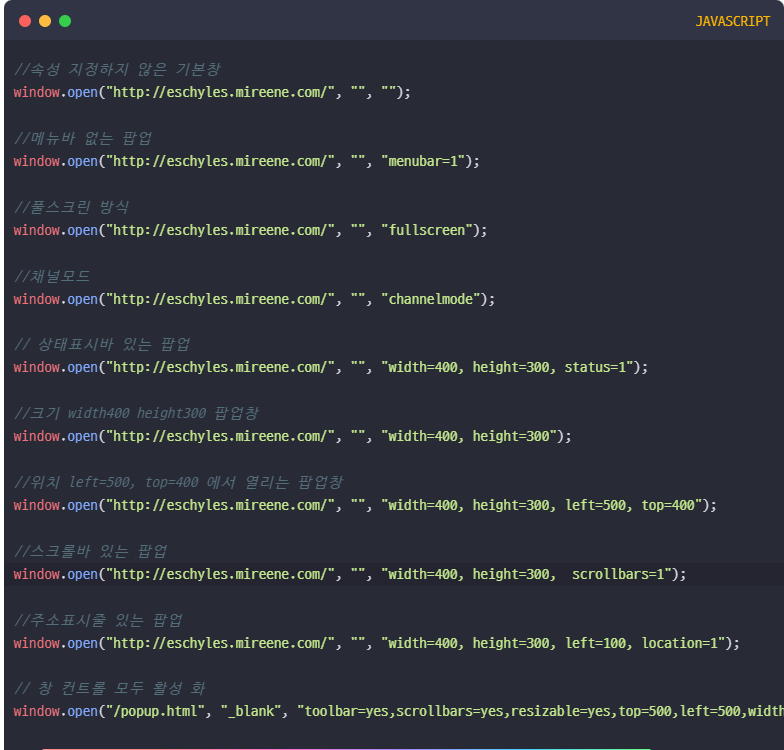
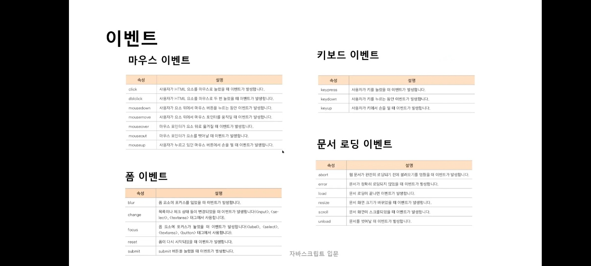
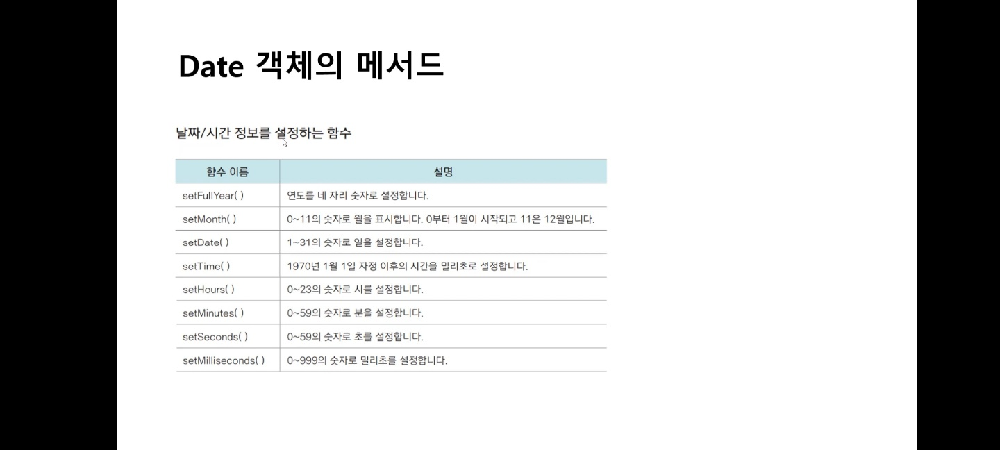
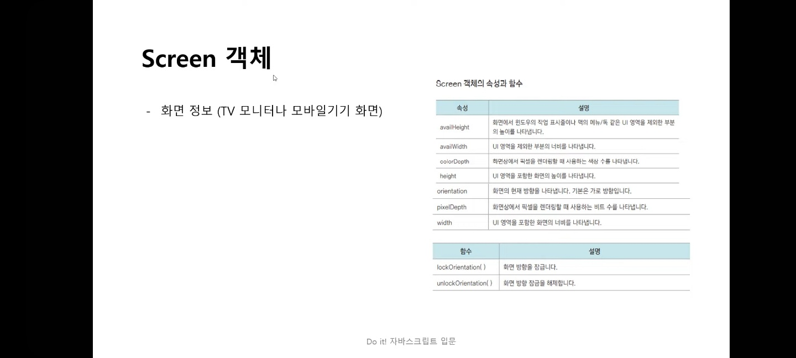

# **Frontend** 

## 💡 `JavaScript` 

--- 

**`프런트엔드(Front-end)`** <br>
- HTML/CSS/JavaScript <br>
    - JQuery / React, Vue, Angular 등 → '**자바스크립트**'의 *라이브러리* or *프레임워크* <br>
        - 기초 문법 똑같다. <br>
- 사용자(User)의 눈에 보이는 부분 <br>
    - ex) 회원가입 폼 만들기 <br>

**`백엔드(Back-end)`** <br>
- 사이트를 서버와 연동을 하여 DB로 전달 <br>
- jsp, asp, php 등의 개발자 <br>
- 사용자(User)의 눈에 보이지 않는 부분 <br>
    ex) 가입 버튼을 누르면 실제 내용 DB로 전달 <br>

---

**`자바스크립트`** <br>
- 자바(Java) 와 다른 것 → Java : 어플 개발, 게임 개발 등에 많이 사용하는 언어 <br>
    ```
    [참고]

    https://www.java.com/ko/download/help/java_javascript.html

    https://stackoverflow.com/questions/245062/whats-the-difference-between-javascript-and-java
    ```
- HTML 코드에 삽입하여 웹 브라우저에서 많이 사용하는 프로그래밍 언어 <br>
    ```
    조건 구현부
    ```
- 웹의 내용을 동적으로 바꾸거나 마우스 클릭 같은 이벤트를 처리할 수 있음 <br>
- 이미지에 마우스를 가져다 댔을 때, 이미지가 바뀐다든지, 메뉴가 열리는 등의 일 <br>
- 대소문자 구분 <br>
    ```
    a와 A는 다르다.
    ```
- 큰 따옴표와 작은 따옴표 모두 허용 <br>
    ```
    단, 이중으로 쓸 때 큰 따옴표 안 큰 따옴표 또는 작은 따옴표 안 작은 따옴표는 오류
    '' / "" → 오류

    "" / '' ▷ 이렇게 써야 한다. (구분)
    ```
- 다양한 객체들로 구성되며, 각 객체마다 다양한 메서드들을 가지고 있음(객체기반 스크립트언어) <br>
    ```
    객체란?
    특정 기능을 수행하는 단위체

    객체(Object).메서드(Method); [메서드(Method) : 명령]
    ┌
      복합기.복사해라
      복합기.스캔해라
      복합기.인쇄해라
                    ┘
    ```

---

**`객체 종류`** <br>
```
객체 : 객체는 값이 아닌 '참조'로 처리 → (값의) 복사본 x


const X = person [person : Object인 경우]

▶ X 변경하면 person도 변경 된다.
```
1. 내장 객체 : 자체적으로 가지고 있는 객체 <br>
    - 자바스크립트 안 자체 코드로 가지고 있는 것 <br>
        ```
        String(문자), Date(날짜), Array(배열), Math(수학) 등

        ▷ 각 해당 메서드 따로 있다.
        ```
2. 브라우저 객체 : 브라우저 계층 구조 <br>
    ```
    window, screen, history, navigator 등
    ```
3. 문서 객체 : HTML구조 - 최상위 html, 하위 head, body <br>

```
1 ~ 3 외, 더 존재한다.
```

---

**`선언문`** <br>
- 자바스크립트 코드를 작성할 영역을 선언하는 곳 <br>
- 이전 JavaScript 유형
    ```HTML
    <script type="text/javascript"></script>

    <!-- 아주 옛날 방식 → HTML5버전부터 사용 x -->
    ```
    cf)
    ```HTML
    <style type="text/css"></style>
    ```
- 속성
    1. 내부형 → 태그 활용(&lt;script&gt;) - 태그 안 작성
        ```HTML
        <script>
            스크립트 실행문; → 문장 끝에 세미콜론(;)으로 마감
        </script> <!-- 해드(head), 바디(body) 안에 작성 -->
        ```
        cf)
        ```HTML
        <style>
            CSS문;
        </style>
        ```
    2. 외부형 스트립트 <br>
        ```HTML
        <script src="경로/파일명"></script>

        <!-- script: src → tab 키 -->
        ```
        cf)
        ```HTML
        <link rel="stylesheet" href="경로/파일명"> <!-- 닫는 태그 없음 -->        
        ```

---

**`위치`** <br>
1. head <br>
    ```HTML
    <head>~</head> 
    ```
    ▶ body태그를 읽기 전에 실행 됨 <br>
2. body <br>
    ```HTML
    <body>~</body>
    ```
    ▶ head태그를 실행한 이후에 실행(이벤트로 함수 호출) <br> 

---

**`확장자`** <br>
.js

---

**`주석`** <br>

1. 한 줄 주석 <br>
    ```JavaScript
    // 주석문
    ```
2. 여러 줄 주석 <br>
    ```JavaScript
    /* 주석문 */
    ```

---

**`출력`** <br>
- innerHTML. : HTML 내용 정의 <br>
    ```
    innerHTML 안에 &lt;code&gt;~&lt;/code&gt; 태그로 코드 표시 가능
    ```
- document.write(). : 테스트 목적 <br>
    ```
    플러스(+) 또는 쉼표(,)로 구분 가능(문자 구분)
    ```
    ```
    body에 내용이 찍힘
    ```
    ```
    크롬 F12 키 → 콘솔 → 오류 확인
    ```
    ```JavaScript
    document.write("<hr>");

    /* <hr> 태그 동작한다. */
    /* \n(줄바꿈) 실행 x → <br> 태그 사용 */
    ```
- window.alert(). : 경고, 메시지 목적(window 생략 가능) <br>
- console.log(). : 디버깅을 위한 콘솔 (괄호 안 : 콘솔창에 출력하고 싶은 것 입력) <br> 

---

**`코드 입력 주의사항`** <br>
1. 대문자, 소문자 구분하여 작성 <br> 
2. 한 줄 코드 작성 후 세미콜론( ; ) <br>
3. 큰따옴표와 작은따옴표의 겹침 오류 주의 <br>
    - 큰 따옴표 계속 겹치면 인식 못 한다. <br>
4. 중괄호{ }, 소괄호( )의 짝이 맞게 작성 <br>
```
일부 오류 → .(점) 한 개 등 잘못 작성하면 실행 안 된다.(주의)

ex) 파일, 사진 등 넣었지만 안 나오면 오류!
```

---

**`window 객체 메서드`** <br>
- alert( ) : 메시지 창, 확인 버튼 <br>
    - window.alert([message]); → [message] : [경고 대화 상자] ▶ 텍스트 문자열 or 문자열로 변환해 나타낼 객체 <br>
    - 브라우저마다 알람 디자인 다르다. <br>
    - type : undefined <br>
- prompt ( ) : 질문과 답변의 질의응답 창 <br>
    - window.prompt(message, default); → message 매개변수 생략 가능(default 설정 시 default를 기본값으로) <br>
        - 반환 값 : **null** 또는 사용자가 입력한 **문자열☆** <br>
            - null : 취소 or 빈 문자 '확인' <br>
                - null → 취소 → type : Object <br>
                - 빈 문자 '확인' → type : string <br>
            - **반환 값이 문자열☆** → type : string <br>
- confirm( ) : 질문으로 확인이나 취소버튼을 나타냄 <br>
    - window.confirm(message); → [경고 대화 상자] ▶ 표시할 텍스트 문자열 <br>
        - 확인 : true <br>
        - 취소 : false <br>

<br>

- **`alert ( )`** <br>
    - 문자형 : 문자나 숫자를 큰 따옴표(" ")나 작은 따옴표(' ')로 표시한 데이터 <br>
        ```
        "Abc01"  "11AAA"  "96" …
        ```

    - 숫자형 : 숫자 <br>


```
\(역슬레시)

\n : 줄 바꿈
\' : 작은 따옴표
\" : 큰 따옴표

\xXX(2개의 16진수) → Latin-1문자
\uXXXX(4개의 16진수) → 4개로 지정된 유니코드 문자 ▶ 유니코드 사용 가능 
\XXX() → Latin-1문자 (1 ~ 377 사이 8진수) [ECMAScript v3 지원 x]
```

- **`document.write();`** <br>
document 문서 객체 <br>
body에 내용을 찍어라(출력) <br>
    ```HTML
    <br>
    <hr>
    "+", ","
    …
    ```

- **`변수(Variables)`** <br>
    - 변하는 데이터(Data)를 저장하는 공간 <br>
    - 변수에는 한 번에 1개의 데이터만 저장되고, 새로운 데이터가 입력되면 변경 <br>
        ```JavaScript
        var a, b, c;
        
        var a;
        var b;
        var c;
        ```

**`변수에 저장할 수 있는 데이터 종류`** <br>
1. `문자형(String)` : 문자나 숫자를 큰따옴표(" ") 또는 작은따옴표(' ')로 표현 <br>
2. `숫자형(Number)` : 숫자 <br>
3. `논리형(Boolean)` : true, false <br>
4. `빈(Null) 데이터` : 변수에 저장된 데이터를 비우고자 할 때 사용(0이 아님) <br>
     ```
    cf)
    delete, undefined
    ```
5. `undefined` : 값이 없는 변수의 값 → 단순히 선언만 하는 경우, undefined로 할당된다. <br>
    - 선언 : 데이터 값이 없다. <br>

---

cf)

```JavaScript
window.open()
      .open(url)
      .open(url, target)

// ----------------------

document.getElementById('ID');
```

---

**`변수 선언`** <br>

1. var 변수명; <br>
2. var 변수명1, 변수명2, 변수명3 …; (여러 개의 변수 선언) <br>
3. var 변수명 = 데이터 값; <br>

**`변수명 작성 시 주의사항`** <br>
- 첫 글자는 $, 언더바(_), 영문자만 써야함 <br>
- 첫 글자 다음은 영문자, 숫자, $, 언더바(_)만 포함할 수 있음 <br>
- 예약어(Reserved Words)를 사용할 수 없음 <br>
    - 예약어는 이미 자바스크립트에서 사용 중인 단어 <br>
        ```
        '예약어'를 프로퍼티 키(key)로 사용해도 에러가 발생하지 않지만,
        예상치 못한 에러가 발생할 수 있다.

        https://www.w3schools.com 
        검색 : Reserved Words
        ```
- 대문자 소문자 구분 <br>


```
ABC → ○
123abc → x ▶ 앞 숫자 x 
Total# → x ▶ 특수코드 x
Two of → x ▶ 공백 (띄어쓰기 x) ▷ Two_of → ○ (공백 대신 언더바(_))
int → x ▶ (int형) 예약어
Not! → x ▶ 예약어
_tot → ○
```

```
★ 코드를 유추할 수 있는 것으로 사용
```

---

### **연산자** <br><br>

**`산술 연산자`** <br>
|||
|:---:|:---:|
| ＋ |더하기|
| － |빼기|
| ＊ |곱하기|
| / |나누기|
| % |나머지|
|||

```
숫자(Number)  ☆  "숫자"(String)    →   '정수형' 우선 [빼기 / 곱하기 / 나누기 / 나머지]
            (연산)


숫자(Number)  ☆  "숫자"(String)    →   '문자형' 우선 [더하기]
            (연산)


"숫자"(String) ☆ "숫자"(String)    → 연산 ○, 숫자 연산이 아닌 문자 연산 → "123" + "456" = 123456;
            (연산)
```

- 줄바꿈 <br>
    - &lt;br&gt; <br>
- 태그와 변수 같이 쓸 때 <br>
    - &lt;태그&gt; + 변수 <br>
    - &lt;태그&gt;, 변수 <br>

<br>

**`대입(할당) 연산자`** <br>
|||||
|:---:|:---:|:---:|:---:|
|||쓰는방법|풀이|
| = |대입|a = b| a = b|
| += |덧셈 대입|a += b|a = a + b|
| -= |뺄셈 대입|a -= b|a = a + b|
| *= |곱셈 대입|a *= b|a = a * b|
| /= |나눗셈 대입|a /= b|a = a / b|
| %= |나머지 대입|a %= b|a = a % b|
||||

<br>

**`비교 연산자`** <br>

||||
|:---:|:---:|:---|
||쓰는 방법|풀이|
|>=|A >= B|A가 B보다 크거나 같다.|
|<=|A <= B|A가 B보다 작거나 같다.|
|>|A > B|A가 B보다 크다.|
|<|A < B|A가 B보다 작다.|
|==|A == B|A와 B가 같다.|
|!=|A != B|A와 B가 같지 않다.|
|||

```
──────────────────────────────────────────────────────────────────
■ Equal Operator (==) ▶ '값'만 비교
  
  10 == "10" → 문자열을 숫자로 변환 후 '값(value)' 비교  ▶ true

 ┌ 
  true == '1' 
  
  → 
    ① true를 1로 변환 
    ② 문자열을 숫자로 변환
    ③ 값(value) 비교

                    ▶ true
                           ┘

  null == undefined  ▶ true

  NaN == NaN  ▶ false
──────────────────────────────────────────────────────────────────
■ Strict Equal Operator (===) ▶ '타입 + 값' 모두 비교 
(타입 : data type → Number, String, Array, null, undefined …)

10 === "10"  ▶ false
10 === 10  ▶ true

null === undefined  ▶ false
NaN === Nan  ▶ false
──────────────────────────────────────────────────────────────────
```

<br>

**`증감 연산자`** <br>
- ++변수, 변수++ ▷ 변수의 값을 1씩 증가 <br>
- --변수, 변수-- ▷ 변수의 값을 1씩 증가 <br>
- ++변수, --변수 : 전위 연산자 <br>
- 변수++, 변수-- : 후위 연산자 <br>
    - 앞 : 연산 후 명령을 실행 <br>
    - 뒤 : 명령을 실행한 후에 연산 <br>

<br>


**`논리 연산자`** <br>
결과 : true, false <br>
- && → and 연산자 : 결과가 모두 true일 때만 true로 반환 <br>
- || → or 연산자 : 결과가 하나라도 true이면 true로 반환 <br>
- ! → not 연산자 : 결과가 반대로 반환 <br>

<br>

**`문자 결합 연산자`** <br>
최소 2개의 데이터가 필요함 <br>
여러 개의 문자를 하나로 결합할 때 사용 <br>
- '+'로 연결 <br>
    - "문자" + "문자" <br>
    - "문자" + 숫자 <br>
<br>

**`삼항 조건 연산자`** <br>
조건식의 결과가 true 또는 false일 때 각각 다른 실행문을 수행 <br>
```
조건식 ? true 실행문1 : false 실행문2
```
- 조건식의 결과 값이 참(true)이면 실행문1, 거짓(false)이면 실행문2를 수행 <br>

---

**`질의 응답 창`** <br>
```
prompt('질의 내용', '기본 답변');
```
사용자가 입력 ○ / 질문사항에 답변할 수 있다. (입력 : 입력에 대한 데이터) <br> 

---

**`데이터 형식`** <br>
- 값을 포함할 수 있는 데이터 유형 <br>
    1. 문자형(String) : 문자나 숫자를 큰 따옴표(" ") 또는 작은 따옴표(' ') <br>
    2. 숫자형(Number) : 숫자 <br>
    3. 논리형(boolean) : true, false <br>
    4. Object
    5. function
- 값을 포함할 수 없는 데이터 유형 <br>
    1. 빈(null) 데이터 : 빈 데이터 → 0이 아님 <br>
    2. undefined <br>

---

**`typeof( )`** <br>
변수에 저장된 자료형을 알고 싶을 때 사용 <br>
- 문자형 : string <br>
- 숫자형 : number <br>
- true/false : boolean <br>
…

```
prompt로 숫자를 입력해도 문자(열)[string] 출력

prompt로 문자(특수문자) 입력해도 문자(열)[string] 출력
```

---

**`문자형 숫자 - 숫자형으로 변경`** <br>
1. Number( ) : 숫자데이터로 반환 <br>
    - string 숫자 → number형 <br>
    - 소수점 표현 ○ <br>
        ```
        .123 ▷ 0.123 표현(출력)
        ```
        ```
        Number(prompt(" "));
        → 문자 입력하면 NaN
        ▷ 입력 안 함(공백(space)), 취소 → 0
        ```
2. parseInt( ) : 정수형 데이터로 반환((+)양의 정수, 0, (-)음의 정수) [정수형 → float] <br>
    - string 숫자 → number형 <br>
        ```
        숫자(숫자 먼저) + 문자 → 숫자만 정수형으로 반환 [타입 : Number]
        ▷ 공백 제거, 문자 제거

        문자(문자 먼저) + 숫자 → NaN
        ```
        ```
        cf)

        parseInt(Number()) 
        ▷ .123 → 0
        
        ↕

        Number(parseInt())
        ▷ .123 → NaN
        ```
       
▶ 1, 2 모두 숫자(Number)로 반환 <br>

```
cf)

prompt → Number, ParseInt : "123" 입력 시 모두 NaN
Number(prompt()) / parseInt(prompt())

입력x(확인), 취소, 공백 → NaN
```

---

**`질문으로 확인이나 취소버튼을 나타냄`** <br>
```
confirm('질의 내용');
```
- `확인` 버튼 : `true` 반환 <br>
- `취소` 버튼 : `false` 반환 <br>

---

**`제어문`** <br>
프로그램의 흐름을 제어할 수 있도록 도와주는 문장 <br>

**`제어문 종류`** <br>
1. 조건문 - 조건을 만족하는지의 여부에 따라 코드를 제어 <br>
2. 반복문 - 특정 코드를 여러 번 반복해서 실행 <br>

- `조건문` <br>
    - `if`문 <br>
        조건식을 만족할 경우만 중괄호 { } 내의 코드를 실행(조건 다음의 코드 실행 - 중괄호 꼭 있는 것 x) <br>
        ```JavaScript
        if (조건식) {
            … ;
        }
        ```
    - `if ~ else`문 <br>
        조건식을 만족했을 때는 코드1를 수행하고, 그렇지 않을 때는 코드2를 실행 <br>
        ```JavaScript
        if (조건식) {
            코드1;
        } else {
            코드2;
        }
        // (if 쓰고) else에만 조건문 쓸 수 없다.
        ```
    - `if ~ else if ~ else` <br>
        2가지 이상의 조건과 정해놓은 조건에 만족하지 않을 때 실행 <br>
        ```JavaScript
        if (조건식1) {
            코드1;
        } else if (조건식2) {
            코드2;
        } else if (조건식3) {
            코드3;
        } else {
            코드4;
        }
        …
        ```
    - `switch ~ case`문 <br>
        조건과 정확히 일치하는 경우에(case값) 코드 실행 <br>
        ```JavaScript
        switch (조건) {
            case 값1:
            코드1;
            break;

            case 값2:
            코드2;
            break;

            default: 
            코드3;
            break;
        }
        ```

- `반복문` <br>
    - `for`문 <br>
        초깃값에서 조건식에 만족할 때까지 실행문 반복 <br>
        ```JavaScript
        for (초깃값; 조건식; 증감식) {
            실행문;
        }
        ```
    - `while`문 <br>
        조건식을 만족하는 동안에 실행문을 반복적으로 수행 <br>
        ```JavaScript
        초깃값;
        while (조건식) { // 조건이 만족할 때까지 명령 실행
            코드;
            증감식;
        }
        ```
    - `do ~ while`문 <br>
        실행문을 먼저 수행하고 조건이 만족하면 실행, 만족하지 않으면 종료 <br>
        ```JavaScript
        초깃값;
        do {
            코드;
            증감식;
        } while (조건식);
        ```
        ---

        - `break`문 <br>
        **☆반복문**의 실행문들은 수행과정에서 break문을 만나면 해당 반복문을 종료함 / 반복문을 정지시킬 때 사용 <br>
            - 반복문 내에서 사용할 수 있다. (if문 단독으로 사용 불가) <br>
        - `continue`문 <br>
        더 이상 실행문을 수행하지 않고 바로 증감식으로 돌아가 실행을 반복함 <br>
            - 반복문 내에서 사용할 수 있다. (if문 단독으로 사용 불가) <br>

        ---

---

window.`location` (window 생략 가능) <br>
- 브라우저의 현재 url 주소 값에 대한 정보 제공 개체(연결된 개체의 위치(url)를 나타낸다.) <br>
- '읽기 전용 속성'은 문서의 현재 위치에 대한 정보가 포함된 개체를 반환 <br>
```
Document.location 도 사용할 수 있다.
```

`location.reload( )` <br>
- 브라우저 새로고침 (현재 페이지 새로고침) <br> 

---

**`Date객체`** <br>
현재 또는 특정 날짜와 시간에 대한 정보를 제공 <br>
```JavaScript
// 기본 형식

var 변수명 = new Date();
```
▷ Date( ) 내장 객체만 단독으로 사용 가능 <br>

<br>

**`날짜 정보제공 메서드`** <br>
객체 생성 후 사용 ( new Date( ); ) <br>
- getFullYear( ) : 날짜에서 년도 <br>
- getMonth( ) : 날짜에서 월 0 ~ 11 (0 : 1월 / 11 : 12월) <br>
    - 배열의 인덱스 번호를 가지고 있다. (배열에 사용 가능) <br>
- getDate( ) : 날짜에서 일 <br>
- getDay( ) : 날짜에서 요일 (0 : 일요일 / 6 : 토요일) <br>
    - 배열의 인덱스 번호를 가지고 있다. (배열에 사용 가능) <br>
- getHours( ) : 시간에서 시 (0 ~ 23) <br>
- getMinutes( ) : 시간에서 분 (0 ~ 59) <br>
- getSeconds( ) : 시간에서 초 (0 ~ 59) <br>
- getMilliseconds( ) : 시간에서 밀리(1/1000)초 (1초 → 1000밀리초) <br>
- getTime( ) : 1970년 1월 1일 이후 경과 시간을 밀리초로 제공 <br>

<br>

**`날짜 지정 메서드`** <br>
객체 생성 후 사용 ( new Date( ); ) <br>
- setFullYear( ) : 날짜에서 연도 <br>
- setMonth( ) : 날짜에서 월만 새로 지정 (1월 : 0 / 12월 : 11) <br>
- setDate( ) : 날짜에서 일만 새로 지정 <br>
- setHours( ) : 시간만 새로 지정 <br>
- setMinutes( ) : 분만 새로 지정 <br>
- setSeconds( ) : 초만 새로 지정 <br>
- setMillseconds( ) : 밀리초만 새로 지정 <br>
- setTime( ) : 현재까지 경과된 밀리초를 새로 지정할 때 <br>
- setGMTString( ) : 날짜를 그리니치 천문대 표준시로 표시 <br>
- toString( ) : 날짜를 문자형식으로 표시 <br>


```JavaScript
new Date() // 현재 날짜

new Date(year, month(-1), date); // 특정 날짜
new Date(year, month(-1), date, hours, minutes, seconds); // 특정 날짜와 시간
```

```
★ 연말일(마지막 날짜)에서 오늘(현재) 날짜를 빼면 '밀리초'단위로 반환
   (마이너스(-) 연산 후 특정 변수에 대입하면)


   cf)
   
   플러스(+) : 문자 포함되어 있어서 문자 연산
   
   곱하기(*), 나누기(/) : 마찬가지로 밀리초 단위로 반환 (but, 쓰레기 값 출력 → 쓰지 말 것)
```

---


**`Math 객체`** <br>
- max(숫자1, 숫자2, 숫자3) : 숫자 중 최댓값 <br>
- min(숫자1, 숫자2, 숫자3) : 숫자 중 최솟값 <br>
- round(숫자) : 반올림 <br>
- ceil(숫자) : 올림 <br>
- floor(숫자) : 내림 <br>
- abs(숫자) : 수의 절댓값 <br>
    ```
    -2 → 2
     2 → 2
    ```
- random( ) : 0과 1 사이의 난수를 발생 <br>
    ```JavaScript
    // 0 ~ 3 사이의 난수
    Math.random() * 3  // 기본 * 1
    ```
- PI: 3.14… <br>
- pow(n, e) : 제곱근 [**(제곱근)와 같다. / e : 제곱] <br>

▷ 모두 문자 "a" 입력시 NaN 반환 <br>
▷ null → 0 반환 <br>

```JavaScript
Math.round(숫자)  // 반올림, 정수반환
Math.ceil(숫자)   // 올림, 정수반환
Math.round(숫자)  // 내림, 정수반환

// 정수에 대한 수 적용 x / Only (소수점) 실수에 적용
// 정수 + 실수(5.125…) → 정수 도출

// ※ 실수인 경우의 'round'
// -0.5  ▷ 올림하지 않는다.(.5) / (소수점 음수 1자리)
// -0.51 ▷ 소수점 음수 2자리는 올림! (0.01의 자리에 1 ~ 9 어떤 수가 오더라도)
// 모두 -1 출력!!
```

---

**`String(문자열) 객체`** <br>
```JavaScript
// 생성법

var 변수 = new String("값"); // 보편적인 생성법
var 변수 = "값"; // 간편한 생성법
```

**`메서드`** <br>
(인덱스 번호 : 0부터 시작) <br>


- 변수.bold( ) : 텍스트를 진하게 표현 <br>
- 변수.italics( ) : 텍스트를 기울기체로 표현 <br>
- 변수.link("url") : 텍스트에 링크를 걸어 반환 <br>
- 변수.length  <br>
    - 텍스트의 개수를 반환 → 괄호( ) 없음 ▷ 공백(띄어쓰기) 포함 / 많이 쓰인다. <br>
    - 배열 안의 개수를 반환 [Array]  <br>
- 변수.toLowerCase( ) : 영문자를 소문자로 바꿔 반환 <br>
- 변수.toUpperCase( ) : 영문자를 대문자로 바꿔 반환 <br>
- 변수.indexOf("i") : 처음부터 i를 찾아 최초로 일치하는 인데스 번호를 반환 (없을 경우 -1 반환 / 공백 포함) <br>
- 변수.lastIndexOf("i") : 끝에서 i를 찾아 최초로 일치하는 인데스 번호를 반환 (없을 경우 -1 반환 / 공백 포함) <br>
    - indexOf, lastIndexOf : (끝)널문자(\n)를 포함하지 않는다. (널문자 반환 x → '-1'로 반환) <br>
- 변수.charAt(n) : n번 인덱스에 저장된 문자 데이터를 반환 <br>
    - 변수.at(n) : Number또는 문자를 반환 (charAt과 기능 같다.) <br>
- 변수.substring(4, 6) : 4번부터 5번 인덱스까지의 문자데이터를 반환(4 ~ (6번 - 1) / 종료 인덱스 전까지 문자열 반환(배열 반환)) <br>
- 변수.substr(10, 3) : 10번 인덱스부터의 3글자를 반환 (n번째부터(포함) 개수) <br>
- 변수.replace("i", "j") : 텍스트 중 i를 j로 치환해서 반환 <br>
- 변수.slice(7, 9) : 7번부터 8번 인덱스까지의 일부만 잘라서 반환 <br>
    - (7 ~ (9번 - 1)) ☆ 배열을 반환 → 얕은 복사본 <br>
- 변수.concat("good") : 끝에 good이라는 문자를 결합하여 반환 <br>
    - 배열1.concat(배열2) → concat의 인자 생략하면 배열1 얕은 복사 일어남 <br>
- 변수.split(" ") : 공백을 기준으로 데이터를 분리(콤마) → 공백 안( , ) 쉼표 들어감(띄어 쓰기 없어짐) <br>
    ```
    ("") : 공백 x → 붙여쓰면 한 문자 문자별 쉼표(,) 들어감. (공백도 해당)
    ("n") : 해당 문자(n)가 있으면 그 자리로 쉼표(,) 들어감.
    ```

---

**`Array(배열) 객체`** <br>
하나의 변수에 여러 개의 데이터를 저장 <br>
```JavaScript
// 생성법

var 변수 = new Array();
var 변수 = new Array(값);
var 변수 = [값1, 값2, 값3, 값4, 값5 …]
```

① **`new`** 키워드를 사용하여 단일 객체를 정의하고 만든다. <br>
```JavaScript
var person = new Object();
```

② 객체 리터럴을 사용하여 단일 객체를 정의 <br>
```JavaScript
var person {
    …
};
```
▶ 단순성, 가독성, 실행 속도를 위해서라면 ②번 방법 사용 <br>

```
property는 undefined나 null을 할당한다고 삭제되지 않기 때문에
반드시 'delete'라는 키워드를 사용하여 프로퍼티를 삭제해 주어야 한다.

▷ 객체 속성에만 영항 ○ / 변수, 함수에 영향 x
```

**`메서드`** <br>
- .reverse( ) : 배열데이터를 역순으로 반환 <br>
- .slice(번호1, 번호2) : 인덱스 번호 1부터 번호2 직전의 데이터까지 잘라서 저장 <br>
- .sort( ) : 배열 데이터를 알파벳 또는 0, 1, 2 …의 오름차순으로 정렬 <br>
- .join('구분자') : 배열데이터를 구분자로 연결하여 결합 <br>
    - 문자 사이사이 (끝 제외) 괄호( ) 안에 지정한 특수문자로 구분 (*, /, & …) <br>
- .concat( ) : 여러 개의 배열 데이터들을 하나로 결합 <br>
- .copyWithin(target, start, end) <br>
    - target : 복사 위치 / index 번호 <br>
    - start, end : 처음 ~ 끝 중 '종료 전'까지 <br>
    - (start만 있고) end 없음 : start에서 끝까지(length 만큼) <br>
- .entries( ) 배열 항목에 접근 [key : value 쌍의 배열 반환]<br>

**`배열 데이터 추가/삭제 메서드`** <br>
- .shift( ) : 배열에서 첫 인덱스(0)에 저장된 데이터를 삭제 <br>
- .pop( ) : 배열에서 마지막 인덱스에 저장된 데이터를 삭제 (배열 끝 항목 제거) <br>
- .unshift( ) : 배열에서 첫 인덱스(0)에 새 데이터를 중첩하여 추가 <br>
- .push( ) : 배열에서 마지막 인덱스에 새 데이터를 중첩하여 추가 (새로운 요소를 마지막 (인덱스로)에 추가) <br>
- .concat( ) : 여러 개의 배열 데이터들을 하나로 결합 <br>

```
[String.prototype]

https://developer.mozilla.org/ko/docs/Web/JavaScript/Reference/Global_Objects/String
```


```
[array.prototype]

https://developer.mozilla.org/ko/docs/Web/JavaScript/Reference/Global_Objects/Array
```

---

### HTML 요소 <br>
HTML 안에 넣는 문자열, 정수는 모두 'String Type' <br>
- id : document.getElementById("id").메소드 <br>
    id는 1개만 쓸 수 있다. <br>
    ```JavaScript
    document.getElementById("id").innerHTML = "내용";
    document.getElementById("#id") // # 쓰면 인식 x

    // body 내 내용 변경 가능 (오히려 []배열처럼 index 지정하면 오류!)
    ```
- tag : document.getElementsByTagName("name").메소드 <br>
- class : document.getElementsByClassName("name").메소드 <br>
    ```JavaScript
    document.getElementsByClassName(".name") // . 쓰면 인식 x
    ```
    ```JavaScript
    // [tag, class]

    // Array처럼 인덱스 번호로 접근 [index]
    document.getElementsByTagName("name")[index 번호].innerHTML = "내용" → 내용 변경 가능 
    document.getElementsByClassName("name")[index 번호].innerHTML = "내용" → 내용 변경 가능 

    document.getElementsByClassName(".name")[index 번호].innerHTML = "내용" // . 쓰면 인식 x
    ```

```
innerHTML = new HTML 

innerHTML : written + read(변경 or 읽기)
innerHTML : String type 
```

```
innerHTML 외 메서드 많이 있다.
```

- querySelectorAll("#id, .class, tag, tag[속성], tag[속성명 ＠ 속성값]...") [＠ : =, ~=, |=, ^=, $=, *=] <br>
＊tag만 쓰는 것은 잘 적용이 안 되서 id, class 쓰는 것을 권장 <br>
ie9 이상 지원 <br>
id(#), class(.) 접근 방식으로 써야 한다. <br>

```
☆ tag, id, class, querySelectorAll 모두 접근 시 [0, 1, 2 …] 배열 인덱스 형식으로 접근하여야 한다.
```

```JavaScript
document.getElementById("id").style.property = style;


document.getElementById("myH1").style.color = "red";

let value = document.getElementById("myP").style.borderTop;

element.style.backgroundColor = "red";  

//element.style = "color:red"; // 이렇게 쓸 수 없음.

// border-top → borderTop : 대쉬(-)는 카멜 케이스 방식 (dash는 마이너스(-) 연산으로 인식할 수 있기 때문에)
// style : 속성 1개씩밖에 적용 안 된다.
```

---

**`함수(function)`** <br>
함수를 사용하면 실행문들을 메모리에 저장했다가 필요할 때 해당 함수의 이름으로 다시 호출하여 사용할 수 있음 <br>

- 기본형식 <br>
    ```JavaScript
    function 함수명() { // 함수 정의
        실행문;
    }

    함수명(); // 정의된 함수 호출
    ```

    ```JavaScript
    function 함수명(매개변수1, 매개변수2) { // 함수 정의
        실행문;
    }

    함수명(인자값1, 인자값2); // 정의된 함수 호출
    ```

---

**`이벤트`** <br>

- **input** <br>
    - `onblur` : 포커스를 잃었을 때 (입력창 …) <br>
    - `onfocus` : 대상에 포커스가 생겼을 떄 발생 <br>
    - `onchange` : 특정 내용 선택, 입력 요소의 값 변경, select에서 내용 변경 (바꿔줄 때 사용 / 핸들러 바꿔줄 때) <br>
    - `onselect` : 드래그 또는 쉬프트 + 방향키 등으로 문자열에 블럭을 씌우는 경우 <br>
    <br>
    - `onsubmit` : 전송 버튼을 눌렀을 때 발생 <br>
    - `onreset` : 취소 버튼을 눌렀을 때 발생 <br>
    - `onkeydown` : 키보드 버튼을 누르고 있을 때 <br>
    - `onkeypress` : 키보드 버튼을 누르고 있을 때 (Alt, Ctrl, Shift, Esc, F1 ~ F12, 한글 제외) <br>
    - `onkeyup` : 키보드 버튼 누르고 있다가 뗄 때 <br>
    <br>
- **mouse** <br>
    - `onmouseover` : 대상에 마우스를 올렸을 때 발생 <br>
    - `onmouseout` : 대상에서 마우스가 벗어났을 때 발생 <br>
    - `onmousedown` : 누르고 있을 때 <br>
    - `onmouseup` : 누른 상태에서 뗄 때 <br>
    - `onmouseomve` : 마우스를 움직일 때 발생 <br>
    <br>
- **click** <br>
    - `onclick` : 클릭 (클릭할 때 적용 ex: &lt;button&gt; 태그 등) <br>
    - `ondblclick` : 더블 클릭 <br>
    <br>
- **load** <br>
    - `onload` : 문서를 모두 불러오고 나서 발생 <br>
    - `onunload` : 문서를 종료할 때 발생 <br>
    - `onerror` : 문서나 이미지를 불어올 때 에러가 나면 발생 <br>
    - `onresize` : 브라우저의 창을 조절할 때 발생 <br>

```
속성값을 ""로 줄 수 있다. (초기화)

color = ""; (초기화)


cf)

color = " "; → 공백으로 인식되어 제대로 적용 x 
```

```
window.onload : 문서를 모두 불러오고 나서 발생(event실행)
```

---

**`타이머 함수`** <br>
특정 시간마다 함수를 호출하고 싶을 때 타이머 함수를 사용 <br>
- **타이머 함수** 종류 <br>
    - setInterval : 특정 시간마다 함수를 계속해서 호출하고 싶을 때 사용 <br>
        ```JavaScript
        // setInterval: 일정시간마다 실행

        var count = 0;

        setInterval(function() {
            count++;
            document.write(count, "<br>");
        }, 500);
        ```
    - clearInterval : 타이머 함수를 멈출 때 사용 <br>
        - setInterval에 변수 설정을 해야 설정 된다. <br>
            ```JavaScript
            clearInterval(timerId); // timerId는 setInterval를 설정한 변수
            ```

            ```JavaScript
            // clearIterval : 타이머 함수 중지

            var count = 0;

            var timerId = setInterval(function() {
                count++;
                if(count > 10) {
                clearInterval(timerId);
                count = "";
                }
                document.write(count, "<br>");
            }, 100);
            ```
    - setTimeout : 일정 시간 후에 딱 한 번만 함수를 실행할 때 사용 <br>
        ```JavaScript
        setTimeout(function() {

        }, milliseconds);
        ``` 
        ```JavaScript
        // setTimeout : 일정 시간 후에 딱 한 번만 함수를 실행
        
        var count = 7;

        // 3초 후에 1 증가
        setTimeout(function() {
            count++;
            document.write(count);
        }, 3000);
        ```

---

**`window.open( )`** <br>




```
practice/practice.html 참고
```

---


---









---
---
---