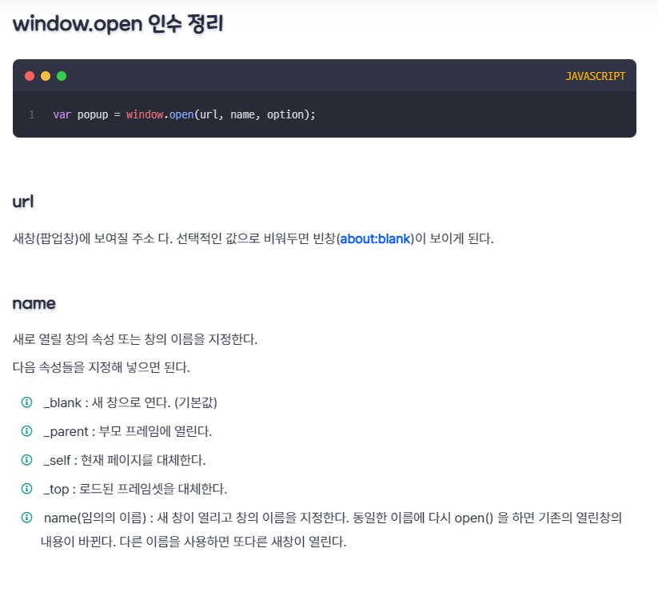
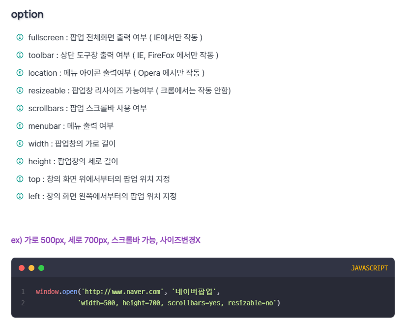
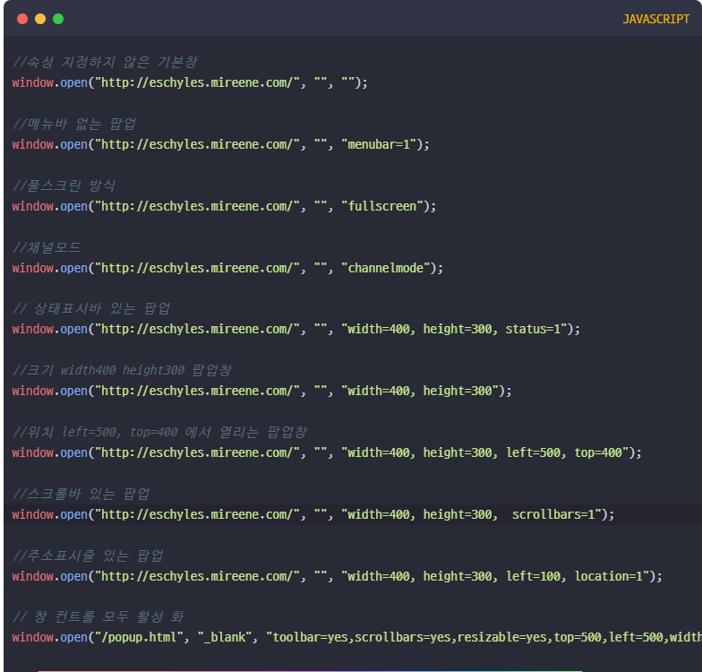

# **Frontend** 

## 💡 `jQuery` 

--- 

### **`jQuery`** <br>

**창시자** <br>
존 레식(John Resig) <br>
- JavaScript 라이브러리(라이브러리 : 자바스크립트로 만들어진 다양한 함수들의 집합) <br>
- JavaScript 프로그래밍을 크게 단순화 함. <br>
- 자바스크립트 언어를 기반으로 구성 <br>

**`jQuery 연동하기`** <br>
```
[방법]

1. jQuery 다운로드 → 파일을 직접 다운로드
2. CDN의 jQuery로 연동 → 온라인 주소로 연결(https:// ~)
  - jQuery 하려면 무조건 연결 필요

* CDN : Content Delivery Network
```

```
○○○.버전.min.js : 압축버전(축소) → 보통 이걸로 많이 쓰인다. 
○○○.버전.js → 개발용
```

```
※ 주의사항
  - 다운로드할 때 지정된 파일 이름 수정하지 말 것.
  - 다운로드한 파일 내부 수정하지 말 것.
    ▷ 다운로드한 파일이 실행 안 될 수 있다.
```

1. jQuery 다운로드 <br>
- https://jquery.com 접속 <br>
    ```
    'toggle()' 검색해서 가져와 쓸 수 있다. 

    단, 버전 업이 되면서 기존 버전 삭제되거나 할 수도 있으니 주의!
    (버전 낮은 버전을 찾아 가져와서 써야할 수도 있다.)
    (ex: 최신 버전 - 3.6.1. / 슬라이드 기능 호환(마지막) 버전 - 1.8.3. / 1.4.4. …)
    ```

2. CDN의 jQuery로 연동 <br>
- https://jquery.com 접속 <br>
    - Download ▷ `Other CDNs` <br>

```
◎ 모든 버전 확인 : Download ▷ 맵 하단 'Past Releases' ▷ jQuery CDN 클릭

  (버전별 script 주소 가져와서 쓸 수 있다.)
```

**`연결 방법`** <br>

```HTML
<script src="다운받은 제이쿼리 파일"></script>
<script>
    $(document).ready(function() { // → 문서 로드가 완료(준비)되면 jQuery 코드를 실행해라.
        // jQuery 코드;
    }); // [ $ === jQuery ]
</script>


<script src="다운받은 제이쿼리 파일"></script>
<script>
    jQuery(document).ready(function() {
        // jQuery 코드;
    }); // 위 코드와 같다.
</script>
```

```HTML
<script src="다운받은 제이쿼리 파일"></script>
<script>
    $(function() {
        // jQuery 코드;
    }); // 이런 형태로 줄여서 쓸 수도 있으나, 사용 안 되는 경우도 있으니 주의.
</script>
```
```
$(function(){}); 코드 안 되는 경우 참고

https://jeffrey-oh.tistory.com/351
```

```
★ 여러 버전을 같이 쓸 때는 제일 높은 상위 버전을 마지막에 써줄 것.

…
1.8.3.min.js
3.6.1.min.js
```

---

**`제이쿼리 주석`** <br>
```javascript
//
/* */
```

---

|||
|:--|:--|
|Selectors|선택자|
|Attributes / CSS|CSS, 속성 등|
|Manipulation|조작|
|Traversing|탐색 (ex : 짝수 번째 찾아라~)|
|Events|이벤트(이벤트 모음)|
|Effects|효과, 애니메이션|
|Ajax|비동기 통신기술을 이용해서<br>XML데이터를 주고 받는 기술<br>(트위터, 페이스북, 네이버에<br>댓글 달면 바로 업데이트)|
|||


**`선택자(Selector)`** <br>
```javascript
$(selector).method()
```

`[Basics]` <br>
1. `* selector` <br>
    HTML의 모든 태그 selector <br>
    ```javascript
    $("*").method();

    $("태그 *").method(); // → 태그 안 * (다른 태그)가 포함된 경우만 적용 됨.
    ```

    ```
    $(괄호 안) → "Double quote" 또는 'Single quote' 모두 가능

    (변수가 아닌 tag, class, id를 선택하는 경우 반드시 (큰/작은)따옴표로 묶어 줄 것. (안 그러면 오류))
    ```

- `css() 메서드` <br>
    선택한 요소에 대해 하나 이상의 스타일 속성을 설정 [`Attributes 영역`] <br>
    ```javascript
    .css("속성명");
    .css("속성명", "속성값");
    .css({"속성명": "속성값", "속성명": "속성값", …}); // → 하나 이상의 CSS 적용
    .css({속성명: "속성값", 속성명: "속성값", …}); // → 하나 이상의 CSS 적용
       // ☆ '속성값'은 반드시 ""('')따옴표로 묶어 줄 것. (안 그러면 오류/적용 x)
    ```

    ```javascript
    .css({속성명 : "", …});
    // 속성값을 빈 값으로 '초기화' 하는 방법도 가능
    ```

2. `element selector` <br>
    ```javascript
    document.getElementsByTagName("태그명");

    $("element").method();
    ```

3. `class selector` <br>
    ```javascript
    document.getElementsByClassName("class명");

    $(".class명").method();
    ```

4. `id selector` <br>
    ```javascript
    document.getElementsById("id명");
    $("#id명").method();
    ```

5. `selector1, selectorN …` <br>
    여러 개의 selector를 같은 method로 <br>
    ```javascript
    $("selector1, selector2, selectorN").method();
    ```

    ```javascript
    $(".class1, .calss2, #id3").method();
    ```

---

`[Hierarchy]` <br>

1. `parent > child` <br>
    ```javascript
    $("parent > child").method();
    ```

- `.text() 메서드` [`Manipulation(조작)`] <br>
    selector의 텍스트 변경 <br>
    (selector의 텍스트 변경 → 1줄만) <br>
    ```javascript
    $(selector).text();
    ```

    ```
    .text() 적용 이후 'background : url()' 배경 이미지 안 먹는다.(적용 x)
    단, ☆배경색은 가능 !
    ```

2. `ancestor descendant` <br>
    ```javascript
    $("ancestor descendant").method();
    ```

3. `prev + next` <br>
    ```javascript
    $("prev + next").method();
    ```

4. `prev ~ siblings` <br>
    ```javascript
    $("prev ~ siblings").method();
    ```

<br>

```
◈ CSS 가상클래스 쓰는 방식과 좀 다른 경우 있다.
```

```CSS
/* CSS */

li + li { /* (인접 형제 관계) */
    속성명: 속성값;
} /* 플러스(+) 뒤 li 태그 전부 적용 */
```

```javascript
/* jQuery */

$(.class1 + li).css({속성명: "속성값"});  /* .class1이 li 태그인 경우 */
/* 플러스(+) 뒤 li 1개만 적용 */
```

```javascript
/* jQuery */

$(li + li).css({속성명: "속성값"}); 
/* CSS와 같다.(li 다음, 플러스(+) 뒤 모든 li 선택) */
```

---

`[basic filters]` <br>
인덱스(index) ('0번'부터 ~ n번) / ( : 콜론 형태 ) <br>

1. `:animated` <br>
    애니메이션이 진행 중인지 감지 (효과 입힐 때) <br>
    ```javascript
    $(selector:animated).method();
    ```
        
    ```
    ☆ 빠르게 클릭할 때 애니메이션이 과도하게 실행되는 것을 방지하기 위해 'false'를 반환
    ```
2. `:eq()` <br>
    해당 인덱스(index) 번호를 찾음 (0부터 ~) <br>
    (해당 인덱스(index) 번호에 명령) <br>
    ```javascript
    $(selector:gt(index)).method();
    ```
3. `:gt()` <br>
    인덱스(index) 번호보다 큰 selector 찾음 <br>
    ```javascript
    $(selector:gt(index)).method();
    ```
4. `:lt()` <br>
    인덱스(index) 번호보다 작은 selector 찾음 <br>
    ```javascript
    $(selector:lt(index)).method();
    ```
5. `:first` <br>
    첫 번째 selector <br>
    ```javascript
    $(selector:first).method();
    ```
6. `:last` <br>
    마지막 번째 selector <br>
    ```javascript
    $(selector:last).method();
    ```
```
2 ~ 6번 모두 같이 쓰는 경우(크게 같이 묶여 있으면),
전체 첫 번째부터 계산
```
7. `:even` <br>
    index 짝수 번째 (0부터 ~) selector 시작(첫 번째) <br>
    ```javascript
    $(selector:even).method();
    ```
8. `:odd` <br>
    index 홀수 번째 (1부터 ~) selector 시작(두 번째) <br>
    ```javascript
    $(selector:odd).method();
    ```
9. `:not()` <br>
    제외하고 적용 <br>
    ```javascript
    $(selector:not(조건)).method();
    ```
10. `:header` [`CSS 없음`] <br>
    h 태그 적용 <br>
    ```javascript
    $(selector:header).method();


    $(selector *:header).method(); // → selector의 하위 모든 h 태그 적용
    // or 
    $(selector :header).method(); // → selector의 하위 모든 h 태그 적용
    ```
11. `:root` [`CSS 있음` (가상클래스 사용하듯이~)] <br>
    문서의 root 선택. root는 항상 html (최상위 요소) <br>
    ```javascript
    $(:root).method();

    // ☆ 선택자 없이 쓰면 된다.
    ```
12. `:lang()` [`CSS 있음` (가상클래스 사용하듯이~)] <br>
    ```javascript
    $(selector:lang(language)).method();
    ```

---

`[Content Filters]` <br>
1. `:contains()` [`CSS 없음`] <br>
    문자열을 포함하는 selector <br>
    (문자열 : body 안은 모두 텍스트 / 모든 텍스트를 포함 / body 안의 123 숫자도 가능) <br>
    ```javascript
    $(selector:contains(문자열)).method();
    ```
2. `:empty` [`CSS 있음` (가상클래스 사용하듯이~)] <br>
    내용만 없는 selector(비워 있는) [하위 자식 X / 공백(space bar) X / 개행 문자(enter) X] <br>
    (내용만 없는 것 : 주석 포함) <br>
    ```javascript
    $(selector:empty).method();

    // &nbsp; → 공백 또한 선택 x
    ```
3. `:parent` [`CSS 없음`] <br>
    내용이 있거나, 내용 없어도 하위자식(o), 공백(띄어쓰기 : space bar(o)), 개행문자(enter(o)) selector <br>
    ```javascript
    $(selector:parent).method();
    ```
4. `:has()` [`CSS 없음`] <br>
    특정 태그를 포함한 selector <br>
    ```javascript
    $(selector:has(특정 태그)).method();
    ```

---

`[Visibility Filters]` <br>
1. `:hidden` <br>
    숨겨진 요소 selector <br>
    ```javascript
    $(selector:hidden).method();
    ```
    ```css
    /* 요소 숨기기 다른 방법 */

    width: 0;
    height: 0;
    /* (+) overflow: hidden */
    /* 공간이 없어서 보이지 않음 */
    ```
2. `:visible` <br>
    화면에 보이는 모든 요소 selector <br>
    ```javascript
    $(selector:visible).method();
    ```    

`[연관 method → EFFECTS(효과) 영역]` <br>
1. `.show()` <br>
    진행 시간 동안 selector 화면 보임 <br>
    (only display: none;에 적용) <br>
    ```javascript
    $(selector).show(진행 시간);
    ```
    ```
    [CSS]

    1) width: 0; height: 0; [(+) overflow: hidden]
    2) visibility: hidden;
    되어 있으면 적용 x
    ```
2. `.hide()` <br>
    진행 시간 동안 selector 화면에서 숨김 <br>
    ```javascript
    $(selector).hide(진행 시간);
    ```

```
:hidden).(show()①) 이후
:visible).(hide()②) 하면
(숨긴 것 보여지면서①) ②번도 이어서 진행

시간은 ① + ② 합쳐서 진행 된다.
```
    
```
진행 시간 : 밀리초(1/1000s)

or

normal : 400ms [default]
fast : 200ms
slow : 600ms
```
```javascript
show(200) or show("fast");
```

```javascript
setTimeout("실행할 함수", 대기시간);
```

```javascript
setInterval("실행할 함수", 대기시간);
```

```
[jQuery]

.js → css image 연결할 떄
▶ js 파일 경로로 보는 것이 아닌, HTML 파일(jQuery 연결 파일) 기준으로 연결
```

---

`[Attribute]` <br>
1. `[name]` <br>
    name(속성)이 있는 selector 적용 <br>
    ```javascript
    $(selector[name]).method();
    ```
    ```javascript
    tag[name1][name2] // 속성 name1 + name2 가지고 있는 것
    ```
2. `[name="value"]` <br>
    value와 일치하는 selector 적용 <br>
    ```javascript
    $(selector[name="value"]).method();
    ```
3. `[name^="value"]` <br>
    value로 시작하는 selector 적용 <br> (or) <br> value와 일치하는 selector 적용 <br>
    ```javascript
    $(selector[name^="value"]).method();
    ```
4. `[name$="value"]` <br>
    value로 끝나는 selector 적용 <br> (or) <br> value와 일치하는 selector 적용 <br>
    ```javascript
    $(selector[name$="value"]).method();
    ```
5. `[name*="value"]` <br>
    value를 포함하거나 value와 일치하는 selector 적용 <br>
    ```javascript
    $(selector[name*="value"]).method();
    ```
6. `[name!="value"]` <br>
    value와 일치하지 않는 selector 적용 <br>
    ```javascript
    $(selector[name!="value"]).method();
    ```
7. `[name|="value"]` <br>
    value-◇ 또는 value와 일치하는 selector 적용 (◇ : value만 일치하면 대시 다음 어떤 문자가 와도 적용) <br>
    ```javascript
    $(selector[name|="value"]).method();
    ```
8. `[name~="value"]` <br>
    value에 공백이 있으면 value가 그 중 하나인 selector <br>
    ```
    value (공백) …

    (or)

    … (공백) value
    ```
    ```javascript
    $(selector[name~="value"]).method();
    ```

---

`[Child Filters]` <br>
1. `:first-child` <br>
    첫 번째 자식 요소 <br>
    ```javascript
    $(selector:first-child).method();
    ```
2. `:last-child` <br>
    마지막 번째 자식 요소 <br>
    ```javascript
    $(selector:last-child).method();
    ```
3. `:nth-child()` <br>
    - 자식 요소 중 n번째 <br>
    ```javascript
    $(selector:nth-child(n)).method();
    ```
    - 자식 요소 중 짝수 <br>
    ```javascript
    $(selector:nth-child(even)).method();
    ```
    - 자식 요소 중 홀수 <br>
    ```javascript
    $(selector:nth-child(odd)).method();
    ```
    - 자식 요소 중 숫자의 배수 (2n + 1 → 1 + 2의 배수 [1, 3, 5 …])
    ```javascript
    $(selector:nth-child(숫자n)).method();
    ```
    
4. `:nth-of-type()` <br>
    type(태그)의 n번째
    ```javascript
    $(selector:nth-of-type(n)).method();
    ```
5. `:only-child` <br>
    부모의 자식 요소 ▶ 오직 자식 요소가 '1개'만 있는 것 <br>
    ```javascript
    $(selector:only-child).method();
    ```
6. `:only-of-type` <br>
    type(태그)가 오직 1개만 있는 것 <br>
    ```javascript
    $(selector:only-of-type).method();
    ```
    ```
    ex) 
        span 1개 + strong 1개

        strong:only-of-type

        → 선택 가능! (strong 2개 x)
    ```

---

`[Forms]` <br>
**input 태그에 적용** <br>
- readonly 적용 x 
- HTML5에 추가된 (tel, email 등) 것 전부 적용 x <br>

1. `:input` <br>
    input 태그에 적용 <br>
    - radio, checkbox에 바로 적용 x <br>
    ```javascript
    $(selector:input).method();
    ```
    - ＊`.wrap()` <br>
        wrap으로 감싸 준다. (태그별 display 적용) <br>
        ☆ *radio*, *checkbox*는 .wrap( )으로 감싸서 적용할 수 있다. <br>
        ```javascript
        $(selector).wrap('태그'); // 지정한 '태그'로 selector 감싸 준다.
                                 // <태그> selector </태그>
        
         /* wrap : manipulation (조작) */
         $(":input").wrap("<tag, id, class></〃>");
        ```
2. `:text` <br>
    타입(type 속성)이 텍스트(text)에 적용 [type="text"] <br>
    ```javascript
    $(selector:text).method();
    ```
3. `:password` <br>
    타입이 패스워드(password)에 적용 [type="password"] <br>
    ```javascript
    $(selector:password).method();
    ```
4. `:radio` <br>
    [tpye="radio"] <br>
    ```javascript
    $(selector).method();
    // .wrap("<태그></태그>")으로 감싸주고 사용해야 한다.
    ```
5. `:checkbox` <br>
    [tpye="checkbox"] <br>
    ```javascript
    $(selector).method();
    // .wrap("<태그></태그>")으로 감싸주고 사용해야 한다.
    ```
6. `:file` <br>
    [tpye="file"] <br>
    ```javascript
    $(selector:file).method();
    ```
7. `:image` <br>
    [tpye="image"] <br>
    ```javascript
    $(selector:image).method();
    ```
8. `:button` <br>
    [tpye="button"] <br>
    ```javascript
    $(selector:button).method();
    // input, button 태그 모두 적용
    ```
9. `:reset` <br>
    [tpye="reset"] <br>
    ```javascript
    $(selector:reset).method();
    // input, button 태그 모두 적용
    ```
10. `:submit` <br>
    [tpye="submit"] <br>
    ```javascript
    $(selector:submit).method();
    // input, button 태그 모두 적용
    ```
11. `:checked` (속성) <br>
    ```javascript
    $(selector:checked).method();
    // checked 속성이 이미 들어간 것은 체크(√) 해제 한다고 적용이 사라지는 것은 아니다.
    // select 태그에 option 태그에 checked 속성 쓴 것에는 ':checked 안 쓰고 사용할 수 있다. (wrap 안 써도 된다.)'
    ```
    ```javascript
    /* (속성값) radio, checkbox와 <태그> select → option 모두 썼으면 ? */
    // (사실 상 select 태그는 selected 속성 쓴 것)

    /* [1] */
    $(":checked").css(); // select의 option에만 적용(selected 쓴 것에 적용된다!).
    // $("selected").css();와 같은 효과

    /* [2] */
    $(":checked").wrap("<span id="test_id" class="test_class"></span>");
    $("#test_id, .test_class").css(); // radio, checkbox에만 적용
    ```
12. `:selected` (속성) <br>
    ```javascript
    $(selector:selected).method();
    ```
13. `enabled` (속성) <br>
    ```javascript
    $(selector:enabled).method();
    // 사용할 수 있는 모든 것(text 입력 필드 적용 ○ / select 태그 적용 ○ / textarea 태그 적용 ○)
    ```
14. `disabled` (속성) <br>
    ```javascript
    $(selector:disabled).method();
    ```

```
:enabled / :disabled

▷ radio, checkbox 제외 (.wrap으로 감싸면 적용 가능)
```

---

**`이벤트 등록`** <br>
```javascript
$(selector).이벤트명(function() {
    // 명령;
});

// 이벤트명 : 어떤 이벤트가 들어갈 때 selector에 적용(selector 실행시켜라.)
```

`Keyboard Events` <br>
|||
|---:|:---|
|`.keydown()`|키보드 눌려 있을 때 발생하는 이벤트|
|`.keypress()`|키보드가 눌려 있을 때 발생<br>(경우에 따라 기능키는 적용 안 된다.)<br>[F1 ~ F12 / Alt / Ctrl / Shift / Esc / 한글]|
|`.keyup()`|(누른 후) 키보드 뗄 때 이벤트 발생|
|||

`Mouse Events/Form Events` <br>
|||
|---:|:---|
|`.click()` ①|(1번) 클릭했을 때 적용|
|`.dblclick()` ②|더블 클릭했을 때 적용|
||①번 후 바로 ② 이어서 하면 바로 적용.<br><br>한 번 클릭 후 이따가 하면 두 번 클릭해야 하지만, <br> 연달아 한 번 클릭 후(①번 적용 후) 바로 한 번 더 <br> 클릭(두 번 클릭 완료)하면 적용 ② 완료|
|`.mouseover()`|마우스 포인터 올려놓았을 때 적용|
|`.mouseout()`|(올려 놓은 마우스 포인터) 벗어나면 적용|
|`.hover()`|(마우스 포인터) 올려놓았을 때 + 벗어났을 때|
|`.mousedown()`|마우스 왼쪽 눌렀을 때 적용|
|`.mouseup()`|(마우스 왼쪽 누른 상태에서) 뗐을 때 적용|
|`.mouseenter()`|대상이 포함된 마우스 포인터가 들어오면 발생(하위 요소 포함 x)|
|`.mouseleave()`|대상이 포함된 마우스 포인터가 완전히 벗어나면 발생(하위 요소 포함 x)|
|`.contextmenu()`|마우스 우클릭 할 때 적용|
|`.mousemove()`|마우스 이동할 때 적용|
|`.focusin()`|입력 필드(입력창) 들어오면 적용(커서 깜박깜박)|
|`.focusout()`|입력 필드(입력창) 벗어났을 때 적용|
|[비교]||
|`.mouseover()`|직접 이벤트를 걸지 않은 자식요소에 마우스 포인터 와도 발생|
|`.mouseenter()`|오로지 자기 자신에게 마우스 포인터가 와야만 발생|
|`.hover()`|`.mouseover()` + `.mouseout()`|
-  
    ```javascript
    $(selector).hover(function() {
      …     // .mouseover()
    }, function() { // ★ 반드시 콤마(,) 사용! [마침표(.) 사용 불가 → 제대로 실행 x]
        …   // .mouseout()
    });

    // function(){명령1}, function(){명령2} → 2개 동작 지정
    // ☆ hover : (selector에) 2번 써서 하면 동작 x → hover는 1번만 작성!
    // 다른 이벤트는 마침표(.)로 쓰는 것 콤마(,)로 쓰면 오류!
    ```

---

**`$(this)선택자`** <br>
이벤트가 발생되는 직접적인 **대상 selector** <br>

`이벤트 등록(단독)` <br>
```javascript
$(selector).이벤트명(function() { // [selector : this로 지정할 수 있다.]
    // 명령;
});
```

`이벤트 등록(그룹)` <br>
```javascript
$(selector).bind(이벤트명, 이벤트명 …, 함수) // 오래된 방식

$(selector).on(이벤트명, 이벤트명 …, 함수) // 1.1버전대에서 새로 추가

/* 이벤트명 : click, dblclick, mouseout … 등 여러 이벤트 묶어주고 해제할 수 있다. */
```

`이벤트 제거` <br>
```javascript
$(selector).unbind(이벤트명); // 오래됨
$(selector).unbind();
$(selector).off(이벤트명); // 1.1버전부터 추가
$(selector).off();
```

---

**`화면 기준 메서드`** <br>

- `screenX` | `screenY` <br>
**사용자 모니터 화면**을 기준으로 한 좌표를 표시 [왼쪽 상단 모서리 : (0, 0)] <br>
- `pageX` | `pageY` <br>
전체 '**문서**'를 기준으로 한 좌표 표시 <br>
스크롤 생기면 특정 지점의 pageY 좌표 값은 페이지가 스크롤 될 때마다 좌표 값 변경 된다. <br>
▷ 사이즈 줄이면 좌표(값) 변화 → 문서 사이즈 따라 변화 <br>
- `clientX` | `clientY` <br>
(상단 url 주소창, 메뉴 등 제외하고 **보이는 창을 기준**으로 0 좌표 값) <br>
브라우저에서 사용자에게 웹페이지가 **보여지는 영역**을 기준으로 좌표 표시 <br>
▷ 스크롤 바 움직여도 특정 지점의 clientX, clientY 값은 동일 <br>
- `offsetX` | `offsetY` <br>
좌표를 출력하도록 하는 이벤트가 걸려 있는 DOM node를 기준으로 좌표 표시 <br>
▷ 만약, 특정 div 영역에서 offsetX, offsetY를 출력한다면, <br>
div 왼쪽 상단 모서리 부분의 offsetX, offsetY 값은 (0, 0) <br>

---

**`TRAVERSING`** <br>
**[탐색 영역]** <br>
```
selector도 있고 method도 있다. (method 모두 뒤에 괄호() 써야 한다.)
```
- `.first()` <br>
    selector 첫 번째 <br>
    - (해당 전체) 하위 속 몇 번째 자식인지 상관 없이 특정 태그 안 전체를 본다. <br>
    ```javascript
    $(selector).first();
    ```
    cf) 
    ```javascript
    $(selector:first).method(); // 적용 같다.

    // selector 또는 method 어떤 것으로 구현해도 상관 없다.
    ```
- `.last()` <br>
    selector 마지막 번째 <br>
    - (해당 전체-특정 태그) 하위 몇 번째 자식인지 상관 없이 특정 태그 안 전체를 본다. <br>
    ```javascript
    $(selector).last();
    ```
    cf) 
    ```javascript
    $(selector:last).method(); // 적용 같다.
    ```
- `.eq()` <br>
    인덱스 번호에 해당하는 요소 적용 <br>
    ```javascript
    $(selector).eq(인덱스 번호);

    // gt, lt는 메소드로 없다.
    ```
    cf) 
    ```javascript
    $(selector:eq(n)).method();
    ```
- `.filter()` <br>
    특정 요소에 적용 <br>
    ```javascript
    $(selector).filter(속성값);
    ```
    ```javascript
    $("div div").filter(".x").text("머야"); // 적용
    // → div 안 div 전체 중 .x 클래스 text 변경
    ```
- `.not()` <br>
    selector에서 조건 제외 <br>
    ```javascript
    $(selector).not(조건);
    ```
- `.slice()` <br>
    ```javascript
    $(selector).slice(start, end);
    ```
    ```javascript
    $(selector).slice(2); // 2번부터 ~ 끝
    $(selector).slice(-5); // 끝에서 5개
    ```
- `.find()` <br>
    해당 요소 찾아서 적용 (selector의 하위 요소 찾아서 적용) <br>
    ```javascript
    $(selector).find(조건);
    ```
- `.prev()` <br>
    이전 노드(요소) 1개만 적용 <br>
    - 마크업에서 앞을 의미 <br>
    ```javascript
    $(selector).prev();
    ```
- `.prevAll()` <br>
    이전 노드 전체 적용 (이전 형제관계까지만) <br>
    ```javascript
    $(selector).prevAll();
    ```
- `.next()` <br>
    다음 노드(요소) 1개만 적용 <br>
    - 마크업에서 뒤를 의미 <br>
    ```javascript
    $(selector).next();
    ```
- `.nextAll()` <br>
    selector에서 다음 노드(요소) 전체 적용 <br>
    ```javascript
    $(selector).nextAll();
    ```
- `.siblings()` <br>
    selector를 제외한 형제노드(요소)만 적용 <br>
    ```javascript
    $(selector).siblings();
    ```
- `.prevUntil()` <br>
    요소 사이의 모든 형제요소 적용 (이전 요소) <br>
    ```javascript
    $(selector).prevUntil(요소 n번째 지정);
    ```
- `.nextUntil()` <br>
    요소 사이의 모든 형제요소 적용 (이후 요소) <br>
    ```javascript
    $(selector).nextUntil(요소 n번째 지정);
    
    // 요소 n번째 '전'까지
    // [selector ~ 요소 n번째] 사이
    ```
- `.children()` <br>
    selector에서 지정한 요소의 `직접적인 자식(하위) 요소` 찾음 <br>
    - **☆ 근접한 하위 요소만** <br>
    - (" ") 공백 쓰면 바로 하위 요소 전체 ~ <br>
    - (하위 안 하위 x) <br>
        - 하위 + 하위(하위 (안) 하위) 같이 직접 지정해도 사용 불가! (적용 X) <br>
    ```javascript
    $(selector).children(지정 요소);

    // '지정 요소'를 직접 지목하면, 그 지목한 요소에 적용.
    // 단, (children)은 하위에 하위는 바로 직접 적용해서 사용 불가! (바로 가까운 하위만 가능)
    ```
- `.closest()` <br>
    selector에서 `지정한 요소`의 가장 가까운 조상노드(부모) 찾음 <br>
    - 상위(부모) 몇 번째든 직접 지정 가능! (적용 ○) <br>
    ```javascript
    $(selector).closest(지정 요소);

    // '지정 요소'를 직접 지목하면, 그 지목한 요소에 적용.
    ```
- `.parent()` <br>
    selector의 `직접적인 부모(상위) 요소` 적용 <br>
    - **☆ 근접한 상위 요소만** <br>
    ```javascript
    $(selector).parent();
    ```   
    cf)
    ```javascript
    $(selector:parent).method(); // 이 selector의 parent와는 다르다. (적용 여부)
    ```
- `.parents()` <br>
    selector의 모든 상위 요소 적용 <br>
    ```javascript
    $(selector).parents();
    ```
- `.parentsUntil` <br>
    selector와 요소 사이의 상위 요소 적용 <br>
    ```javascript
    $(selector).parentsUntil();
    ```
- `.add()` <br>
    selector에서 add 영역 추가 <br>
    기존 요소(selector)에 적용할 요소를 추가 <br>
    - 범위가 넓을수록 전역적으로 적용! <br>
        ex)
        ```
        특정 태그(h2)만 add하면 
        body 내 (h2)태그 모두 적용 
        (selector + h2(all)) 
        ```
    ```javascript
    $(selector).add();
    ```

---

**`Manipulation`** <br>
- `.append()` <br>
    selector1 안에서 맨 뒤에 selector2를 추가 <br>
    ```javascript
    $(selector1).append(selector2); // "문자열", 정수형(123 …), <태그> 가능


    $(selector1).append("안녕");
    $(selector1).append(123);
    $(selector1).append("<span></span>");
    $(selector1).append("<div class="contents">내용</div>");
    ```
- `.prepend()` <br>
    selector1 안에서 맨 앞에 selector2를 추가 <br>
    ```javascript
    $(selector).prepend(selector2);
    ```
- `.appendTo()` <br>
    selector2 안에서 selector1를 맨 뒤로 이동 <br>
    ```javascript
    $(selector2).appendTo(selector1);
    ```
- `.prependTo()` <br>
    selector2 안에서 selector1를 맨 앞으로 이동 <br>
    ```javascript
    $(selector2).prependTo(selector1);
    ```

`랜덤함수 : 임의의 수를 생성` <br>
```javascript
Math.random();
Math.random() * 3; 
```

`일정 타이머 후 실행 함수` <br>

```javascript
setInterval("실행함수", 대기시간);
```

`소수점` <br>
```javascript
Math.floor();
Math.round();
Math.ceil();
```

- `.clone()` <br>
    복제시켜주는 메소드 <br>
    ```javascript
    $(selector).clone(); // 이벤트까지 복제 x
    ```
    ```javascript
    $(selector).clone(true); // 이벤트도 같이 복제 
    ```
- `.before()` <br>
    selector 앞에 태그(요소) 삽입 <br>
    ```javascript
    $(selector).before();

    // <태그>뿐만 아니라 "문자열", 정수형(123 …) 추가 가능
    ```
- `.after()` <br>
    selector 뒤에 태그(요소) 삽입 <br>
    ```javascript
    $(selector).after();

    // <태그>뿐만 아니라 "문자열", 정수형(123 …) 추가 가능
    ```
- `.insertBefore()` <br> 
    selector를 태그(요소) 앞으로 이동 <br>
    ```javascript
    $(selector).insertBefore(); // 이동 메서드
    ```
- `.insertAfter()` <br>
    selector를 태그(요소) 뒤로 이동 <br>
    ```javascript
    $(selector).insertAfter(); // 이동 메서드
    ```
- `.wrap()` <br>
    selector를 지정한 태그(요소)로 묶어줌 <br>
    (각각 묶음 / 하나하나씩 개별로~) <br> 
    ```javascript
    $(selector).wrap();
    ```
- `.wrapAll()` <br>
    selector를 지정한 태그(요소)로 묶어줌 <br>
    - 한꺼번에 같이 ~ (한 번에) 묶음 <br>
    ```javascript
    $(selector).wrapAll();
    ```
- `.wrapInner()` <br>
    selector를 지정한 태그로 묶어줌 (안에서) <br>
    ```javascript
    $(selector).wrapInner();
    ```
- `.replaceWith()` <br>
    selector를 지정한 태그(요소)로 변경 <br>
    ```javascript
    $(selector).replaceWith();

    // <태그>뿐만 아니라 "문자열", 정수형(123 …) 변경 가능
    // 아얘 바꿔버리기 때문에 기존 class, id 있으면 사라짐 유의
    ```
- `.unwrap()` <br>
    selector의 부모요소 삭제, 해당 selector는 그대로 유지됨 <br>
    ```javascript
    $(selector).unwrap();
    ```
- `.html()` <br>
    포괄적 - 태그(요소)를 바꿔줄 수 있다. <br>
    - 요소 안 내용을 바꿔주거나(전부 바꿔준다.), 선택한 요소 안 내용(요소) 가져올 때 사용 <br>
    - &lt;br&gt; 적용 된다. <br>
    ```javascript
    $(selector).html(); // cf) innerHTML
    ```
- `.text()` <br>
    selector의 '텍스트'를 바꿔주는 메서드 <br>
    - 변경 후 css 적용 x <br>
    ```javascript
    $(selector).text();
    ```
- `.remove()` <br>
    selector 삭제 (자식 요소 포함) [ 지정 요소 + 하위 요소 ] <br>
    - `데이터`와 `이벤트` 삭제 <br>
    ```javascript
    $(selector).remove();
    ```
- `.detach()` <br>
    selector 삭제 (자식 요소 포함) [ 지정 요소 + 하위 요소 ] <br>
    - `데이터`와 `이벤트` 유지 <br>
        - .*append*()로 재생성 가능 <br>
    ```javascript
    $(selector).detach();
    ```
- `.empty()` <br>
    selector의 자식 요소만 삭제 (지정 요소까지 삭제되는 것 아니다.) <br>
    - `데이터`와 `이벤트` 전부 삭제 <br>
    ```javascript
    $(selector).empty();
    ```

---

**`ATTRIBUTES/CSS`** <br>
[속성 관련] <br>
- `.attr()` <br>
    selector에 속성이 없으면 속성 추가 or 변경(추가) <br>
    - 속성값 가져올 때도 쓸 수 있다. <br>
    ```javascript
    $(selector).attr();

    // .attr("속성명", "속성값") → 기존의 속성 있으면 새로운 걸로 대체도 가능하다.
    // (다만, 기존과 겹치지 않으면 유지)
    ```
- `.removeAttr()` <br>
    속성을 삭제시켜주는 메서드 <br>
    ```javascript
    $(selector).removeAttr("속성명"); // → 삭제시킬 '속성명'만 써주면 된다.
    ```
- `.width()` <br>
    selector의 너비 관련 <br>
    - 사이즈를 가지고 있다. (수치: px) [사이즈 : css지정, default값] <br>
    ```javascript
    $(selector).width();

    // padding, border, margin 포함 x 
    ```
- `.height()` <br>
    selector의 높이 관련 <br>
    - 사이즈를 가지고 있다. (수치: px) [사이즈 : css지정, default값] <br>
    ```javascript
    $(selector).height();

    // padding, border, margin 포함 x 
    ```
- `.innerWidth()` <br>
    selector 너비 <br>
    - 사이즈를 가지고 있다. (수치: px) [사이즈 : css지정, default값] <br>
    ```javascript
    $(selector).innerWidth();

    // padding 포함 o
    // border, margin 포함 x
    ```
- `.innerHeight()` <br>
    selector의 높이 <br>
    - 사이즈를 가지고 있다. (수치: px) [사이즈 : css지정, default값] <br>

    ```javascript
    $(selector).innerHeight();

    // padding 포함 o
    // border, margin 포함 x
    ```
- `.outerWidth()` <br> 
    selector의 바깥쪽 너비 <br>
    - 사이즈를 가지고 있다. (수치: px) [사이즈 : css지정, default값] <br>

    ```javascript
    $(selector).outerWidth();
    
    // width, padding, border 포함 o
    // margin 포함 x
    ```
- `.outerHeight()` <br>
    selector의 바깥쪽 높이 <br>
    - 사이즈를 가지고 있다. (수치: px) [사이즈 : css지정, default값] <br>

    ```javascript
    $(selector).outerHeight();

    // width, padding, border 포함 o
    // margin 포함 x
    ```
- `.outerWidth(true)` <br>
    selector의 바깥쪽 너비 <br>
    - 사이즈를 가지고 있다. (수치: px) [사이즈 : css지정, default값] <br>

    ```javascript
    $(selector).outerWidth(true); // 여기서 true / false를 반환되는 '1' / '0'으로 넣으면 안 나온다!

    // width, padding, border, margin 포함 o
    ```
- `.outerHeight(true)` <br>
    selector의 바깥쪽 높이 <br>
    - 사이즈를 가지고 있다. (수치: px) [사이즈 : css지정, default값] <br>
    ```javascript
    $(selector).outerHeight(true); // 여기서 true / false를 반환되는 '1' / '0'으로 넣으면 안 나온다!

    // width, padding, border, margin 포함 o
    ```
- `.position()` <br>
    selector의 **부모 요소**를 기준으로 top, left 위치 반환 (position에 대한 위치 담고 있다.) <br>
    - 부모에 포지션 안 줬으면, 자기 자신 기준 (top, right, bottom, left : cm, in 단위 → 설정 값 px로 반환) <br>
    ```javascript
    $(selector).position();

    .position().top; // top 위치 값 → 괄호() 없다.
    .position().left; // left 위치 값 → 괄호() 없다.
    ```
- `.scrollLeft()` <br>
    selector의 가로 스크롤 <br>
    ```javascript
    $(selector).scrollLeft();
    ```
- `.scrollTop()` <br>
    selector의 세로 스크롤 <br>
    ```javascript
    $(selector).scrollTop();
    ```
- `.offset()` <br>
    selector의 top, left 위치 <br>
    - document(body) 기준 <br>
    ```javascript
    $(selector).offset();

    .offset().top; // top 값 → 괄호() 없다.
    .offset().left; // left 값 → 괄호() 없다.
    ```
- `.addClass()` <br>
    (css) class 추가 <br>
    - 클래스명만 써야 한다. (온점(.) 쓰면 x) <br>
    ```javascript
    $(selector).addClass();
    ```
- `.removeClass()` <br>
    (css) class 삭제 <br>
    - 클래스명만 써야 한다. (온점(.) 쓰면 x) <br>
    ```javascript
    $(selector).removeClass();
    ```
- `.toggleClass()` <br>
    클래스가 없으면 추가, 있으면 제거 (click 등 toggle(key) 기능) <br>
    - .addClass() + .removeClass() 번갈아 가면서 적용 (잘 된다.) <br>
    - .mouseover() 적용 x <br>
        ``` 
        1) .mouseover() → .mouseout() 후,
        2) .mouseover() → .mouseout() 해야 다음 기능 수행.
        ```
    - .hover()와 같이 쓸 수 있다. (호환성 ↑) [.mouseover() + .mouseout() 효과 O (한 번에 적용)] <br>
    ```javascript
    $(selector).toggleClass();
    ```
- `.hasClass()` <br>
    (조건부) 클래스 가지고 있으면 적용 <br>
    ```javascript
    $(selector).hasClass();
    ```

---

**`EVENTS`** <br>
- `toggle()` 이벤트 <br>
    (1.9버전 때) 삭제 되었지만, 전 버전(1.8.3 버전)으로 가져와서 쓸 수 있다. <br>
    ```
    2개 이상의 버전을 쓸 때, 높은 버전을 상위(먼저)에 쓰고, 낮은 것을 다음으로 사용
    ```
```javascript
$(selector).toggle(function() {
    // 처음 클릭할 때 명령;
}, function() { // 콤마(,)로 써야 한다. cf) hover
    //두 번째 클릭할 때 명령;
}, /* 추가, 추가, 추가 */ {
    // …
});
```

- `event.stopPropagation()` <br>
    중복되는 이벤트 차단하여 준다. <br>
    - 버블링(전파) 막아준다. <br>
    ```
    <p> 안 <a> 태그
    
    a 누르면 p에 적용되어 있는 것도 같이 발생하는 것 차단.
    ```
- `return false;` <br>
    이벤트 막기 <br>
    ```
    ① 함수 실행 시 페이지 딸려 올라가는 것 방지.
    ② a link(href) (새창) 열리는 것 방지. (현재 브라우저 '(해당)위치'에 실행하게끔 한다.)
    ```
- `event.preventDefault()` <br>
    브라우저의 기본 동작 중지 (보통 클릭에 많이 쓰임 / ex: 체크박스) <br>

```
event.stopPropagation();
return false;
event.preventDefault();

모두 호출 결과 같다.
▷ 이벤트 callback 중단하고 즉시 반환(return) 
    → return 이후에는 이미 return을 반환했기 때문에 실행 x 
      다만, event.stopPropagation(); / event.preventDefault();는 callback 함수 실행은 한다.
```

- `속성 만들기` <br>
`data` 정보 저장 <br>
    ```
    data-이름="속성값"
    (이름 : 임의의 이름)

    ▶ CSS, JS 등 접근할 때 사용할 수 있다.
    ```

---

**`EFFECTS`** <br>
- `.show()` <br>
    selector 보이기 (visibility: hidden 적용 x) <br>
    ##### 왼쪽, 상단 기준 <br>
    ```javascript
    $(selector).show();
    ```
- `.hide()` <br>
    selector 숨기기 <br>
    ##### 우측, 하단 기준 <br>
    ```javascript
    $(selector).hide();
    ```
- `.toggle()` <br>
    [메서드] selector show & hide <br>
    ```javascript
    $(selector).toggle();

    // event toggle과 다르다.
    // event toggle : 클릭 등 적용 
    // 낮은 버전(1.8.3) 파일 없이도 구현(실행) 된다.
    ```

- `콜백명령(함수)` <br>
    ```javascript
    $(선택자).이벤트(function() {
        $(선택자).show(속도, function() {
            ☆ 콜백 명령;
        });
    });
    ```

- `.fadeIn()` <br>
    selector : opacity 0 → 1 효과로 서서히 나타냄(show) <br>
    ```javascript
    $(selector).fadeIn();
    ```
- `.fadeOut()` <br>
    selector : opacity 1 → 0 효과로 서서히 사라짐(hide) <br>
    ```javascript
    $(selector).fadeOut();
    ```
- `.fadeTo()` <br>
    불투명도 직접 지정 [0.0 ~ 1.0] <br>
    ```javascript
    $(selector).fadeTo(opacity 값);
    // fadeIn == 1 | fadeOut == 0
    ```
- `fadeToggle()` <br>
    ```javascript
    $(selector).fadeToggle();

    // .fadeIn() + .fadeOut()
    ```
- `.delay()` <br>
    대기 시간, 지연 시간 <br>
    ```javascript
    $(selector).delay();
    ```
- `slideUp()` <br>
    selector 아래에서 위로 올려 비표시(hide) <br>
    ```javascript
    $(selector).slideUp();
    ```
- `slideDown()` <br>
    selector 위에서 아애로 내려 표시(show) <br>
    ```javascript
    $(selector).slideDown();
    ```
- `slideToggle()` <br>
    ```javascript
    $(selector).slideToggle();

    // .slideUp() + .slideDown()
    ```
- `.animate()` <br>
    selector 애니메이션 효과 <br>
    ```javascript
    $(selector).animate();

    // animate 괄호 안 : 정수, %, px 사용 가능
    // color, backgroundColor : hsl(a), rgb(a), 핵스값(#000000) 사용 가능
    // ☆ string 값 사용 불가능 (red, yellow, blue …)
    ```
- `.stop()` <br>
    진행 중인 애니메이션을 바로 멈추게 함 <br>
    ```javascript
    $(selector).stop();
    ```
- `.finish()` <br>
    애니메이션을 실행하고 멈춤(마지막에 위치) <br>
    - 실행(.animate())하고 멈추면(.stop()) 'finish' 동작 못 한다. <br>
    ```javascript
    $(selector).finish();
    ```
- `:not(:animated)` <br>
    selector 진행 중인 것 관련하여 [class, id, tag]:not(:animated)하면 동작 멈추는 효과 발생 <br>
    ```javascript
    $(selector:not(:animated));

    // animated : 애니메이션 동작 중인 것 감지 (애니메이션이 적용되서 움직이는 요소를 셀렉트)
    // selector 진행 중인 것 : show/hide, fadeIn/fadeOut, slideUp/slideDown 등 …
    ```

||||
|:--|:--|:--|
|`.show()`|`.hide()`|`.toggle()`|
|`.fadeIn()`|`.fadeOut()`|`.fadeToggle()`|
|`.slideUp()`|`.slideDown()`|`.slideToggle()`|
||||

**`괄호( ) 안 설정`** <br>
```
( ) → (speed, easing, callback)
```

||||
|--:|:--|:--|
|**speed**|slow|600ms|
||normal|400ms [default]|
||fast|200ms|
||직접 입력||
||||

|||
|--:|:--|
|**easing**|ui파일 연결해서 효과 적용|
||swing [default]|
|||
```
[ui 파일] 

jQurey 홈페이지에서 다운로드해서 사용
(인터넷 환경에 따라 다운로드 안 될 수 있는 점 참고)
```

|||
|--:|--:|
|**callback**|효과가 100% 완료된 후<br>콜백 함수가 실행<br>(함수 안 함수)|
||시간 설정하면 일정 시간 후<br>콜백 함수가 실행|
|||

||
|:--:|
|`.animate()`|
||

**`괄호( ) 안 설정`** <br>

```javascript
$(selector).animate({style}, speed, easing, callback);

// style : CSS 스타일 쓸 수 있다. [넣어줘야 할 값]
// speed 생략하면 default 값 적용
// speed, easing, callback 생략 가능

// animate 여러 개 적용하면 코드 순서대로 진행(위에서부터 ~ / 동시에 진행 x)
```

```javascript
$(selector).animate({style}, {options});

// options == callback → 생성한 "함수명"은 명칭만 사용(괄호 x)
```

|**options**||
|--:|:--|
|.duration( == speed )|속도, 지속 시간|
|.complete|애니메이션 완료 후 실행할 함수|
|.step|애니메이션의 각 단계에 대해 실행할 함수|
|.easing|움직임 효과 적용|
|||

(이 외 옵션 더 있다.) <br>
```
[animate options]

https://www.w3schools.com/jquery/eff_animate.asp
https://api.jquery.com/animate/
```


---

### etc 

- `.prop()` <br>
    속성값을 가져오거나 속성값을 추가 <br>
    - ★ HTML의 속성이 아닌 '**JS**'의 속성 <br>
    ```javascript
    $(selector).prop();

    // cf) $(selector).attr();
    ```
- `.is()` <br>
    selector의 대상을 비교하여 맞으면 true, 아니면 false를 반환 <br>
    (대상 : 지정 대상 → 속성 등 …)
    ```javascript
    $(selector).is(); // 존재 유무
    ```
- `.val()` <br>
    form(양식)의 값을 가져오거나 값을 설정하는 메서드 <br>
    ```javascript
    $(selector).val(); // value
    ```
- `.change()` <br>
    selector의 '값'이 변할 경우, 변화를 캐치하는 이벤트 <br>
    ```javascript
    $(selector).change();
    ```
- `.size()` <br>
    selector의 개수 <br>
    (버전 1.12 / 1.10.4 ui) (1.10.4 → animate easing) <br>
    ```javascript
    $(selector).size();
    ```
- `sliphover()` <br>
    ```javascript
    $(selector).sliphover();

    // <라이브러리> 사용
    // jquery.sliphover 구글 검색
    // https://wayou.github.io/SlipHover/#
    ```

---
1. 팝업창 띄우기
```javascript
window.open(파일명, 창이름, 옵션);
```

|||
|--:|:--|
|파일명|URL|
|창이름|name / target(_self, _blank …)|
|옵션|width, height|
||위치 : left, top, right, bottom<br> ▷ bottom, right 잘 안 먹힘<br> ▷ left, top 브라우저마다 위치 안 맞을 수도 있다.(확인 필요)|

2. 팝업창 닫기
```javascript
window.close();
```





---
---
---